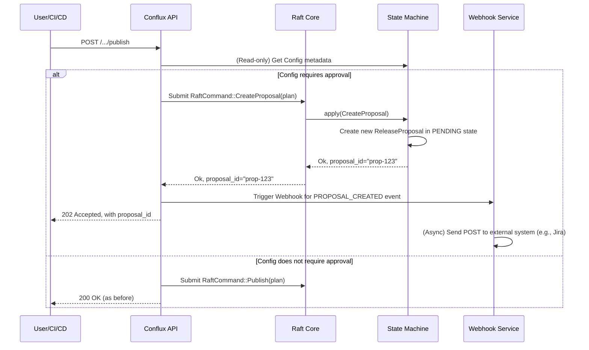

### **核心模块详细设计：集成审批工作流 (Approval Workflow Integration)**

该模块允许将高风险的操作（如生产环境的配置发布）置于一个审批流程之下。Conflux 本身**不实现**审批流引擎，而是作为一个“状态机”，负责记录审批状态，并通过 Webhook 与外部的、专业的审批系统（如 Jira, ServiceNow, Jenkins, 或一个自定义的内部审批平台）进行交互。

#### **1. 接口设计 (API Design)**

审批流的引入，将改变现有“发布”API的行为。

##### **a) 变更的发布 API**

`PUT /configs/{id}/releases` 和 `POST /configs/{id}/publish` 这类高风险 API 将增加一个新的行为。

* 如果一个配置项被标记为“需要审批”，调用这些 API 将**不再直接生效**。
* 取而代之，它会创建一个**发布提案 (Release Proposal)**，并返回 `202 Accepted`，响应体中包含该提案的 ID。

##### **b) `ReleaseProposal` 资源 API**

我们将引入一个新的资源 `/proposals` 来管理审批流程。

| Endpoint | Method | Description |
| :--- | :--- | :--- |
| `/proposals` | `GET` | 列出所有待处理或历史的发布提案。 |
| `/proposals/{proposal_id}` | `GET` | 查看一个特定提案的详情、状态和审批历史。 |
| `/proposals/{proposal_id}/approve` | `POST` | (外部系统回调) 批准一个提案。 |
| `/proposals/{proposal_id}/reject` | `POST` | (外部系统回调) 拒绝一个提案。 |
| `/proposals/{proposal_id}/cancel` | `POST` | (用户操作) 取消一个已提交但未审批的提案。 |

##### **c) Webhook 配置 API**

管理员需要能够配置 Conflux 如何与外部系统通信。

```rust
// 伪代码，展示API端点和功能

// 配置一个全局或租户级别的 Webhook
POST /_config/webhooks
// Body: 
// {
//   "name": "Jira Production Approvals",
//   "target_url": "https://hooks.jira.com/...",
//   "event_types": ["PROPOSAL_CREATED"],
//   "secret_token": "...", // 用于验证 Webhook 来源
//   "retry_policy": { ... }
// }

// 列出/删除 Webhooks
GET /_config/webhooks
DELETE /_config/webhooks/{id}
```

---

#### **2. 出参入参设计 (Input/Output Parameter Design)**

##### **输入参数 (Inputs)**

1. **`POST /proposals/{id}/approve` (外部回调)**

    ```json
    {
      "approver": "jira-user:charlie",
      "comment": "LGTM, approved as per ticket PROD-1234."
    }
    ```

    * 这个回调请求必须由 Conflux 通过一个安全的机制进行验证（例如，检查请求头中的 HMAC 签名）。

##### **输出参数 (Outputs)**

1. **发布 API 的 `202 Accepted` 响应**

    ```json
    {
      "message": "Release proposal created and is pending approval.",
      "proposal_id": "prop-xyz-789",
      "approval_status": "PENDING",
      "approval_dashboard_url": "https://conflux.mycompany.com/proposals/prop-xyz-789"
    }
    ```

2. **`GET /proposals/{id}`**

    ```json
    {
      "id": "prop-xyz-789",
      "status": "APPROVED", // PENDING, APPROVED, REJECTED, CANCELED, EXECUTED
      "proposer": "user-alice",
      "config_id": 123,
      "proposed_changes": { /* 包含将要创建的Version和将要应用的Release Rules */ },
      "history": [
        { "event": "CREATED", "actor": "user-alice", "timestamp": "..." },
        { "event": "APPROVED", "actor": "jira-user:charlie", "comment": "...", "timestamp": "..." },
        { "event": "EXECUTED", "actor": "system", "timestamp": "..." }
      ]
    }
    ```

---

#### **3. 数据模型设计 (Data Model Design)**

##### **a) `Config` 表的扩展**

我们需要在 `Config` 的元数据中增加一个字段来标记是否需要审批。这个标记本身可以由更高权限的管理员设置。

* **Raft State Machine (`Config` struct):**

    ```rust
    #[derive(Serialize, Deserialize, Debug, Clone)]
    pub struct Config {
        // ... existing fields ...
        pub approval_settings: Option<ApprovalSettings>,
    }

    #[derive(Serialize, Deserialize, Debug, Clone)]
    pub struct ApprovalSettings {
        pub required: bool,
        // 可选: 指定哪个 Webhook 配置用于此配置项
        pub webhook_id: Option<i64>, 
    }
    ```

##### **b) `ReleaseProposal` (新的 Raft 状态)**

`ReleaseProposal` 是一个全新的、需要通过 Raft 共识管理的状态。

```rust
// Raft State Machine
#[derive(Serialize, Deserialize, Debug, Clone)]
pub struct ReleaseProposal {
    pub id: String, // e.g., "prop-" + UUID
    pub status: ProposalStatus,
    pub config_id: u64,
    pub proposer_id: u64,
    pub created_at: DateTime<Utc>,
    
    // 存储了“如果被批准，将要执行的Raft命令”
    // 这里我们直接存储 PublishingPlan，因为它包含了所有变更信息
    pub plan: PublishingPlan,
    
    // 审批历史记录
    pub history: Vec<ProposalEvent>,
}

#[derive(Serialize, Deserialize, Debug, Clone, PartialEq, Eq)]
pub enum ProposalStatus {
    Pending, Approved, Rejected, Canceled, Executed, Failed,
}
```

##### **c) `Webhook` 配置 (存储在元数据 DB)**

Webhook 配置不要求强一致性，可以存在 PostgreSQL 中。

```sql
CREATE TABLE webhooks (
    id BIGSERIAL PRIMARY KEY,
    tenant_id BIGINT REFERENCES tenants(id), -- 可选，支持租户级Webhook
    name TEXT NOT NULL,
    target_url TEXT NOT NULL,
    secret_token_encrypted TEXT, -- 加密存储
    event_types TEXT[] NOT NULL, -- e.g., '{"PROPOSAL_CREATED"}'
    is_active BOOLEAN NOT NULL DEFAULT TRUE
);
```

---

#### **4. 核心流程设计 (Core Flow Design)**

##### **a) 创建并触发审批流程**



##### **b) 外部系统回调与执行流程**

```mermaid
sequenceDiagram
    participant Ext as External System (Jira)
    participant API as Conflux API (Webhook Handler)
    participant Raft as Raft Core
    participant SM as State Machine

    Ext->>API: POST /proposals/prop-123/approve
    API->>API: Validate HMAC signature or secret token
    
    alt Signature valid
        API->>Raft: Submit RaftCommand::ApproveProposal(proposal_id, approver, comment)
        Raft->>SM: apply(ApproveProposal)
        SM->>SM: Load Proposal, check status is PENDING
        SM->>SM: Update Proposal status to APPROVED
        SM-->>Raft-->>API: Ok
        API-->>Ext: 200 OK
        
        Note right of SM: An internal async task/scheduler<br>picks up APPROVED proposals.

        SM->>Raft: (New command) Submit RaftCommand::ExecuteProposal(proposal_id)
        Raft->>SM: apply(ExecuteProposal)
        SM->>SM: Load Proposal, check status is APPROVED
        SM->>SM: Execute the stored `plan` (PublishingPlan)
        SM->>SM: Update Proposal status to EXECUTED
    else Signature invalid
        API-->>Ext: 401 Unauthorized
    end
```

---

#### **5. 关键逻辑详细说明 (Key Logic Details)**

##### **a) Webhook 安全性**

* **HMAC 签名:** 当 Conflux 发送 Webhook 时，它应该在请求头中包含一个 HMAC 签名（例如 `X-Conflux-Signature-256`）。签名由 `secret_token` 和请求体计算得出。外部系统在收到回调时，必须用相同的 `secret_token` 重新计算签名并进行比对，以验证是 Conflux 发出的回调。
* **HTTPS:** 所有 Webhook 通信必须基于 HTTPS。

##### **b) 提案的执行 (Execution of Proposals)**

将提案的“批准”和“执行”解耦是一个重要的设计决策。

* **批准 (`ApproveProposal`)**: 只是一个状态变更，从 `PENDING` -> `APPROVED`。这个操作应该非常快。
* **执行 (`ExecuteProposal`)**: 是一个独立的操作，它实际执行存储在提案中的 `PublishingPlan`。
* **为什么解耦?**
    1. **可靠性:** 我们可以创建一个独立的、可靠的后台任务（“执行器”），它专门负责轮询状态为 `APPROVED` 的提案并执行它们。如果执行失败（例如，因为底层 Raft 暂时不可用），这个任务可以安全地重试。
    2. **可观察性:** 将执行作为一个独立的状态（`EXECUTED` vs `FAILED`），使得追踪一个提案的完整生命周期变得非常清晰。
    3. **可调度性:** 未来可以支持“定时发布”，即提案被批准后，等到一个预设的时间才被执行器捡起。

##### **c) Webhook 发送与重试**

`Webhook Service` 应该是一个可靠的后台服务。

* 当需要发送 Webhook 时，不应在 API 请求的主流程中同步发送，因为外部系统的响应可能很慢。
* 应该将发送任务放入一个持久化的队列中（例如，一个专门的 PostgreSQL 表或 Redis list）。
* 一个或多个后台 worker 从队列中取出任务并发送。如果发送失败或超时，worker 会根据预设的重试策略（如指数退避）重新入队。

---

#### **6. 详细测试用例和测试方法 (Detailed Test Cases & Methods)**

##### **a) 单元测试**

* **`test_proposal_state_transitions`**: 单元测试 `ReleaseProposal` 结构体的状态机，确保它只能从 `PENDING` 转换到 `APPROVED` 或 `REJECTED`，从 `APPROVED` 转换到 `EXECUTED` 等，防止非法状态转换。
* **`test_webhook_signature_generation_and_validation`**: 验证 HMAC 签名的生成和校验逻辑。

##### **b) 集成测试 (需要 Mock 外部审批系统)**

* **`test_approval_required_workflow`**:
    1. 配置一个 `Config` 为需要审批。
    2. 调用 `publish` API，验证返回 `202 Accepted` 并创建了一个 `PENDING` 的提案。
    3. 验证 `Webhook Service` 向 Mock 服务器发送了 `PROPOSAL_CREATED` 事件。
    4. 模拟外部系统回调 `approve` API。
    5. 轮询 `GET /proposals/{id}`，验证其状态最终变为 `EXECUTED`。
    6. 验证配置确实被发布了。
* **`test_reject_proposal_workflow`**: 类似上面，但调用 `reject` API，并验证提案状态变为 `REJECTED`，且配置未被发布。
* **`test_invalid_webhook_callback`**: 向回调 API 发送一个没有或签名错误的请求，验证返回 401/403。

---

#### **7. 设计依赖 (Dependencies)**

* **Raft 状态机**: 是存储 `ReleaseProposal` 状态的真理之源。
* **元数据 DB**: 存储 Webhook 配置。
* **HTTP 客户端 (`reqwest`)**: 用于发送 Webhook。
* **加密库 (`ring`)**: 用于计算 HMAC 签名。
* **后台任务/队列系统**: (推荐) 用于实现可靠的 Webhook 发送。

---

#### **8. 已知存在问题 (Known Issues)**

1. **外部系统可靠性**: 整个流程的可靠性现在依赖于外部审批系统和网络连接。如果外部系统宕机，审批流将完全中断。
2. **回调地狱 (Callback Hell)**: 如果审批流程非常复杂，涉及多个系统的多次回调，状态管理会变得很困难。
3. **提案与配置的同步**: 如果在一个提案等待审批期间，有人对同一个配置项提交并批准了另一个提案，可能会导致非预期的结果。需要有并发控制机制。

---

#### **9. 可迭代 Enhancement (Potential Enhancements)**

1. **轮询作为备用机制 (Polling as Fallback)**:
    * 除了 Webhook 回调，Conflux 可以提供一个 API，允许外部系统（如 CI/CD）定期轮询提案的状态。例如 `GET /proposals/{id}`。
    * CI/CD 流水线在创建提案后，可以进入一个轮询循环，直到状态变为 `APPROVED` 或 `REJECTED`，然后再进行下一步。这降低了对 Webhook 可靠性的强依赖。
2. **提案加锁 (Proposal Locking)**: 当一个配置项存在一个 `PENDING` 的提案时，锁定该配置项，不允许提交任何新的提案，直到当前提案被解决（批准、拒绝或取消）。这可以防止并发修改带来的混乱。
3. **内置的简单审批 UI**: 对于不想集成复杂外部系统的用户，Conflux 可以提供一个简单的内置审批页面。当提案创建时，它会向指定的管理员发送一封邮件，邮件中包含一个链接，点击链接即可进入该页面进行批准或拒绝。这大大降低了使用门槛。
4. **支持更多事件和触发器**: 扩展 Webhook 系统，支持更多事件（如 `CONFIG_DELETED`, `USER_CREATED`），并允许用户基于这些事件构建更复杂的自动化流程。
