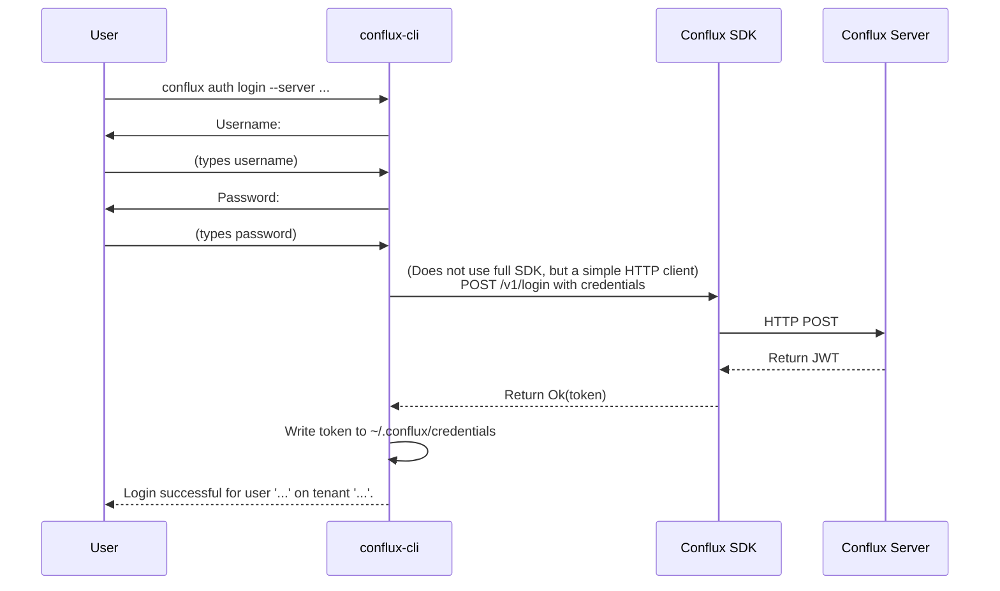

### **核心模块详细设计：命令行界面 (CLI)**

Conflux CLI (`conflux-cli`) 是一个独立的二进制程序，它作为 Conflux 系统的主要命令行交互工具。它构建在 **客户端 SDK** 之上，为用户提供了一种快速、可脚本化的方式来管理和查询配置。

#### **1. 接口设计 (API Design) - 命令结构**

CLI 的接口就是它的命令、子命令和参数。我们将采用一种分层的、符合 POSIX 约定的结构，使用 `clap` crate 来实现。

**顶层命令:** `conflux <SUBCOMMAND>`

##### **a) 用户/认证命令 (`conflux auth`)**

* `conflux auth login --server <endpoint>`: 交互式登录，提示输入用户名和密码，成功后获取 JWT 并保存到本地。
* `conflux auth logout`: 清除本地保存的凭证。
* `conflux auth status`: 显示当前的登录状态（用户、租户、服务器、token 有效期）。

##### **b) 配置管理命令 (`conflux config`)**

* `conflux config get <CONFIG_NAME> --tenant <t> --app <a> --env <e>`: 拉取并打印一个配置的内容。
  * Flags: `--output <format>` (e.g., `raw`, `json`), `--version <id>` (获取特定历史版本)。
* `conflux config list --tenant <t> --app <a> --env <e>`: 列出指定命名空间下的所有配置项。
* `conflux config versions <CONFIG_NAME> ...`: 列出某个配置的所有历史版本。
* `conflux config create <CONFIG_NAME> --file <path> ...`: 从一个本地文件创建或更新一个配置项（**注意:** 这个命令可能是一个封装了 `publish` 的高级命令）。

##### **c) 发布管理命令 (`conflux release`)**

* `conflux release apply <CONFIG_NAME> --version <id> --strategy <strat> ...`: 发布一个版本。这是一个高级命令。
  * `--strategy canary --labels "region=us-east,dc=dc1"`
  * `--strategy stable` (发布为默认稳定版)
* `conflux release rollback <CONFIG_NAME> --to-version <id> ...`: 回滚到指定版本。
* `conflux release status <CONFIG_NAME> ...`: 查看一个配置当前的发布状态和规则。

##### **d) 管理员命令 (`conflux admin`)**

这些命令需要特殊权限，用于管理系统本身。

* **`conflux admin tenant create <NAME> --quotas ...`**: 创建租户。
* **`conflux admin user create <USERNAME> --tenant <t> ...`**: 创建用户。
* **`conflux admin role grant <ROLE> --user <USER> --tenant <t>`**: 分配角色。
* **`conflux admin permission add <ROLE> --resource <res> --action <act> ...`**: 授予权限。
* **`conflux admin cluster status`**: 查看集群状态。
* **`conflux admin cluster node add ...`**: 添加节点。

---

#### **2. 出参入参设计 (Input/Output Parameter Design)**

* **输入 (Inputs):**
  * **子命令和参数:** 由用户在 shell 中输入。`clap` 负责解析。
  * **标准输入 (stdin):** 允许通过管道传递配置内容，例如 `cat myconfig.toml | conflux config create my-conf --from-stdin`。
  * **配置文件:** `~/.conflux/config.yaml` 存储默认服务器地址、租户等，避免每次都输入。
  * **凭证文件:** `~/.conflux/credentials` 存储登录后获取的 JWT。
* **输出 (Outputs):**
  * **标准输出 (stdout):** 用于打印成功的结果（例如，`get` 的内容，`list` 的表格）。支持多种格式化。
  * **标准错误 (stderr):** 用于打印进度信息、警告和错误消息。
  * **退出码 (Exit Code):** `0` 表示成功，非 `0` 表示失败，不同的非零值可以表示不同类型的错误。

**输出格式化示例:**

```bash
# 默认表格输出
$ conflux config list --tenant my-tenant
NAME              FORMAT  LATEST_VERSION  LAST_MODIFIED
database.toml     toml    5               2023-10-27T12:00:00Z
feature-flags.json json   12              2023-10-26T18:30:00Z

# JSON 输出
$ conflux config list --tenant my-tenant --output json
[
  { "name": "database.toml", "format": "toml", ... },
  { "name": "feature-flags.json", "format": "json", ... }
]
```

---

#### **3. 数据模型设计 (Data Model Design)**

CLI 本身是无状态的，但它在本地文件系统上管理着配置和凭证。

##### **a) 本地文件结构**

```
~/.conflux/
├── config.yaml       # 存储用户配置，如默认服务器、租户、输出格式
└── credentials       # 存储认证信息 (JWT)，文件权限应为 600
```

##### **b) `config.yaml` 示例**

```yaml
server_endpoint: "https://conflux.mycompany.com"
default_tenant: "my-team-tenant"
default_output: "table"
```

##### **c) `credentials` 文件格式**

可以是一个简单的 JSON 或 INI 文件，存储服务器端点和对应的 JWT。

```ini
[https://conflux.mycompany.com]
token = "eyJhbGciOiJI..."
refresh_token = "..."
expires_at = 1698411600
```

---

#### **4. 核心流程设计 (Core Flow Design)**

##### **a) `conflux auth login` 流程**



##### **b) 通用命令执行流程 (e.g., `config get`)**

```mermaid
graph TD
    A[User runs `conflux config get ...`] --> B{Parse args with `clap`};
    B --> C{Load config from `~/.conflux/config.yaml`};
    C --> D{Load credentials from `~/.conflux/credentials`};
    
    D --> E{Check if token is expired};
    alt Token Expired
        E --> F[Attempt to refresh token using refresh_token];
        F -- Success --> G[Update credentials file];
        F -- Failure --> X[Print error and suggest `login`];
    else Token Valid
        E --> G;
    end
    
    G --> H{Initialize Conflux SDK with config and token};
    H --> I[Call corresponding SDK method<br>e.g., `sdk.get_string(...)`];
    I --> J{Format the result based on `--output` flag};
    J --> K[Print result to stdout];
    K --> L[Exit with code 0];
    
    I -- SDK returns error --> Y[Print formatted error to stderr];
    Y --> Z[Exit with non-zero code];
```

---

#### **5. 关键逻辑详细说明 (Key Logic Details)**

##### **a) 基于 SDK 构建**

CLI 的核心原则是**不重复造轮子**。除了最初的登录流程（它直接调用 HTTP API），所有其他与 Conflux 服务器的交互都应该通过我们之前设计的**客户端 SDK** 来完成。

* `conflux config get` -> `sdk.get_string()`
* `conflux release apply` -> 封装了 `sdk.create_version()` 和 `sdk.update_releases()` 的调用。
* 这确保了业务逻辑、重试、缓存等行为在 CLI 和其他应用中是一致的。

##### **b) 认证与会话管理**

* CLI 必须能处理 JWT 过期的问题。一个健壮的实现会在每次执行命令前，检查本地存储的 token 的 `exp` 时间戳。
* 如果 token 即将过期或已过期，CLI 应自动尝试使用 `refresh_token`（如果存在）去调用服务器的 `/auth/refresh` 端点来获取新的 JWT，并更新本地文件。这个过程对用户应该是透明的。

##### **c) 输出格式化**

* 为了支持不同的输出格式，可以设计一个 `trait Formatter`，并为 `TableFormatter`, `JsonFormatter`, `YamlFormatter` 等实现它。
* 根据用户的 `--output` 参数，在运行时选择一个格式化器来处理从 SDK 返回的数据结构。`serde` 在这里会扮演关键角色。

---

#### **6. 详细测试用例和测试方法 (Detailed Test Cases & Methods)**

##### **a) 单元测试**

* 使用 `clap` 的 `try_parse_from` 来测试命令行的解析逻辑。
* 单元测试输出格式化器的逻辑。

##### **b) 集成/端到端测试 (使用 `assert_cmd` 或类似 crate)**

这类测试会实际执行编译好的 CLI 二进制文件，并检查其输出和退出码。

* **`test_login_success_and_fail`**:
    1. 运行 `login` 使用错误的密码，断言退出码非零且 stderr 包含 "Authentication failed"。
    2. 运行 `login` 使用正确的密码，断言退出码为零，并检查 `~/.conflux/credentials` 文件被创建。
* **`test_get_config_formats`**:
    1. 运行 `conflux config get ...`，断言 stdout 打印了正确的配置内容。
    2. 运行 `conflux config get ... --output json`，断言 stdout 打印了合法的 JSON。
* **`test_command_chaining`**:
    `conflux admin tenant create my-ci-tenant`
    `conflux admin user create ci-user --tenant my-ci-tenant`
    `conflux config create my-conf --file ... --tenant my-ci-tenant`
    验证每一步都成功。
* **`test_no_auth_fails`**: 在未登录的情况下运行 `config get`，断言命令失败并提示需要登录。

---

#### **7. 设计依赖 (Dependencies)**

* **客户端 SDK**: CLI 的核心业务逻辑依赖。
* **`clap`**: 命令行参数解析。
* **`serde`, `serde_json`, `serde_yaml`**: 用于处理配置和输出格式。
* **`reqwest`**: (可能) 用于实现登录流程的简单 HTTP client。
* **`tokio`**: 因为 SDK 是异步的，所以 CLI 也需要一个异步运行时。
* **`comfy-table`, `cli-table`**: (可选) 用于生成漂亮的表格输出。

---

#### **8. 已知存在问题 (Known Issues)**

1. **凭证安全**: 将明文 JWT 存储在本地文件系统上存在安全风险。如果用户的笔记本电脑被盗，攻击者可能会获取到这个 token。
2. **高级交互**: 对于复杂的、多步骤的操作（例如，引导一个全新的集群），纯命令行的交互可能会变得非常繁琐和容易出错。
3. **与 Web UI 的竞争**: CLI 的功能可能会与 Web UI 重叠。需要明确两者的定位和用户群体。

---

#### **9. 可迭代 Enhancement (Potential Enhancements)**

1. **增强本地凭证安全**:
    * 使用操作系统的密钥链服务（如 macOS Keychain, Windows Credential Manager, Linux Secret Service）来存储 token，而不是明文文件。`keyring` crate 可以帮助实现这个。
    * 支持通过 OIDC (OpenID Connect) 流程进行登录，CLI 会打开一个浏览器让用户在 IdP (如 Okta, Google) 中认证，然后通过回调接收 token。这是更现代和安全的认证方式。
2. **交互式向导 (Interactive Wizard)**:
    * 对于复杂操作，例如 `conflux admin cluster initialize`，可以提供一个交互式模式。CLI 会通过一系列问题来引导用户完成配置，而不是要求用户一次性提供所有参数。`dialoguer` crate 很适合做这个。
3. **Shell 自动补全**: 为主流的 shell (Bash, Zsh, Fish) 生成自动补全脚本。`clap` 对此有很好的内置支持。这能极大地提升 CLI 的可用性。
4. **插件系统**: 允许社区或用户为 CLI 编写自己的插件/扩展命令。这可以通过动态加载或一个定义良好的子命令分发机制来实现。
