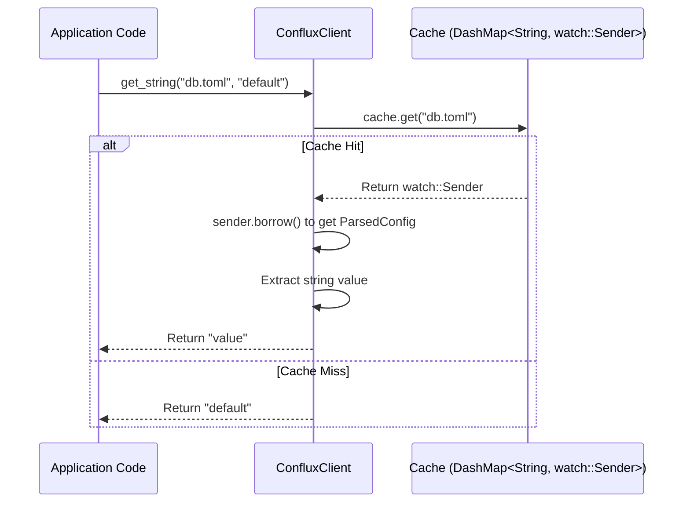
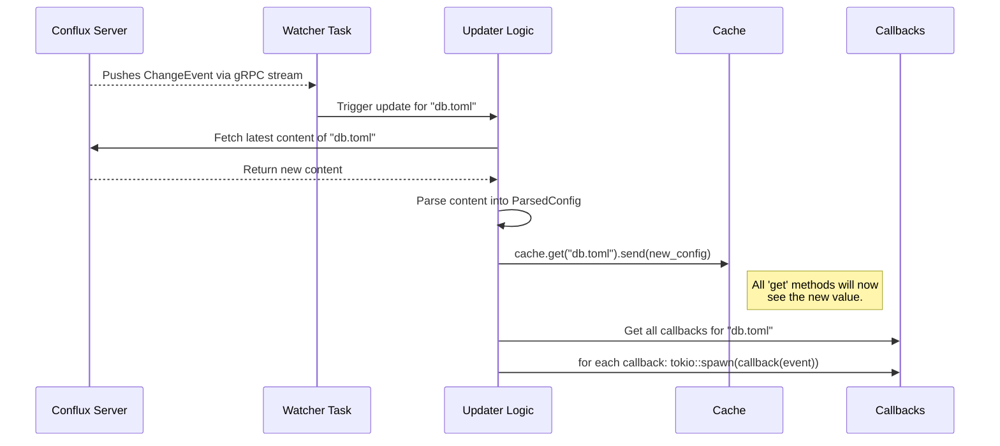

好的，我们继续下一个关键模块的详细设计：**客户端 SDK (Client SDK)**。一个设计精良的 SDK 是开发者与系统交互的桥梁，其易用性、健壮性和性能直接影响整个平台的成败。

---

### **核心模块详细设计：客户端 SDK (Client SDK)**

客户端 SDK 旨在为应用开发者提供一个简单、高效、容错的接口来与 Conflux 配置中心交互。它封装了服务发现、认证、配置拉取、动态更新、本地缓存和故障恢复等所有复杂性。

#### **1. 接口设计 (API Design)**

SDK 的公共 API 必须是线程安全的，并且设计得极其简单。

```rust
// file: conflux-sdk/src/client.rs

// SDK 的配置选项
pub struct ConfluxOptions {
    pub app_name: String,
    pub environment: String,
    pub endpoints: Vec<String>, // Conflux 服务器的 gRPC 地址列表
    pub tenant: String,
    pub auth_token: String,
    // 本地快照配置
    pub snapshot_path: Option<PathBuf>,
    pub snapshot_encryption_key: Option<[u8; 32]>,
    // 启动策略
    pub boot_strategy: BootStrategy,
}

pub enum BootStrategy {
    // 快速失败: 无法从服务器或快照加载配置则panic
    FailFast,
    // 安全运行: 使用代码中提供的默认值继续运行
    FailSafe,
}

// 主客户端结构体
#[derive(Clone)]
pub struct ConfluxClient { /* ... private fields ... */ }

impl ConfluxClient {
    /// 异步创建一个新的Conflux客户端实例并初始化。
    /// 此方法会启动后台任务来拉取配置和监听变更。
    pub async fn new(options: ConfluxOptions) -> Result<Self, SdkError>;

    /// 同步获取一个字符串类型的配置值。
    /// 如果配置不存在或类型不匹配，则返回`default_value`。
    /// 这个方法从内存缓存中读取，速度极快（纳秒级）。
    pub fn get_string(&self, config_name: &str, default_value: &str) -> String;

    /// 同步获取一个整数类型的配置值。
    pub fn get_i64(&self, config_name: &str, default_value: i64) -> i64;
    
    /// 同步获取一个布尔类型的配置值。
    pub fn get_bool(&self, config_name: &str, default_value: bool) -> bool;

    // ... 其他类型 (f64, Vec<String>, etc.) 的 'get' 方法

    /// 订阅一个特定配置项的变更回调。
    /// 当配置更新时，提供的回调函数将被异步执行。
    pub fn on_change<F>(&self, config_name: &str, callback: F)
    where
        F: Fn(ChangeEvent) + Send + Sync + 'static;
    
    /// 强制刷新所有配置。
    /// 通常不需要手动调用，但可用于调试。
    pub async fn force_refresh(&self);

    /// 优雅地关闭SDK，停止所有后台任务。
    pub async fn shutdown(&self);
}
```

---

#### **2. 出参入参设计 (Input/Output Parameter Design)**

##### **输入参数 (Inputs)**

1. **`ConfluxClient::new(options: ConfluxOptions)`**:
    * `options`: 包含所有初始化所需信息的结构体，如服务地址、身份凭证、应用标识等。

2. **`get_string(config_name: &str, default_value: &str)`**:
    * `config_name`: 要获取的配置名，例如 `"database.toml"`。
    * `default_value`: 在任何失败情况下（未找到、类型错误、未初始化）返回的备用值。

3. **`on_change(config_name: &str, callback: F)`**:
    * `config_name`: 要监听的配置名。
    * `callback`: 一个 `Fn` 闭包，它接收 `ChangeEvent` 作为参数。

##### **输出参数 (Outputs)**

1. **`ConfluxClient::new(...) -> Result<Self, SdkError>`**:
    * 成功时返回一个可 `Clone` 的 `ConfluxClient` 实例。
    * 失败时（例如，根据 `BootStrategy::FailFast` 策略）返回一个自定义的 `SdkError`。

2. **`get_string(...) -> String`**:
    * 返回一个 `String`。`get_*` 系列方法被设计为**永不失败**，总是返回一个值，这大大简化了应用层的代码。

---

#### **3. 数据模型设计 (Data Model Design)**

SDK 内部需要管理其状态，包括缓存、后台任务句柄和配置。

```rust
// file: conflux-sdk/src/internal.rs

// 内部共享状态，被 Arc 包裹后在 Client 和后台任务间共享
struct InnerState {
    // 核心的内存缓存。
    // Key: config_name
    // Value: 一个 watch channel，存储着解析后的配置内容。
    //        使用 watch channel 可以实现高效的“一写多读”更新。
    cache: DashMap<String, watch::Sender<ParsedConfig>>,

    // 订阅的回调函数。
    // Key: config_name
    // Value: 回调函数列表的动态数组。
    callbacks: DashMap<String, Vec<Box<dyn Fn(ChangeEvent) + Send + Sync>>>,

    // gRPC 客户端
    grpc_client: RwLock<Option<WatcherServiceClient<Channel>>>,
    
    // 配置选项
    options: ConfluxOptions,
    
    // 用于通知后台任务退出的信号
    shutdown_signal: CancellationToken,
}

// 解析后的配置内容，支持多种格式
enum ParsedConfig {
    Toml(toml::Value),
    Json(serde_json::Value),
    // ... 其他格式
}
```

**为什么选择 `tokio::sync::watch`?**
当一个配置更新时，`Updater` 任务作为唯一的“写者”，会向 `watch::Sender` 发送新的 `ParsedConfig`。`get_*` 方法作为“读者”，可以持有一个 `watch::Receiver` 的副本，并**同步地**（使用 `borrow()`）访问当前的值。这比 `RwLock` 性能更好，因为它避免了读写锁争用，写者永远不会被读者阻塞。

---

#### **4. 核心流程设计 (Core Flow Design)**

##### **a) 初始化流程 (`new` 方法)**

```mermaid
graph TD
    A[App calls ConfluxClient::new(options)] --> B{Load from Snapshot};
    B -- Success --> C{Populate Cache from Snapshot};
    B -- Failure / Not Found --> D[Continue with empty cache];
    
    C --> E{Spawn Background Tasks};
    D --> E;

    subgraph E [Spawn Background Tasks in parallel]
        direction LR
        T1[Poller Task]
        T2[Watcher Task]
    end

    T1 --> F[Initial Full Fetch];
    F -- Success --> G{Update Cache &<br/>Write to Snapshot};
    F -- Failure --> H{Check BootStrategy};
    
    T2 --> I[Establish gRPC Watch Stream];
    I -- Success --> J[Ready to receive events];
    I -- Failure --> K[Watcher will retry in background];

    H -- FailFast --> L[Return SdkError];
    H -- FailSafe --> M[Return Ok(Client)];
    G --> M;
    J --> M;
    
    M --> N[Initialization Complete];
```

##### **b) 配置读取流程 (`get_string` 方法)**



##### **c) 动态更新流程 (Watcher 触发)**



---

#### **5. 关键逻辑详细说明 (Key Logic Details)**

##### **a) 容错与恢复 (Fault Tolerance & Recovery)**

* **本地快照:** 在 `Updater` 每次成功从服务器拉取并更新缓存后，它都会将整个缓存的状态加密并异步地写入到本地快照文件。这提供了离线启动的能力。
* **Watcher 与 Poller 的协同:**
  * `Watcher` 任务负责维护 gRPC 长连接。如果连接因任何原因断开，它会进入一个带指数退避的重试循环。
  * `Poller` 任务在启动时执行一次全量拉取。此外，它可以被设计为在 `Watcher` 持续断开超过一定阈值（例如 5 分钟）后，再次被激活，以保证配置的最终一致性。

##### **b) 缓存与解析**

当 `Updater` 获取到新的配置内容（`Vec<u8>`）时，它会根据 `ConfigFormat` 将其**预先解析**为 `ParsedConfig` 枚举。`get_*` 方法在访问缓存时，只是从这个已解析的结构中提取值。这避免了每次 `get` 调用都进行昂贵的文本解析。

##### **c) 回调执行**

`on_change` 注册的回调函数在被触发时，会通过 `tokio::spawn` 在一个独立的任务中执行。这可以防止一个缓慢的回调函数阻塞 `Updater` 任务，从而影响其他配置的更新。

---

#### **6. 详细测试用例和测试方法 (Detailed Test Cases & Methods)**

##### **a) 单元测试**

* **`test_get_from_populated_cache`**: 验证 `get_*` 方法能从预填充的缓存中正确返回值。
* **`test_get_with_default_value`**: 验证在缓存未命中、类型不匹配等情况下能正确返回默认值。
* **`test_on_change_registration`**: 验证回调函数能被正确注册。
* **`test_update_triggers_callback`**: 模拟一次缓存更新，验证对应的回调函数被调用。

##### **b) 集成测试 (需要一个 Mock Conflux Server)**

* **`test_init_with_fail_fast`**: Mock 服务器返回错误，验证 `new()` 方法返回 `Err`。
* **`test_init_with_fail_safe`**: Mock 服务器返回错误，验证 `new()` 返回 `Ok`，且 `get` 返回默认值。
* **`test_init_from_snapshot`**:
    1. 创建并加密一个快照文件。
    2. Mock 服务器设置为不可访问。
    3. 验证 `new()` 能成功从快照初始化。
* **`test_end_to_end_hot_update`**:
    1. SDK 初始化并连接到 Mock 服务器。
    2. Mock 服务器通过 gRPC stream 推送一个 `ChangeEvent`。
    3. 验证 SDK 的 `get` 方法在之后能返回新值，并且对应的 `on_change` 回调被触发。

---

#### **7. 设计依赖 (Dependencies)**

* **Conflux Server**: 提供 gRPC API 用于配置拉取和订阅。
* **`tokio`**: 核心异步运行时。
* **`tonic`**: gRPC 客户端实现。
* **`dashmap`**: 内部缓存。
* **`serde`, `toml`, `serde_json`**: 配置解析。
* **`ring` or other crypto library**: 用于本地快照的加密/解密。
* **`CancellationToken`**: 用于优雅地关闭后台任务。

---

#### **8. 已知存在问题 (Known Issues)**

1. **Thundering Herd (惊群效应) for Callbacks**: 如果一个配置项有大量（数千个）回调订阅，一次更新会导致同时 `spawn` 数千个任务，可能对 `tokio` 调度器造成瞬时压力。
2. **配置格式硬编码**: 当前设计中，支持的配置格式（`ParsedConfig` 枚举）是硬编码在 SDK 中的。如果服务器端通过插件增加了新的格式，SDK 需要同步更新和重新编译才能支持。
3. **认证令牌刷新**: SDK 当前接收一个静态的 `auth_token`。对于需要定期刷新的短期令牌（如 OAuth2），SDK 没有内置的刷新机制。

---

#### **9. 可迭代 Enhancement (Potential Enhancements)**

1. **回调任务节流/合并 (Callback Throttling/Batching)**: 对于惊群效应，可以引入一个中间层。`Updater` 只是向一个 MPSC channel 发送通知，一个专门的“回调执行器”任务从此 channel 读取，并可以在短时间内对同一配置的多个变更进行合并，或者限制并发执行的回调任务数量。
2. **动态解析器 (Dynamic Parsers)**: 让 SDK 能处理任意文本格式。`get_*` 方法可以接收一个闭包 `Fn(&[u8]) -> T` 作为参数，由调用者提供解析逻辑。或者，将 `ParsedConfig` 从枚举改为 `Box<dyn Any + Send + Sync>`，实现更动态的类型系统。
3. **可插拔的认证模块 (Pluggable Auth Module)**: 将认证逻辑抽象成一个 `trait AuthProvider`，SDK 在初始化时接收一个 `Box<dyn AuthProvider>`。这样就可以轻松实现静态令牌、OAuth2 客户端凭证流等不同的认证方式，而无需修改 SDK 核心。
4. **支持配置引用 (Support for Config References)**: 实现一个解析器，可以识别配置内容中的特殊引用语法（如 `{{ conflux:prod/secrets/db_password }}`）。当应用代码请求这个配置时，SDK 会自动、递归地解析这些引用，并用实际的值进行替换，前提是 SDK 持有的 `auth_token` 有权限读取被引用的配置。这极大地增强了配置的组合能力。
