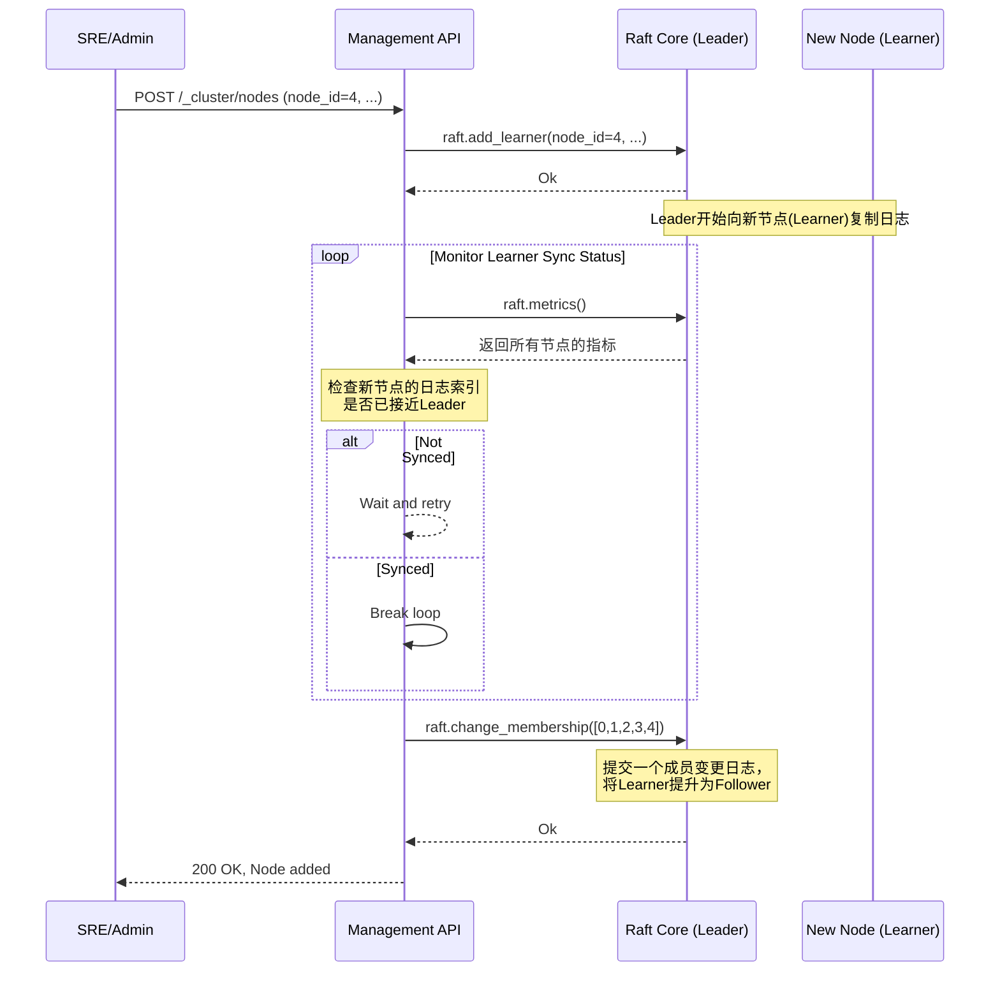

### **核心模块详细设计：集群运维与管理 (Cluster Operations & Management)**

该模块负责 Conflux 集群自身的生命周期管理，包括节点的加入与离开、集群的引导、备份与恢复等。它通过一组受严格保护的管理 API 来暴露功能。

#### **1. 接口设计 (API Design)**

这些 API 通常在一个独立的网络端口上提供，或者通过一个需要特殊认证（如 mTLS 客户端证书）的 Axum `Router` 来保护。

##### **a) 管理 API (gRPC 或 RESTful HTTP)**

```rust
// 伪代码，展示API端点和功能

// --- 集群成员管理 ---
// 添加一个新节点到集群
POST /_cluster/nodes
// Body: { "node_id": 4, "api_address": "conflux-4:8080", "raft_address": "conflux-4:9001" }

// 安全地移除一个节点
DELETE /_cluster/nodes/{node_id}

// --- Leader 管理 ---
// 查看当前 Leader 信息
GET /_cluster/leader

// 主动触发 Leader 转移
POST /_cluster/leader/transfer
// Body (可选): { "target_node_id": 2 }

// --- 集群引导与恢复 ---
// (仅对未初始化的集群有效) 初始化一个新集群
POST /_cluster/initialize
// Body: { "members": { "0": {...}, "1": {...}, "2": {...} } }

// (仅对空集群有效) 从快照恢复集群
POST /_cluster/restore
// Body: { "snapshot_uri": "s3://my-backups/conflux/snapshot-2023-10-27.snap" }

// --- 备份 ---
// 手动触发一次快照创建和上传
POST /_cluster/backup

// --- 健康与状态 ---
// 获取整个集群的健康状态和指标
GET /_cluster/status
```

---

#### **2. 出参入参设计 (Input/Output Parameter Design)**

##### **输入参数 (Inputs)**

1. **`POST /_cluster/nodes`**:
    * `node_id`: `u64` - 新节点的唯一 ID。
    * `api_address`: `String` - 新节点的 API 地址。
    * `raft_address`: `String` - 新节点的 Raft 通信地址。

2. **`POST /_cluster/initialize`**:
    * `members`: `Map<NodeId, Node>` - 初始集群所有成员的 ID 和地址信息。

3. **`POST /_cluster/restore`**:
    * `snapshot_uri`: `String` - 指向对象存储中快照文件的 URI。

##### **输出参数 (Outputs)**

1. **`GET /_cluster/status`**:

    ```json
    {
      "cluster_id": "uuid-...",
      "leader_id": 1,
      "current_term": 15,
      "last_applied_log": 10523,
      "nodes": {
        "1": { "status": "Leader", "is_reachable": true, "log_index": 10523, ... },
        "2": { "status": "Follower", "is_reachable": true, "log_index": 10523, ... },
        "3": { "status": "Follower", "is_reachable": false, "log_index": 9800, ... }
      },
      "errors": ["Node 3 is unreachable and lagging significantly"]
    }
    ```

2. 大多数 `POST` 和 `DELETE` 请求在成功时返回 `200 OK` 或 `202 Accepted`，失败时返回相应的错误码和信息。

---

#### **3. 数据模型设计 (Data Model Design)**

该模块主要与 `openraft` 核心和底层的 `Store` 交互，其本身没有复杂的数据模型。关键在于对 `openraft` 暴露的接口进行安全、健壮的封装。

核心数据实体由 `openraft` 提供：

* `Node { addr: String, data: AppData }`: 代表一个节点。
* `Membership { configs: BTreeSet<BTreeSet<NodeId>>, nodes: BTreeMap<NodeId, Node> }`: 代表集群成员配置。
* `RaftMetrics`: 包含 Leader、任期、日志索引等实时指标。

---

#### **4. 核心流程设计 (Core Flow Design)**

##### **a) 安全添加节点流程 (Safe Add Node)**

这个流程必须保证新节点在成为正式成员前，其数据是完全同步的，以避免破坏集群一致性。



##### **b) 自动集群引导流程 (Automatic Bootstrapping)**

这个流程在 Helm Chart 部署时自动发生，无需人工干预。

```mermaid
graph TD
    A[Start all Pods (conflux-0, 1, 2)] --> B{conflux-0 (Node 0) is special};
    B -- Yes --> C[Enter "Initializing" state];
    B -- No (Nodes 1, 2) --> D[Start "Join Requester" task];

    D --> E{Loop: Send join request to<br/>conflux-0.headless-svc};
    E -- Success --> F[Wait for initialization];
    E -- Failure --> E;
    
    C --> G{Wait for N-1 join requests};
    G -- Not enough requests --> G;
    G -- All requests received --> H[Call raft.initialize(members)];
    Note on H: Members list is constructed from<br>received join requests
    H --> I[Cluster Initialized, start election];
    I --> F;
    F --> J[Become active Follower];
```

##### **c) 备份与恢复流程**

**备份:**

1. 后台任务或手动 API 调用 `raft.trigger_snapshot()`。
2. `openraft` 会调用状态机的 `begin_snapshot()`。
3. 在 `begin_snapshot` 的实现中，我们将生成的快照数据流式上传到一个 `Uploader` 服务。
4. `Uploader` 服务将快照流写入对象存储（如 S3），并附带元数据（集群ID、时间戳、日志ID）。

**恢复:**

1. 在一个全新的、空的单节点集群上，调用 `POST /_cluster/restore`。
2. API Handler 从 `snapshot_uri` 下载快照文件。
3. 调用 `raft.install_snapshot()`，将下载的数据流传入。
4. 状态机会用快照数据完全重置其本地状态。
5. 恢复完成后，可以通过“添加节点”流程，重建一个完整的、与备份状态一致的集群。

---

#### **5. 关键逻辑详细说明 (Key Logic Details)**

##### **a) 运维 API 的安全性**

这些 API 拥有摧毁整个集群的能力，因此必须被严格保护。

* **网络隔离:** 运维端口不应暴露在公网上。在 K8s 中，可以通过 `NetworkPolicy` 限制只有来自特定运维 Pod 或内部网络的流量才能访问。
* **强制 mTLS:** 所有对运维 API 的调用都必须使用客户端证书进行 mTLS 认证，只有持有受信任 CA 签发的管理员证书的客户端才能调用。

##### **b) Leader 转移的实现**

调用 `raft.change_membership()` 来移除 Leader 节点是不安全的。正确的做法是先转移 Leader 身份。
`openraft` 没有直接的 `transfer_leader` API，但可以通过以下方式实现：

1. Leader 节点收到转移请求后，设置一个内部标志，使其拒绝所有新的 `client_write` 请求。
2. Leader 节点向目标节点发送一个特殊的 RPC，请求其发起选举。
3. 目标节点收到请求后，会增加自己的 `term` 并向所有节点发起 `VoteRequest`。
4. 由于原 Leader 已停止活动，其他节点很可能会投票给新候选人，从而完成和平的 Leader 转移。

##### **c) `/_cluster/status` 的聚合逻辑**

这个 API 需要从集群中的**所有**节点收集信息。

1. 处理该请求的节点首先从本地 `raft.metrics()` 获取自身状态。
2. 然后，它会向 `membership` 列表中的所有其他节点的运维 API（例如 `GET /_internal/status`）并行地发送请求。
3. 它会聚合所有节点的响应，计算出集群的整体健康状况（例如，是否存在网络分区、哪个节点落后等），然后返回最终的 JSON 对象。

---

#### **6. 详细测试用例和测试方法 (Detailed Test Cases & Methods)**

##### **a) 单元测试**

* 主要针对辅助函数，例如，解析 `/_cluster/status` 聚合逻辑中的响应。

##### **b) 集成/端到端测试 (使用 `minikube` 或 `kind` 进行本地 K8s 测试)**

* **`test_cluster_bootstrap`**:
    1. 使用 Helm Chart 部署一个 3 节点的集群。
    2. 等待一段时间，然后调用 `/_cluster/status`。
    3. 断言集群已成功形成，并且有一个 Leader。
* **`test_add_node_workflow`**:
    1. 部署一个 3 节点集群。
    2. `helm scale statefulset conflux --replicas=4`。
    3. 调用 `POST /_cluster/nodes` 添加新节点。
    4. 持续轮询 `/_cluster/status`，验证新节点最终成为活跃的 Follower。
* **`test_remove_node_and_scale_down`**:
    1. 从一个 4 节点集群开始。
    2. 调用 `DELETE /_cluster/nodes/3`。
    3. 验证 `/_cluster/status` 中该节点消失。
    4. `helm scale statefulset conflux --replicas=3`。
    5. 验证集群在缩容后依然健康运行。
* **`test_backup_and_disaster_recovery`**:
    1. 部署集群并写入数据。
    2. 调用 `POST /_cluster/backup`，验证快照文件出现在 Mock S3 中。
    3. 销毁整个集群。
    4. 部署一个单节点集群，调用 `POST /_cluster/restore`。
    5. 验证恢复后，之前写入的数据可以被查询到。

---

#### **7. 设计依赖 (Dependencies)**

* **`openraft`**: 提供了所有底层的集群管理原语。
* **Kubernetes (StatefulSet, Service)**: 是实现自动化部署和发现的基础。
* **Helm**: 用于打包和管理 K8s 部署。
* **对象存储 (S3-compatible)**: 用于备份文件的持久化。
* **HTTP/gRPC 框架 (Axum/Tonic)**: 用于暴露运维 API。

---

#### **8. 已知存在问题 (Known Issues)**

1. **脑裂 (Split-Brain) 风险**: Raft 协议本身能防止脑裂导致的数据不一致。但在网络分区期间，旧的 Leader 可能短时间内仍然认为自己是 Leader。虽然它无法提交新的日志，但可能会向客户端提供陈旧的读数据。
2. **自动化引导的竞争条件**: 如果节点启动顺序或网络延迟非常极端，自动引导逻辑可能会出现竞争条件（例如，节点 0 还未准备好，节点 1 就开始疯狂发送加入请求）。
3. **恢复操作的风险**: `restore` 是一个非常危险的操作。如果误操作在一个正在运行的集群上执行，可能会导致所有数据丢失。

---

#### **9. 可迭代 Enhancement (Potential Enhancements)**

1. **Conflux Operator**: 开发一个 Kubernetes Operator 来替代 Helm Chart 和手动 API 调用。Operator 可以将集群运维逻辑（如扩缩容、版本升级、备份）编码成控制器。管理员只需修改 `ConfluxCluster` 这个 CRD (Custom Resource Definition) 的 `spec`（例如，`replicas: 5`），Operator 就会自动执行所有必要的、安全的步骤来达到期望状态。这是 K8s 生态中最成熟的运维模式。
2. **更强的恢复保护**: 为 `restore` API 增加多重保护。例如，要求传入一个 `cluster_uuid`，并且只有当集群的 `uuid` 与一个预期的、已销毁的 `uuid` 匹配时才允许恢复。或者引入一个“恢复模式”，需要先将节点置于此模式才能执行恢复。
3. **Fencing 机制**: 为了解决脑裂期间的陈旧读问题，可以引入 Fencing 令牌。Leader 在每次与客户端交互时都提供一个单调递增的令牌（例如，它的 `term`）。客户端 SDK 在后续请求中带上这个令牌，如果服务器发现令牌已过期，就会拒绝请求，强制客户端寻找新的 Leader。
