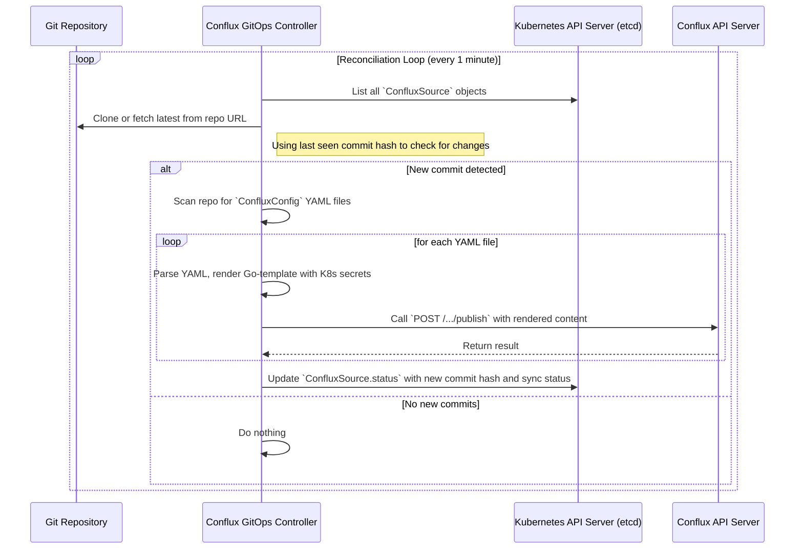

### **核心模块详细设计：配置即代码 (Config-as-Code) 与 GitOps 集成**

该模块旨在将 Conflux 的配置管理能力与版本控制系统 (Git) 和流行的基础设施即代码 (IaC) 工具（如 Terraform）深度集成。其核心目标是让所有配置的变更都变成可审查、可回溯、自动化的代码变更。

这个模块主要包含两个部分：

1. **Terraform Provider**: 允许用户使用 HCL 语言声明式地管理 Conflux 资源。
2. **GitOps 控制器 (Operator)**: 一个在 Kubernetes 中运行的控制器，它会监听 Git 仓库，并自动将变更同步到 Conflux。

#### **1. 接口设计 (API Design)**

此模块不直接提供新的用户 API，而是**消费**现有的 Conflux 管理 API，并为其他系统（Terraform, Kubernetes）提供它们所期望的接口（即 Provider 和 Operator 的行为）。

##### **a) Terraform Provider Schema**

这是我们为 Terraform 用户定义的“接口”。

* **Provider 配置:**

    ```hcl
    provider "conflux" {
      server_endpoint = "https://conflux.mycompany.com"
      auth_token      = var.conflux_api_token
    }
    ```

* **`conflux_config` 资源:**

    ```hcl
    resource "conflux_config" "app_A_db" {
      tenant      = "my-tenant"
      application = "app-A"
      environment = "production"
      name        = "database.toml"
      format      = "toml"
      schema      = file("schemas/db.schema.json")
      
      retention_policy {
        strategy = "AND"
        rules {
          type = "count"
          keep = 50
        }
        rules {
          type = "days"
          keep = 180
        }
      }
    }
    ```

* **`conflux_release` 资源 (核心):**

    ```hcl
    resource "conflux_release" "app_A_db_v3" {
      // 引用上面的 config 资源
      config_id   = conflux_config.app_A_db.id

      // 版本内容
      content     = file("configs/app-A/v3.toml")
      description = "Terraform Apply: Update connection pool settings (plan #${var.build_id})"

      // 发布策略
      is_stable = true // 将此版本设置为新的默认稳定版
    }
    ```

    或者一个更复杂的灰度发布：

    ```hcl
    resource "conflux_release" "app_A_db_v4_canary" {
      config_id   = conflux_config.app_A_db.id
      content     = file("configs/app-A/v4.toml")
      description = "Canary release of v4"

      // is_stable = false (默认)

      depends_on = [conflux_release.app_A_db_v3]
    }

    resource "conflux_release_policy" "app_A_policy" {
      config_id = conflux_config.app_A_db.id
      
      rule {
        priority   = 10
        version_id = conflux_release.app_A_db_v4_canary.version_id
        labels = {
          "canary" = "true"
        }
      }
      rule {
        priority   = 0
        version_id = conflux_release.app_A_db_v3.version_id
        labels     = {} // 默认规则
      }
    }
    ```

##### **b) GitOps Controller (Kubernetes CRD)**

这是我们为 Kubernetes 用户定义的“接口”。

* **`ConfluxSource` CRD:** 定义了要监听的 Git 仓库。

    ```yaml
    apiVersion: gitops.conflux.io/v1alpha1
    kind: ConfluxSource
    metadata:
      name: app-a-config-repo
    spec:
      interval: 1m
      url: https://github.com/my-org/app-a-configs
      ref:
        branch: main
    ```

* **`ConfluxConfig` CRD:** 在 Git 仓库中定义的资源。

    ```yaml
    # 文件: /production/database.yaml (在 Git 仓库中)
    apiVersion: gitops.conflux.io/v1alpha1
    kind: ConfluxConfig
    metadata:
      name: database.toml # 将成为 Conflux 中的 config name
      namespace: my-tenant # 将成为 Conflux 中的 tenant
    spec:
      application: app-a
      environment: production
      format: toml
      template:
        content: |
          # 使用 Go-template 语法，可以引用 K8s secrets
          host = "db.prod.svc.cluster.local"
          password = "{{ .Secrets.database_password }}"
      
      # 引用存储了 secrets 的 K8s Secret
      secretsRef:
        name: db-credentials
    ```

---

#### **2. 出参入参设计 (Input/Output Parameter Design)**

* **输入**:
  * **Terraform:** HCL 代码文件。
  * **GitOps:** Git 仓库中的 YAML 文件。
* **输出**:
  * **Terraform:**
    * `terraform plan` 的执行计划。
    * `terraform apply` 的执行日志。
    * `terraform.tfstate` 文件，存储了资源的状态。
  * **GitOps:**
    * `ConfluxSource` 对象的 `.status` 字段，包含了同步的状态、最后一次 commit hash 等。
    * Kubernetes Events，报告同步的成功或失败。

---

#### **3. 数据模型设计 (Data Model Design)**

此模块本身无持久化状态，它的状态由 Terraform state 文件或 Kubernetes etcd (通过 CRD) 存储。

---

#### **4. 核心流程设计 (Core Flow Design)**

##### **a) Terraform Provider 工作流程**

```mermaid
graph TD
    A[User runs `terraform apply`] --> B{Terraform Core reads HCL};
    B --> C{Terraform Core calls Conflux Provider's<br>`PlanResourceChange` RPC};
    C --> D{Provider calls Conflux APIs<br>to get current state};
    D --> E{Provider calculates the diff};
    E --> C;
    C --> F[Terraform Core displays the plan to user];
    
    F --> G{User confirms "yes"};
    G --> H{Terraform Core calls Provider's<br>`ApplyResourceChange` RPC};
    
    subgraph H [Provider executes changes]
        H1[Read resource attributes from plan] --> H2{Map attributes to Conflux API calls};
        H2 -- Create/Update `conflux_release` --> H3[Call `POST /.../publish`];
        H2 -- Create/Update `conflux_release_policy` --> H4[Call `PUT /.../releases`];
        H3 & H4 --> H5[Conflux Server performs the action];
    end
    
    H --> I{Provider saves the new state from API response<br>back to Terraform Core};
    I --> J[Terraform Core writes to `tfstate` file];
    J --> K[Done];
```

##### **b) GitOps 控制器工作流程**



---

#### **5. 关键逻辑详细说明 (Key Logic Details)**

##### **a) Terraform Provider 实现要点**

* **语言:** Terraform Provider 必须用 **Go** 语言编写，并使用 HashiCorp 提供的 `terraform-plugin-sdk`。
* **CRUD 实现:** 需要为每个定义的资源（`conflux_config`, `conflux_release` 等）实现 `Create`, `Read`, `Update`, `Delete` 四个函数。
* **状态管理:** `Read` 函数至关重要。它必须能从 Conflux API 获取资源的当前状态，并将其准确地填充到 Terraform 的状态结构体中。任何不匹配都会导致 `terraform plan` 显示有“漂移”。
* **原子性:** `conflux_release` 资源的 `Create` 函数应该调用我们设计的原子化 `publish` API，以确保版本创建和策略更新是一个操作。

##### **b) GitOps 控制器实现要点**

* **框架:** 可以使用 `kubebuilder` 或 `Operator SDK` (都是 Go 语言) 来快速搭建一个 Kubernetes 控制器。
* **Secrets 处理:** 控制器需要有权限从 Kubernetes 中读取 `Secret` 对象，以便在渲染模板时注入敏感数据。这通过 RBAC (`ClusterRole`, `ServiceAccount`) 来配置。这是**关键的安全点**。
* **幂等性:** 控制器的同步逻辑必须是幂等的。无论运行多少次，对于同一个 Git commit，它都应该使 Conflux 达到相同的最终状态。可以使用 `idempotency_key` (例如，使用 commit hash + file path 的哈希) 来调用 `publish` API。
* **状态反馈:** 当同步失败时，控制器必须在 `ConfluxSource` 的 status 中记录详细的错误信息，并生成 Kubernetes Event，这样用户可以通过 `kubectl describe confluxsource ...` 来排错。

---

#### **6. 详细测试用例和测试方法 (Detailed Test Cases & Methods)**

##### **a) Terraform Provider 测试**

* 使用 Terraform 的**验收测试 (Acceptance Tests)** 框架。测试会真实地启动一个 Conflux 实例，然后运行 `terraform apply` 和 `terraform destroy` 来验证资源的完整生命周期。
* **`TestAccConfluxConfig_Basic`**: 测试 `conflux_config` 的创建和销毁。
* **`TestAccConfluxRelease_Stable`**: 测试创建一个 `conflux_release` 并将其设为稳定版。
* **`TestAccConfluxRelease_UpdateContent`**: 测试修改 `content` 字段后，`terraform apply` 会创建一个新版本。
* **`TestAccConfluxPolicy_Canary`**: 测试 `conflux_release_policy` 资源的创建和更新。

##### **b) GitOps 控制器测试**

* 使用 `kubebuilder` 提供的 `envtest` 框架，它可以在测试中启动一个临时的 `etcd` 和 `kube-apiserver`。
* **`TestReconciliation`**:
    1. 在测试环境中创建一个 `ConfluxSource` CR 和一个 `Secret` CR。
    2. Mock 一个 Git 仓库（例如，一个本地目录）。
    3. Mock Conflux API 服务器。
    4. 启动控制器的 Reconcile 循环。
    5. 验证控制器正确地调用了 Conflux API，并且参数是正确的。
    6. 验证 `ConfluxSource` 的 `status` 被正确更新。

---

#### **7. 设计依赖 (Dependencies)**

* **Terraform Provider:**
  * **Go**: 编程语言。
  * **HashiCorp terraform-plugin-sdk**: 核心框架。
  * **Conflux 管理 API**: Provider 的后端。
* **GitOps 控制器:**
  * **Go**: 编程语言。
  * **Kubernetes controller-runtime, client-go**: 核心框架。
  * **Git 客户端库 (e.g., go-git)**: 用于克隆和拉取仓库。
  * **模板引擎 (e.g., Go's text/template)**: 用于渲染配置。
  * **Conflux 管理 API**: 控制器的后端。

---

#### **8. 已知存在问题 (Known Issues)**

1. **凭证管理**: Terraform 和 GitOps 控制器都需要一个高权限的 Conflux API token。如何安全地存储和轮换这个 token 是一个关键的安全挑战。通常使用 Vault, K8s secrets 或云厂商的 secrets manager 来管理。
2. **GitOps 的模板能力有限**: 使用 Go template 这种简单的模板引擎，对于复杂的配置逻辑生成能力有限。
3. **Terraform 的竞速问题**: 如果多个 CI/CD job 同时对同一个 Terraform 项目运行 `apply`，可能会因为状态锁（state locking）而失败，或者如果未使用远程 state，可能会导致状态文件损坏。

---

#### **9. 可迭代 Enhancement (Potential Enhancements)**

1. **更强大的 GitOps 模板引擎**:
    * 支持 **Helm**: 允许 Git 仓库中的配置使用 Helm chart 的语法，控制器会先渲染 Helm chart，再将结果推送到 Conflux。
    * 支持 **Kustomize**: 允许使用 Kustomize 来管理不同环境的配置叠加。
    * 支持 **CUE/Jsonnet**: 这两种语言提供了比 YAML+template 强大得多的数据校验和逻辑生成能力。
2. **双向同步 (Two-Way Sync)**:
    * 一个非常高级的功能。不仅将 Git 的变更同步到 Conflux，还允许将 Conflux 中（通过 UI 或 CLI）的变更**反向写回**到一个 Git PR 中。
    * 这创建了一个完美的闭环，无论用户通过何种方式修改配置，最终的“真理之源”始终是 Git。
3. **Pulumi Provider**: 除了 Terraform，Pulumi 是另一个流行的 IaC 工具，它允许使用通用编程语言（如 TypeScript, Python, Go）来定义基础设施。为 Conflux 开发一个 Pulumi Provider 会吸引另一部分用户群体。
4. **Dry-Run / Preview 功能**:
    * **GitOps**: 在合并 PR 到 `main` 分支之前，一个 CI 任务可以触发控制器在一个“dry-run”模式下运行。控制器会计算出将要对 Conflux 做的变更，并将其作为评论发表到 PR 上，供人工审查。
    * **Terraform**: `terraform plan` 已经提供了这个功能。
