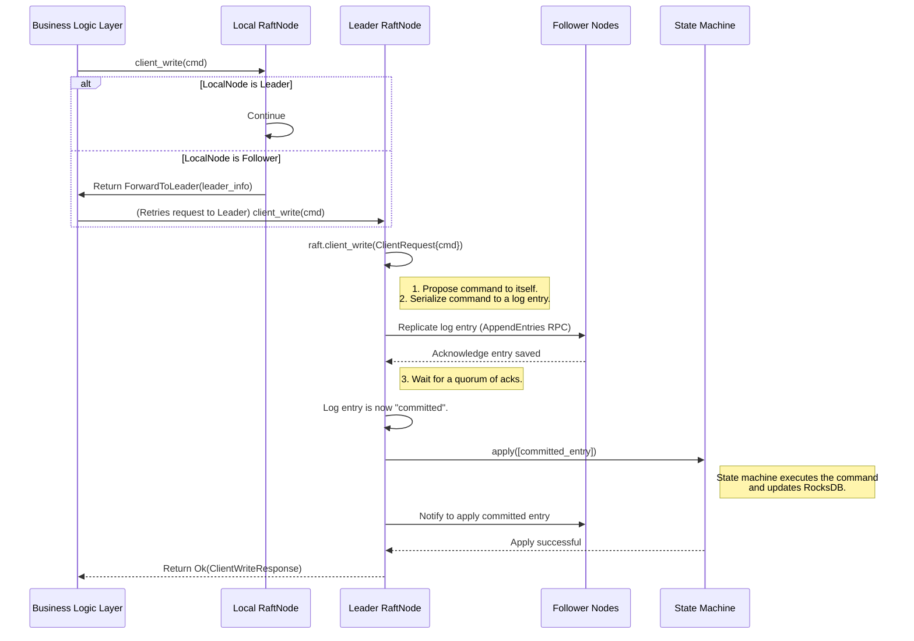

### **核心模块详细设计：核心共识层 (Core Consensus Layer)**

该模块负责实现 Raft 协议，管理集群成员，处理 Leader 选举，并安全地复制业务逻辑层提交的命令。它的正确性和性能对整个系统至关重要。

#### **1. 接口设计 (API Design)**

共识层的接口主要是供系统内部其他模块（主要是业务逻辑层和运维管理模块）调用的 Rust API。它不直接对外暴露网络接口。

##### **a) `RaftNode` - 核心服务接口**

我们将创建一个 `RaftNode` 结构体，它封装了 `openraft::Raft` 实例和所有与之相关的网络和服务。

```rust
// file: src/raft/node.rs
use openraft::{Raft, Config as RaftConfig};
use crate::{TypeConfig, RaftCommand, NodeId};

// RaftNode 封装了所有与Raft相关的状态和逻辑
pub struct RaftNode {
    // openraft 的核心实例
    pub raft: Raft<TypeConfig>,
    // ... 其他字段，如网络客户端、配置等
}

impl RaftNode {
    /// 创建并启动一个Raft节点。
    /// 这包括启动Raft内部任务和网络服务。
    pub async fn new(
        node_id: NodeId,
        config: Arc<RaftConfig>,
        store: Arc<Store>, // 状态机和Raft状态的存储
        // ... 其他依赖
    ) -> Result<Self, StartupError>;

    /// 客户端写请求入口。
    /// 业务逻辑层通过此方法提交一个命令以在集群中执行。
    /// 此方法会处理到Leader的转发。
    pub async fn client_write(&self, cmd: RaftCommand) -> Result<ClientWriteResponse, ClientWriteError>;

    /// 客户端读请求入口。
    /// 提供不同一致性级别的读。
    pub async fn client_read<R>(&self, req: R, level: ReadConsistency) -> Result<R::Response, ClientReadError>;

    /// 初始化一个新集群。
    /// 只有在集群未初始化时才能调用。
    pub async fn initialize(&self, members: BTreeMap<NodeId, Node>) -> Result<(), RaftError>;
    
    // --- 成员管理接口 (供运维模块调用) ---
    pub async fn add_learner(&self, node_id: NodeId, node: Node) -> Result<ClientWriteResponse, RaftError>;
    pub async fn change_membership(&self, members: BTreeSet<NodeId>) -> Result<ClientWriteResponse, RaftError>;

    /// 获取当前Leader的ID和地址。
    pub async fn current_leader(&self) -> Option<(NodeId, Node)>;
}
```

##### **b) `RaftNetwork` - Raft 内部网络接口**

`openraft` 需要一个实现了 `RaftNetwork` trait 的网络层来发送 Raft RPCs（如 `AppendEntries`, `Vote`）。

```rust
// file: src/raft/network.rs
use openraft::{RaftNetwork, AppendEntriesRequest, VoteRequest, InstallSnapshotRequest};

// 我们的网络层实现
pub struct NetworkManager { /* ... HTTP/gRPC client, etc. ... */ }

#[async_trait]
impl RaftNetwork<TypeConfig> for NetworkManager {
    async fn append_entries(&self, rpc: AppendEntriesRequest<TypeConfig>, option: RPCOption) -> Result<...>;
    async fn install_snapshot(&self, rpc: InstallSnapshotRequest<TypeConfig>, option: RPCOption) -> Result<...>;
    async fn vote(&self, rpc: VoteRequest<TypeConfig>, option: RPCOption) -> Result<...>;
}
```

---

#### **2. 出参入参设计 (Input/Output Parameter Design)**

##### **输入参数 (Inputs)**

1.  **`RaftNode::client_write(cmd: RaftCommand)`**:
    *   `cmd`: `RaftCommand` 枚举，包含了要被复制和应用的业务命令。

2.  **`RaftNode::initialize(members: BTreeMap<NodeId, Node>)`**:
    *   `members`: 包含所有初始成员 `NodeId` 和其网络地址 `Node` 的映射。

##### **输出参数 (Outputs)**

1.  **`RaftNode::client_write(...) -> Result<ClientWriteResponse, ClientWriteError>`**:
    *   `ClientWriteResponse`: `openraft` 提供的响应类型，通常包含了应用命令后的结果和 `log_id`。
    *   `ClientWriteError`: 包含了各种可能的错误，例如 `ForwardToLeader`（当前节点不是Leader，需要转发）、`Timeout`、`IoError` 等。

2.  **`RaftNode::current_leader(...) -> Option<(NodeId, Node)>`**:
    *   返回一个元组，包含当前 Leader 的 `NodeId` 和其地址信息。如果当前没有 Leader，则返回 `None`。

---

#### **3. 数据模型设计 (Data Model Design)**

共识层的核心数据模型由 `openraft` crate 定义，我们需要理解并配置它们。

##### **a) `TypeConfig` - Raft 类型配置**

这是 `openraft` 的核心泛型配置，它将我们应用层的类型与 `openraft` 的泛型关联起来。

```rust
// file: src/raft/types.rs
use openraft::{AppData, AppDataResponse};
use crate::{NodeId, Node, RaftCommand, ClientWriteResponse};

#[derive(Debug, Clone, Serialize, Deserialize)]
pub struct ClientRequest {
    // 我们将所有业务命令都封装在 RaftCommand 中
    pub command: RaftCommand,
}

impl AppData for ClientRequest {
    // 对于 openraft, 业务请求的响应是空的，因为
    // 业务逻辑的返回值是通过其他方式（如状态机查询）获得的。
    type Response = (); 
}

// 定义所有与 Raft 相关的类型
openraft::declare_raft_types!(
    pub TypeConfig:
        // 应用数据和响应
        D = ClientRequest,
        R = (), // AppDataResponse
        // 集群成员 ID
        NodeId = u64,
        // 集群节点信息
        Node = openraft::BasicNode,
        // 状态机快照数据
        SnapshotData = tokio::io::Cursor<Vec<u8>>,
);
```

##### **b) Raft 状态存储**

`openraft` 需要一个实现了 `RaftStorage` trait 的存储层。这个 trait 要求我们提供方法来读写 Raft 日志、状态机和快照。在我们的设计中，**`Store` 模块将同时实现 `RaftStateMachine` 和 `RaftStorage` 两个 trait**，因为它管理着所有需要持久化的数据。

---

#### **4. 核心流程设计 (Core Flow Design)**

##### **a) 客户端写流程 (Client Write Flow)**

这个流程展示了系统如何处理一个写请求，并处理了到 Leader 的转发。



##### **b) Leader 选举流程**

当 Leader 心跳超时或节点启动时，`openraft` 会自动触发选举。

```mermaid
graph TD
    A[Node's election timer expires] --> B{Become Candidate};
    B --> C{Increment current term};
    C --> D{Vote for self};
    D --> E{Send VoteRequest RPC to all other nodes};
    
    subgraph Other Nodes
        F[Receive VoteRequest]
        F --> G{Check if term is valid and haven't voted yet};
        G -- Yes --> H[Grant vote and reply];
        G -- No --> I[Reject vote and reply];
    end
    
    E --> F;
    H --> J{Candidate collects votes};
    I --> J;

    J --> K{Did I get a majority of votes?};
    K -- Yes --> L[Become Leader!];
    L --> M[Start sending heartbeats (empty AppendEntries)];
    K -- No --> N[Timeout, start new election round];
    N --> B;
```

---

#### **5. 关键逻辑详细说明 (Key Logic Details)**

##### **a) Raft 节点间的网络实现**

*   我们将使用 `reqwest` (for HTTP/1) 或 `tonic` (for gRPC/HTTP/2) 来实现 `RaftNetwork` trait。gRPC/HTTP/2 是更好的选择，因为它支持多路复用，可以避免头端阻塞，在高负载下性能更好。
*   每个节点都会启动一个 gRPC/HTTP 服务器来接收来自其他节点的 Raft RPCs。
*   `NetworkManager` 会为每个目标节点维护一个客户端连接，并使用它来发送 RPCs。
*   网络层必须处理超时、重试和连接错误，并将其转换为 `openraft` 能理解的错误类型（如 `RPCError::Unreachable`）。

##### **b) `client_write` 的转发逻辑**

`RaftNode::client_write` 的实现需要包含一个重试和转发循环。

```rust
// in impl RaftNode

pub async fn client_write(&self, cmd: RaftCommand) -> Result<...> {
    let mut retries = 3;
    loop {
        let res = self.raft.client_write(ClientRequest { command: cmd.clone() }).await;
        
        match res {
            Ok(response) => return Ok(response), // 成功
            Err(e) => {
                if let ClientWriteError::ForwardToLeader(fwd_err) = e {
                    if retries > 0 {
                        retries -= 1;
                        // 从 fwd_err.leader_node 中获取 Leader 地址
                        // 通过网络客户端向 Leader 重新发送请求
                        // ...
                        continue;
                    }
                }
                return Err(e.into()); // 其他错误或重试耗尽
            }
        }
    }
}
```

##### **c) `openraft` 配置 (`RaftConfig`)**

`RaftConfig` 是一个非常重要的结构体，它控制着 Raft 协议的所有时间参数和行为。
*   `election_timeout_min`, `election_timeout_max`: 选举超时时间，需要根据你的网络延迟来调整。
*   `heartbeat_interval`: Leader 发送心跳的间隔。
*   `snapshot_policy`: 快照策略，例如 `SnapshotPolicy::LogsSinceLast(5000)` 表示每当有 5000 条新日志时就触发一次快照。
*   `max_payload_entries`: 一次 `AppendEntries` RPC 中可以包含的最大日志条目数。

---

#### **6. 详细测试用例和测试方法 (Detailed Test Cases & Methods)**

`openraft` 自身已经有非常详尽的测试。我们的测试重点在于**我们对 `openraft` 的集成**是否正确。

##### **a) 单元测试**

*   **`test_type_config_serialization`**: 验证我们定义的 `ClientRequest` 等类型能被正确地序列化和反序列化。

##### **b) 集成测试 (通常需要一个多节点的测试框架)**

*   **`test_single_node_write_and_read`**: 在一个单节点集群上，验证 `client_write` 能成功，并且之后能从状态机中读到变更。
*   **`test_three_node_cluster_leader_election`**: 启动一个 3 节点集群，验证在短时间内能选举出一个 Leader。
*   **`test_write_to_follower_is_forwarded`**:
    1.  建立一个 3 节点集群，确定 Leader。
    2.  向一个 Follower 节点发送 `client_write` 请求。
    3.  验证请求最终被成功执行，并且数据在所有节点上都保持了一致。
*   **`test_leader_kill_and_re_election`**:
    1.  建立一个 3 节点集群。
    2.  强制 kill 掉 Leader 节点的进程。
    3.  验证剩下的两个节点能在短时间内选举出新的 Leader。
    4.  验证集群在新 Leader 下能继续正常处理写请求。
*   **`test_network_partition_and_recovery`**:
    1.  建立一个 5 节点集群。
    2.  使用网络工具（如 `iptables`）将集群分割成一个 3 节点的多数派和一个 2 节点的少数派。
    3.  验证多数派能选举出 Leader 并继续服务。
    4.  验证少数派无法选举出 Leader，也无法处理写请求。
    5.  恢复网络连接，验证少数派的节点能自动重新加入集群并同步数据。

---

#### **7. 设计依赖 (Dependencies)**

*   **`openraft`**: 核心的 Raft 实现库。
*   **State Machine & Storage (`Store`模块)**: 共识层需要一个实现了 `RaftStorage` trait 的存储后端。
*   **网络框架 (`tonic`, `reqwest`)**: 用于实现 `RaftNetwork`。
*   **业务逻辑层**: `client_write` 的调用方。
*   **运维管理模块**: `add_learner`, `change_membership` 等接口的调用方。

---

#### **8. 已知存在问题 (Known Issues)**

1.  **性能调优复杂性**: Raft 的性能高度依赖于时间参数、批处理大小和网络延迟。为特定部署找到最优配置需要大量的测试和调优。
2.  **日志无限增长**: 虽然有快照机制，但在高写入负载下，Raft 日志仍然可能增长得非常快，占用大量磁盘空间。需要有相应的磁盘监控和清理策略。
3.  **成员变更的安全性**: `change_membership` 是一个非常危险的操作。如果操作不当（例如，一次性移除超过半数的节点），可能会导致集群永久性地失去法定人数（Quorum），从而无法服务。

---

#### **9. 可迭代 Enhancement (Potential Enhancements)**

1.  **自适应批处理 (Adaptive Batching)**: 根据网络延迟和吞吐量，动态地调整 `max_payload_entries` 等批处理参数，以在不同负载下达到最优性能。
2.  **见证者节点 (Witness/Non-Voter Node)**: `openraft` 支持非投票成员。可以引入一个或多个“见证者”节点，它们接收日志副本并参与快照，但不参与选举投票。这可以在不增加选举复杂性的情况下，增加数据的冗余副本，或帮助仲裁（例如，在 2 节点集群中加入一个见证者，可以容忍一个节点宕机）。
3.  **Lease Reads 优化**: 实现一种基于租约（Lease）的读优化。Leader 在确认自己的 Leader 地位后，可以获得一个时间租约。在租约有效期内，它可以安全地服务读请求，而无需每次都与 Follower 通信来确认自己的 Leader 地位。这可以显著降低强一致性读的延迟。`openraft` 为实现此功能提供了基础。