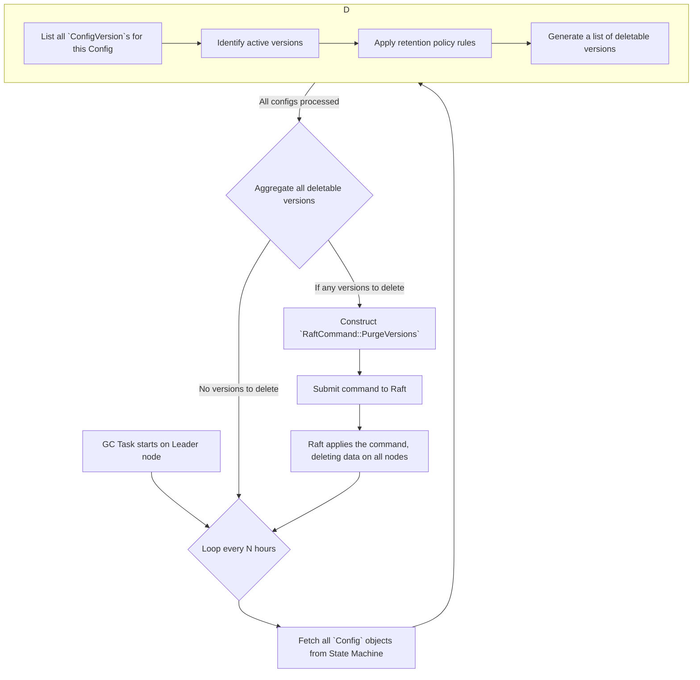
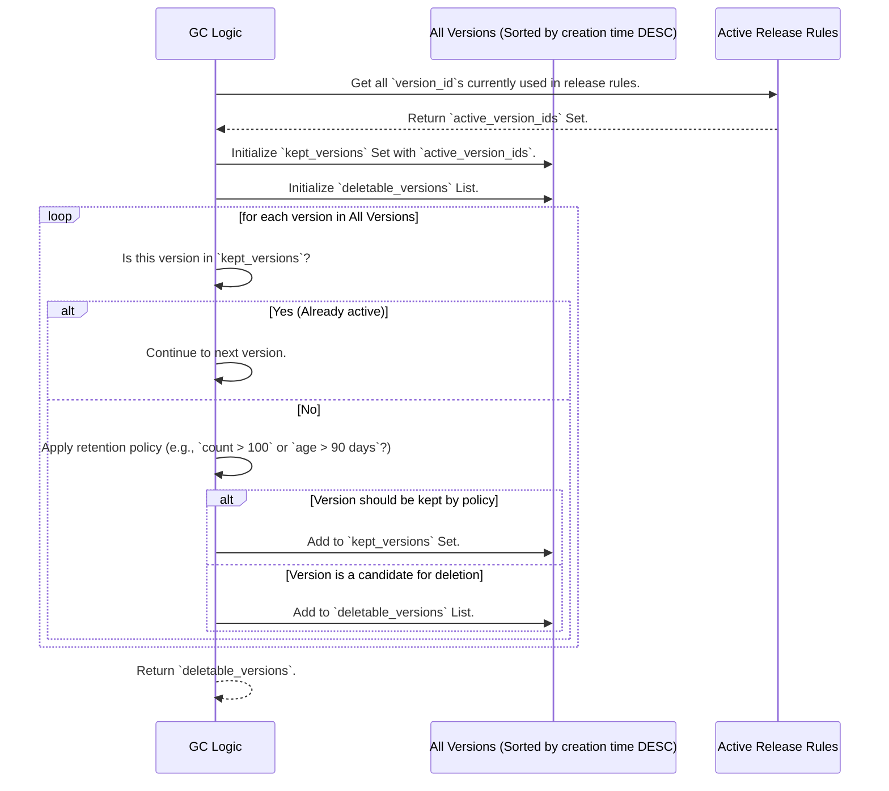

### **核心模块详细设计：数据生命周期管理与垃圾回收 (GC)**

该模块负责根据预设的策略，自动地、安全地清理和归档过时的配置版本。它的核心挑战在于，必须在回收空间和保留数据完整性（不删除任何正在被引用的版本）之间找到完美的平衡。

#### **1. 接口设计 (API Design)**

此模块的功能主要通过对现有 `Config` 资源的管理 API 进行扩展来暴露，并增加一些用于手动触发和监控 GC 的运维接口。

##### **a) 配置项管理 API 扩展**

`POST /configs` 或 `PUT /configs/{id}` API 的请求体中，将增加一个用于定义保留策略的字段。

```json
// 请求体扩展
{
  // ... 其他配置元数据，如 name, format, schema ...
  "retention_policy": {
    "strategy": "AND", // "AND" 或 "OR"
    "rules": [
      { "type": "count", "keep": 100 }, // 保留最近的100个版本
      { "type": "days", "keep": 90 }      // 保留最近90天的版本
    ]
  }
}
```

##### **b) GC 运维 API**

这些是供 SRE 使用的低层API，用于控制和监控 GC 过程。

| Endpoint | Method | Description |
| :--- | :--- | :--- |
| `/_cluster/gc` | `POST` | **手动触发**: 立即触发一轮全局的 GC 检查。 |
| `/_cluster/gc/status` | `GET` | **查看状态**: 获取 GC 服务的状态，如下次运行时间、上次运行结果等。 |
| `/_cluster/gc/configs/{id}` | `GET` | **预览**: 查看对于某个特定配置，如果现在运行 GC，哪些版本将会被删除。 |

---

#### **2. 出参入参设计 (Input/Output Parameter Design)**

##### **输入参数 (Inputs)**

1. **`retention_policy` 对象**:
    * `strategy`: `string` ("AND" | "OR") - 多个规则之间的逻辑关系。
        * `AND`: 一个版本必须同时满足**所有**规则才会被保留。
        * `OR`: 一个版本只要满足**任意一个**规则就会被保留。
    * `rules`: `array` - 规则列表。
        * `type`: `string` ("count" | "days")
        * `keep`: `integer` - 要保留的数量或天数。

##### **输出参数 (Outputs)**

1. **`GET /_cluster/gc/status`**:

    ```json
    {
      "service_status": "IDLE", // IDLE, RUNNING
      "last_run": {
        "timestamp": "...",
        "duration_seconds": 120.5,
        "result": "SUCCESS",
        "versions_deleted": 15230,
        "bytes_reclaimed": 528482300
      },
      "next_run_scheduled_at": "..."
    }
    ```

2. **`GET /_cluster/gc/configs/{id}/preview`**:

    ```json
    {
      "config_id": 123,
      "policy": { /* ... */ },
      "versions_to_be_deleted": [
        { "id": 5, "created_at": "..." },
        { "id": 4, "created_at": "..." }
      ],
      "versions_to_be_kept": [
        { "id": 10, "reason": "Kept by 'count' rule" },
        { "id": 9, "reason": "Kept by 'days' rule" },
        { "id": 8, "reason": "Currently active in a release" }
      ]
    }
    ```

---

<h4><ins>3. 数据模型设计 (Data Model Design)</ins></h4>

##### **a) `Config` 结构体扩展**

我们的核心 `Config` 结构体（在 Raft 状态机中管理）需要增加 `retention_policy` 字段。

```rust
// Raft State Machine (`Config` struct)
#[derive(Serialize, Deserialize, Debug, Clone)]
pub struct Config {
    // ... existing fields ...
    pub retention_policy: Option<RetentionPolicy>,
}

#[derive(Serialize, Deserialize, Debug, Clone)]
pub struct RetentionPolicy {
    pub strategy: RetentionStrategy,
    pub rules: Vec<RetentionRule>,
}

#[derive(Serialize, Deserialize, Debug, Clone)]
pub enum RetentionStrategy { AND, OR }

#[derive(Serialize, Deserialize, Debug, Clone)]
pub enum RetentionRule {
    Count(u32), // 保留 N 个
    Days(u32),  // 保留 N 天
}
```

##### **b) GC Raft 命令**

GC 的删除操作必须通过 Raft 共识来执行，以确保所有节点都删除相同的版本。

```rust
#[derive(Serialize, Deserialize, Debug, Clone)]
pub enum RaftCommand {
    // ... 其他命令 ...

    // 原子地删除一批过时的版本
    PurgeVersions {
        // Key: config_id, Value: 要删除的 version_id 列表
        versions_to_purge: BTreeMap<u64, Vec<u64>>,
    },
}
```

---

#### **4. 核心流程设计 (Core Flow Design)**

GC 流程由一个在 **Leader 节点**上运行的后台任务驱动。

##### **a) GC 主循环流程**



##### **b) 版本筛选逻辑 (核心算法)**

对于单个 `Config`，确定可删除版本的算法如下：



---

#### **5. 关键逻辑详细说明 (Key Logic Details)**

##### **a) GC 只在 Leader 上运行**

GC 任务是一个计算密集型（需要加载和分析大量元数据）和 I/O 密集型（最终发起写操作）的过程。为了避免重复工作和竞争，这个任务**只应该在 Raft 集群的 Leader 节点上运行**。

* 实现方式：在 `main` 循环中，可以定期检查 `raft.metrics().current().state()`。如果当前节点是 `Leader`，就确保 GC 的 `tokio::task` 正在运行；如果不是 Leader，就取消它。

##### **b) 安全性：绝不删除活跃版本**

算法的核心是，在应用任何保留策略之前，**第一步永远是识别并豁免所有正在被 `Config.releases` 字段引用的 `version_id`**。这确保了无论保留策略多么激进，都不会删除任何线上正在使用的配置，从而保证了系统的线上稳定性。

##### **c) `PurgeVersions` 命令的 `apply` 实现**

当状态机收到 `PurgeVersions` 命令时，它会：

1. 遍历 `versions_to_purge` map。
2. 为每个 `config_id` 和其下的 `version_id` 列表，创建一个 `WriteBatch`。
3. 在 `WriteBatch` 中，`delete_cf` 对应的 `ConfigVersion` 对象（在 `cf_state_machine` 列族中）。
4. 原子地提交 `WriteBatch`。
5. **注意:** 这个操作不需要更新 `Config` 对象本身，因为它只删除了历史版本，不影响 `latest_version_id` 或 `releases`。

##### **d) 数据归档 (Archiving)**

在执行删除之前，可以先将要删除的 `ConfigVersion` 对象归档。

1. 在 `PurgeVersions` 的 `apply` 逻辑中，在将版本从 RocksDB 删除**之前**，先读取该版本的内容。
2. 将该 `ConfigVersion` 对象序列化（例如，为 JSON）。
3. 将其异步地发送到一个外部归档服务或队列中。这个归档服务的责任是将数据写入到 S3 Glacier, BigQuery 等低成本存储中。
4. 这个发送操作应该是“fire-and-forget”，它的失败不应该阻塞 GC 的删除流程。

---

#### **6. 详细测试用例和测试方法 (Detailed Test Cases & Methods)**

##### **a) 单元测试**

* **`test_retention_policy_logic`**: 对版本筛选的核心算法进行详细的单元测试。
  * `test_count_rule`: 验证 `count: 10` 能正确保留最新的 10 个版本。
  * `test_days_rule`: 验证 `days: 30` 能正确保留 30 天内的版本。
  * `test_and_strategy`: 验证 `AND` 策略下，版本必须同时满足 count 和 days 规则才被保留。
  * `test_or_strategy`: 验证 `OR` 策略下，版本满足任一规则即被保留。
  * **`test_active_version_is_always_kept`**: 这是一个**关键测试**。设置一个非常旧的版本（例如 1 年前）为一个活跃的发布版本，然后运行一个激进的保留策略（保留 1 天）。断言这个旧的、活跃的版本**没有**被标记为可删除。

##### **b) 集成测试**

* **`test_gc_end_to_end`**:
    1. 创建一个 `Config` 并设置保留策略（例如，`count: 2`）。
    2. 创建 5 个版本 (v1, v2, v3, v4, v5)。
    3. 手动触发 `/cluster/gc` API。
    4. 等待 GC 完成。
    5. 调用 `GET /configs/{id}/versions`，验证只剩下 v4 和 v5。
    6. 直接检查底层 RocksDB，验证旧版本的数据确实已被删除。
* **`test_gc_preview_api`**: 在运行 GC 之前，调用 `GET /gc/configs/{id}/preview`，验证其返回的 `versions_to_be_deleted` 列表与实际将被删除的列表一致。

---

#### **7. 设计依赖 (Dependencies)**

* **Raft 状态机与存储**: GC 逻辑需要读取 `Config` 和 `ConfigVersion`，并最终通过 Raft 命令来删除数据。
* **Leader 选举机制**: GC 任务依赖于能够准确地识别当前 Leader。
* **(可选) 外部归档服务**: 如果需要实现数据归档。

---

#### **8. 已知存在问题 (Known Issues)**

1. **GC 性能影响**: 在拥有数百万配置和数亿版本的超大规模集群中，GC 的第一步“加载所有 Config 元数据”本身就可能是一个巨大的负担，可能导致 Leader 节点内存压力和 CPU 尖峰。
2. **“颠簸”问题 (Thrashing)**: 如果保留策略设置得非常接近版本的创建速率（例如，每分钟创建一个版本，但保留策略只保留 5 分钟的版本），GC 会非常频繁地运行和删除数据，造成不必要的 I/O 压力。
3. **时钟偏斜**: 基于天数的保留策略依赖于 `ConfigVersion` 的创建时间戳。如果集群节点的时钟不一致，可能会导致版本保留的实际天数与预期不符（尽管由 Leader 统一生成时间戳可以缓解这个问题）。

---

#### **9. 可迭代 Enhancement (Potential Enhancements)**

1. **增量式/分片式 GC (Incremental/Sharded GC)**:
    * 对于超大规模集群，不一次性加载所有 `Config`。GC 任务可以维护一个游标，每次只处理一小部分（例如 1000 个）`Config`。
    * 将 `PurgeVersions` 命令也进行分片，每次只删除一小批版本，以平滑 I/O 负载。
2. **GC 资源控制**:
    * 允许管理员配置 GC 任务的资源限制，例如“每秒最多删除 N 个版本”或“GC 期间的 I/O 带宽限制”，以减少对正常服务的影响。
3. **存储引擎层面的 TTL**:
    * 一些 K/V 存储（如 RocksDB 的 TTL Compaction Filter）支持为数据设置原生的 Time-To-Live (TTL)。
    * 我们可以探索一种更高级的模式：当一个版本不再活跃且超过了保留策略时，不是立即删除它，而是使用 `SetTTL` 命令为其设置一个 TTL（例如 24 小时）。底层的 RocksDB 会在下次 compaction 时自动、高效地清理这些过期数据。这可以把 GC 的删除压力从应用层转移到存储引擎的后台进程。
