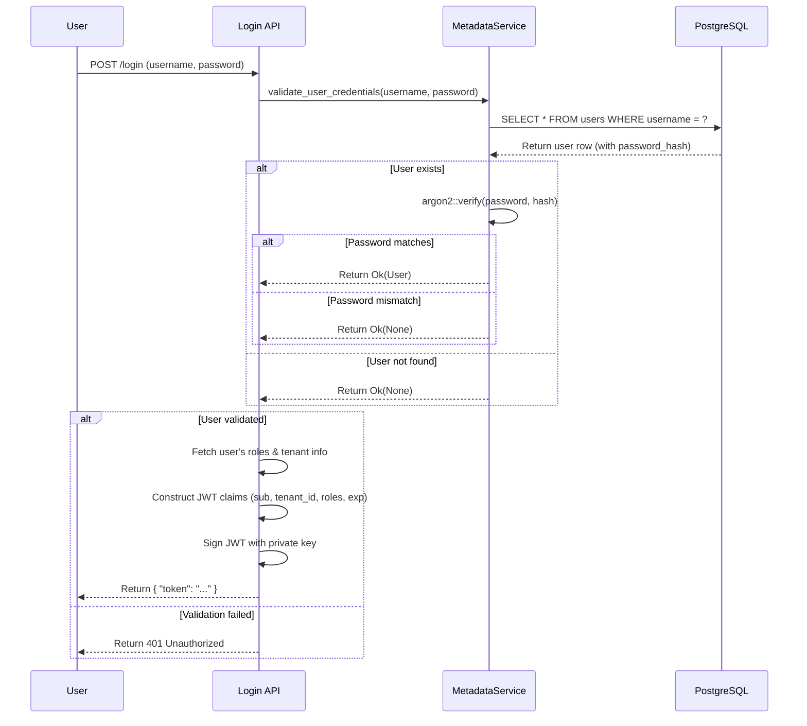
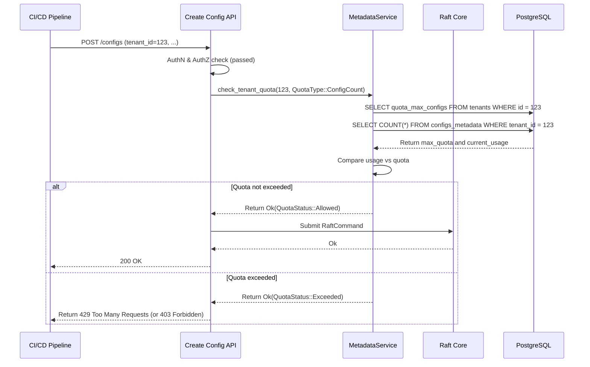

### **核心模块详细设计：元数据与账户管理 (Metadata & Account Management)**

该模块负责管理所有非配置内容的、关系性强的数据，包括租户、用户、角色、应用以及配额等。它使用一个独立的 PostgreSQL 数据库作为后端，并通过一组内部服务和外部 API 来暴露其功能。

#### **1. 接口设计 (API Design)**

此模块的接口分为两部分：供其他内部模块调用的 Rust 服务接口，以及供系统管理员使用的外部管理 API。

##### **a) 内部 Rust 服务接口 (`MetadataService`)**

这是一个 Rust `struct`，封装了数据库连接池和所有与元数据相关的业务逻辑。

```rust
// file: src/metadata/service.rs

#[derive(Clone)]
pub struct MetadataService {
    pool: PgPool,
}

impl MetadataService {
    pub fn new(pool: PgPool) -> Self;

    // --- Tenant Management ---
    pub async fn create_tenant(&self, name: &str, quotas: TenantQuotas) -> Result<Tenant, DbError>;
    pub async fn get_tenant_by_id(&self, id: i64) -> Result<Option<Tenant>, DbError>;
    pub async fn check_tenant_quota(
        &self, 
        tenant_id: i64, 
        quota_type: QuotaType
    ) -> Result<QuotaStatus, DbError>;

    // --- User Management ---
    pub async fn create_user(&self, username: &str, password: &str) -> Result<User, DbError>;
    pub async fn validate_user_credentials(&self, username: &str, password: &str) -> Result<Option<User>, DbError>;

    // --- Application Management ---
    pub async fn create_application(
        &self, 
        tenant_id: i64, 
        app_name: &str
    ) -> Result<Application, DbError>;
    pub async fn list_applications_for_tenant(&self, tenant_id: i64) -> Result<Vec<Application>, DbError>;
    
    // ... 其他元数据相关的业务逻辑
}
```

##### **b) 外部管理 API (RESTful HTTP)**

这些 API 用于超级管理员创建和管理租户、用户等。

| Endpoint | Method | Description |
| :--- | :--- | :--- |
| `/sa/tenants` | `POST` | (SuperAdmin) 创建一个新租户，并设置其配额。 |
| `/sa/tenants` | `GET` | (SuperAdmin) 列出所有租户。 |
| `/sa/tenants/{tenant_id}` | `GET` | (SuperAdmin) 查看特定租户的详情和用量。 |
| `/tenants/{tenant_id}/users` | `POST` | (TenantAdmin) 在租户下创建一个新用户。 |
| `/tenants/{tenant_id}/applications` | `POST` | (TenantAdmin) 在租户下注册一个新应用。 |

---

#### **2. 出参入参设计 (Input/Output Parameter Design)**

##### **输入参数 (Inputs)**

1.  **`POST /sa/tenants`**:
    ```json
    {
      "name": "new-customer-inc",
      "quotas": {
        "max_configs": 5000,
        "max_config_size_bytes": 204800,
        "max_api_requests_per_minute": 1000
      }
    }
    ```
2.  **`MetadataService::check_tenant_quota(...)`**:
    *   `tenant_id`: `i64`
    *   `quota_type`: `enum QuotaType { ConfigCount, ConfigSize(u32), ... }`

##### **输出参数 (Outputs)**

1.  **`GET /sa/tenants/{id}`**:
    ```json
    {
      "id": 123,
      "name": "new-customer-inc",
      "created_at": "...",
      "quotas": {
        "max_configs": 5000,
        // ...
      },
      "usage": {
        "current_config_count": 1250,
        // ...
      }
    }
    ```
2.  **`MetadataService::check_tenant_quota(...) -> Result<QuotaStatus, DbError>`**:
    *   `QuotaStatus`: `enum QuotaStatus { Allowed, Exceeded }`

---

#### **3. 数据模型设计 (Data Model Design)**

这里的核心是之前已经定义好的 PostgreSQL Schema。我们将在这里重申并细化它。

##### **a) PostgreSQL Schema (DDL)**

```sql
-- 租户表，增加配额字段
CREATE TABLE tenants (
    id BIGSERIAL PRIMARY KEY,
    name TEXT NOT NULL UNIQUE,
    created_at TIMESTAMPTZ NOT NULL DEFAULT NOW(),
    -- 配额定义
    quota_max_configs INT NOT NULL DEFAULT 1000,
    quota_max_config_size_bytes INT NOT NULL DEFAULT 102400,
    quota_max_api_requests_per_minute INT NOT NULL DEFAULT 120
);

-- 应用表，增加了描述
CREATE TABLE applications (
    id BIGSERIAL PRIMARY KEY,
    tenant_id BIGINT NOT NULL REFERENCES tenants(id) ON DELETE CASCADE,
    name TEXT NOT NULL,
    description TEXT,
    created_at TIMESTAMPTZ NOT NULL DEFAULT NOW(),
    UNIQUE(tenant_id, name)
);
CREATE INDEX idx_applications_tenant_id ON applications(tenant_id);

-- 用户表，增加了状态和元数据
CREATE TABLE users (
    id BIGSERIAL PRIMARY KEY,
    username TEXT NOT NULL UNIQUE,
    email TEXT UNIQUE,
    password_hash TEXT NOT NULL, -- 使用 Argon2 或 bcrypt
    is_active BOOLEAN NOT NULL DEFAULT TRUE,
    metadata JSONB, -- 可用于存储用户的额外信息
    created_at TIMESTAMPTZ NOT NULL DEFAULT NOW()
);

-- Casbin RBAC 规则表 (如果采用 Casbin 方案)
CREATE TABLE casbin_rule (
    id SERIAL PRIMARY KEY,
    ptype VARCHAR NOT NULL,
    v0 VARCHAR NOT NULL,
    v1 VARCHAR NOT NULL,
    v2 VARCHAR NOT NULL,
    v3 VARCHAR NOT NULL,
    v4 VARCHAR NOT NULL,
    v5 VARCHAR NOT NULL,
    CONSTRAINT unique_key UNIQUE (ptype, v0, v1, v2, v3, v4, v5)
);

-- 审计日志表，增加了更多索引和细节
CREATE TABLE audit_logs (
    id BIGSERIAL PRIMARY KEY,
    trace_id UUID,
    user_id BIGINT REFERENCES users(id) ON DELETE SET NULL,
    tenant_id BIGINT NOT NULL REFERENCES tenants(id) ON DELETE CASCADE,
    action rbac_action NOT NULL,
    resource TEXT NOT NULL,
    outcome VARCHAR(16) NOT NULL CHECK (outcome IN ('SUCCESS', 'FAILURE')),
    failure_reason TEXT,
    ip_address INET,
    user_agent TEXT,
    details JSONB,
    created_at TIMESTAMPTZ NOT NULL DEFAULT NOW()
);
CREATE INDEX idx_audit_logs_created_at ON audit_logs(created_at DESC);
CREATE INDEX idx_audit_logs_user_tenant_action ON audit_logs(user_id, tenant_id, action);
```

##### **b) Rust 结构体 (`sqlx` 映射)**

```rust
#[derive(sqlx::FromRow)]
pub struct Tenant {
    pub id: i64,
    pub name: String,
    pub created_at: DateTime<Utc>,
    pub quota_max_configs: i32,
    // ...
}

#[derive(sqlx::FromRow)]
pub struct User {
    pub id: i64,
    pub username: String,
    #[sqlx(rename = "password_hash")]
    pub password_hash: String,
    pub is_active: bool,
    // ...
}
```

---

#### **4. 核心流程设计 (Core Flow Design)**

##### **a) 用户登录与 JWT 签发流程**



##### **b) 配额检查流程**

配额检查发生在**进入 Raft 共识之前**，作为一个前置检查。



---

#### **5. 关键逻辑详细说明 (Key Logic Details)**

##### **a) 密码安全**

*   **Hashing:** 必须使用现代的、强密码哈希算法，如 `Argon2` (首选) 或 `bcrypt`。绝不能使用 MD5 或 SHA 系列算法。`Argon2` 能更好地抵抗 GPU 破解。
*   **Rust Crate:** 使用 `argon2` crate 来处理密码的哈希和验证。

##### **b) 数据库连接池管理**

*   `MetadataService` 持有一个 `sqlx::PgPool`。这是一个线程安全的连接池。
*   服务中的每个异步函数都会从池中获取一个连接来执行其数据库操作，操作完成后连接会自动返回池中。
*   连接池的大小（`max_connections`）是一个关键的性能调优参数。

##### **c) 审计日志的实现**

*   创建一个 Axum 中间件或在每个需要审计的 API handler 的末尾调用。
*   这个审计逻辑会收集请求的上下文（用户ID, 租户ID, IP地址, 资源, 操作, 结果），并将其异步地写入 `audit_logs` 表。
*   写入审计日志的操作应该是“fire-and-forget”，它的失败不应该影响主 API 请求的成功响应。可以将写入操作 `tokio::spawn` 到一个独立的任务中。

---

#### **6. 详细测试用例和测试方法 (Detailed Test Cases & Methods)**

##### **a) 单元测试**

*   **`test_password_hashing_and_verification`**: 验证 `create_user` 能生成正确的密码哈希，并且 `validate_user_credentials` 能对正确的和错误的密码进行验证。
*   **`test_quota_check_logic`**: 单元测试 `MetadataService` 中的配额比较逻辑。

##### **b) 集成测试 (需要一个测试数据库)**

*   **`test_create_tenant_and_user`**:
    1.  调用 `create_tenant`。
    2.  调用 `create_user`。
    3.  直接查询数据库，验证 `tenants` 和 `users` 表中存在正确的数据。
*   **`test_quota_exceeded_prevents_creation`**:
    1.  创建一个配额为 1 的租户。
    2.  成功创建一个配置。
    3.  尝试创建第二个配置。
    4.  验证 API 调用因为配额检查而失败，返回 429。
*   **`test_audit_log_is_created_on_action`**:
    1.  调用一个受审计的 API（例如，更新一个角色）。
    2.  查询 `audit_logs` 表，验证生成了一条包含正确信息的审计记录。

---

#### **7. 设计依赖 (Dependencies)**

*   **PostgreSQL**: 核心的持久化存储。
*   **`sqlx`**: Rust 数据库工具包。
*   **`argon2`**: 密码哈希库。
*   **`jsonwebtoken`**: JWT 的签发和验证。
*   **认证与授权模块**: `MetadataService` 是授权模块的数据源，同时登录流程又是认证的起点。

---

#### **8. 已知存在问题 (Known Issues)**

1.  **数据库单点故障 (SPOF)**: Raft 集群是高可用的，但 `Metadata DB` 在当前设计中是一个单点。如果 PostgreSQL 宕机，所有需要元数据（登录、权限检查、配额检查）的操作都会失败。
2.  **配额检查的竞争条件**: `check_tenant_quota` 中的“读-比较-写”操作不是原子的。在极高并发下，两个请求可能同时读取到 `usage < quota`，然后都成功创建了资源，导致最终的用量超过配额。
3.  **用量统计性能**: 计算 `current_config_count` 需要对 `configs_metadata` 表进行 `COUNT(*)`，当表非常大时，这个操作可能会很慢。

---

#### **9. 可迭代 Enhancement (Potential Enhancements)**

1.  **高可用的 PostgreSQL**: 在生产环境中，PostgreSQL 必须部署为高可用集群，例如使用流复制（Streaming Replication）和自动故障转移工具（如 Patroni, Stolon）。这是解决 SPOF 问题的标准方案。
2.  **原子化的配额更新**:
    *   **方案A (悲观锁):** 在事务中，使用 `SELECT ... FOR UPDATE` 来锁定 `tenants` 行，然后再进行用量检查和更新。这保证了原子性，但会降低并发性能。
    *   **方案B (原子减法):** 在 `tenants` 表中增加一个 `quota_remaining_configs` 字段。每次创建配置时，执行 `UPDATE tenants SET quota_remaining_configs = quota_remaining_configs - 1 WHERE id = ? AND quota_remaining_configs > 0`。如果 `UPDATE` 影响的行数为 1，则表示配额扣减成功。这是最高性能的原子化方案。
3.  **用量计数器/物化视图**:
    *   为了避免昂贵的 `COUNT(*)`，可以在 `tenants` 表中增加一个 `usage_config_count` 字段。
    *   使用数据库触发器 (Triggers)，在 `configs_metadata` 表发生 `INSERT` 或 `DELETE` 时，自动地增减这个计数器。
    *   这使得读取用量变成了一个 O(1) 的操作，极大地提升了配额检查的性能。