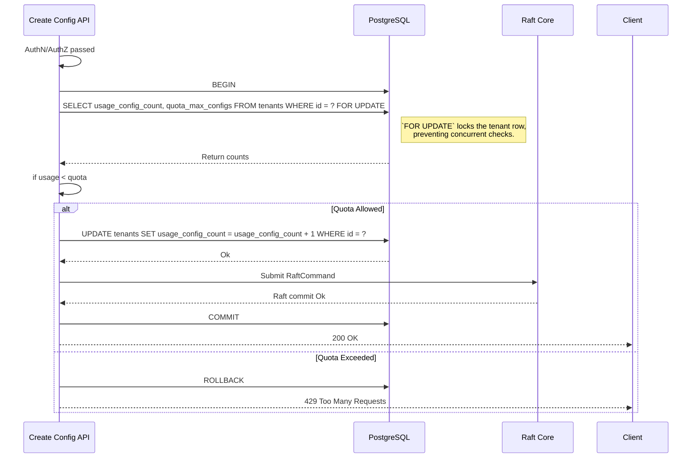
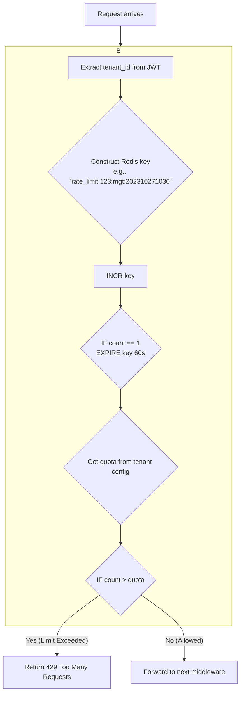

### **核心模块详细设计：多租户与配额管理**

该模块负责在共享的 Conflux 集群中，为不同的租户（客户、团队或项目）提供逻辑上隔离的、资源受限的环境。它确保了系统的公平性、稳定性和安全性，并为计费提供了数据基础。

#### **1. 接口设计 (API Design)**

此模块的接口主要体现在对现有 API 的**行为增强**和新增的**租户管理 API**上。

##### **a) 增强的现有 API**

所有现有的 API（如 `/configs`, `/apps`, `/roles` 等）现在都严格地以**租户**为作用域。URL 结构将强制体现这一点。

* **例如:** `POST /tenants/{tenant_id}/configs` (在租户下创建配置)
* **认证:** 调用这些 API 的 JWT 必须包含一个 `tenant_id` 声明，并且 Casbin/RLS 策略会使用这个 `tenant_id` 来进行严格的授权检查。

##### **b) 租户管理 API (SuperAdmin & TenantAdmin)**

这些 API 用于管理租户本身及其配额。

| Endpoint | Method | Role | Description |
| :--- | :--- | :--- | :--- |
| `/sa/tenants` | `POST` | SuperAdmin | 创建一个新租户，并设置其初始配额。 |
| `/sa/tenants` | `GET` | SuperAdmin | 列出系统中的所有租户。 |
| `/sa/tenants/{tenant_id}` | `GET` | SuperAdmin | 获取特定租户的详细信息，包括用量和配额。 |
| `/sa/tenants/{tenant_id}/quotas` | `PUT` | SuperAdmin | 更新一个租户的配额。 |
| `/tenants/{my_tenant_id}/status` | `GET` | TenantAdmin | 查看当前租户的配额和用量。 |

---

#### **2. 出参入参设计 (Input/Output Parameter Design)**

##### **输入参数 (Inputs)**

1. **`POST /sa/tenants`**:

    ```json
    {
      "name": "customer-b-llc",
      "admin_user": { // 可选，自动创建租户管理员
        "username": "customer-b-admin",
        "password": "a-strong-password"
      },
      "quotas": {
        "max_configs": 1000,
        "max_config_size_bytes": 102400,
        "max_versions_per_config": 50,
        "max_api_requests_per_minute": 600
      }
    }
    ```

2. **`PUT /sa/tenants/{id}/quotas`**:
    * 请求体与上面 `quotas` 对象相同。

##### **输出参数 (Outputs)**

1. **`GET /tenants/{my_tenant_id}/status`**:

    ```json
    {
      "tenant_id": "tenant-xyz",
      "quotas": {
        "max_configs": 1000,
        "max_api_requests_per_minute": 600
      },
      "usage": {
        "current_config_count": 250,
        "total_storage_bytes": 15320890,
        "api_requests_this_minute": 45
      }
    }
    ```

2. **配额超限时的响应**: 当任何操作因配额超限而被拒绝时，系统应返回 `429 Too Many Requests` 或 `403 Forbidden` (或 `413 Payload Too Large`)，并在响应体中明确指出原因。

    ```json
    {
      "error": "QuotaExceeded",
      "message": "Maximum number of configurations (1000) for this tenant has been reached."
    }
    ```

---

#### **3. 数据模型设计 (Data Model Design)**

##### **a) 元数据 DB (PostgreSQL) 扩展**

我们需要在 `tenants` 表中增加用量计数字段，以避免昂贵的实时计算。

```sql
CREATE TABLE tenants (
    id BIGSERIAL PRIMARY KEY,
    name TEXT NOT NULL UNIQUE,
    status VARCHAR(16) NOT NULL DEFAULT 'ACTIVE', -- ACTIVE, SUSPENDED
    created_at TIMESTAMPTZ NOT NULL DEFAULT NOW(),
    
    -- 配额定义
    quota_max_configs INT NOT NULL DEFAULT 1000,
    quota_max_config_size_bytes INT NOT NULL DEFAULT 102400,
    -- ... 其他配额

    -- 用量计数器 (由触发器维护)
    usage_config_count INT NOT NULL DEFAULT 0,
    usage_total_storage_bytes BIGINT NOT NULL DEFAULT 0
);
```

##### **b) 速率限制存储 (Redis)**

对于 API 速率限制这种需要高性能、带 TTL 的计数器场景，Redis 是比 PostgreSQL 更好的选择。

* **Key:** `rate_limit:{tenant_id}:{api_group}` (e.g., `rate_limit:123:mgt_api`)
* **Data Structure:** 使用 Redis 的 `INCR` 和 `EXPIRE` 命令来实现一个**固定窗口**或**滑动窗口**计数器。

---

#### **4. 核心流程设计 (Core Flow Design)**

##### **a) 写操作的配额检查流程 (以创建配置为例)**

这个流程必须是**原子化**的，以防止竞争条件。



**替代方案 (更高性能):** 如之前所述，使用 `UPDATE ... SET counter = counter - 1 WHERE ... counter > 0` 的原子减法，可以避免行锁，性能更好。

##### **b) API 速率限制中间件流程 (基于 Redis)**



##### **c) 用量计数器更新流程 (基于数据库触发器)**

这是保证用量数据与实际数据严格一致的最佳实践。

```sql
-- 创建一个函数，用于在 Config 创建/删除时更新计数器
CREATE OR REPLACE FUNCTION update_tenant_config_usage()
RETURNS TRIGGER AS $$
BEGIN
    IF (TG_OP = 'INSERT') THEN
        UPDATE tenants
        SET usage_config_count = usage_config_count + 1
        WHERE id = NEW.tenant_id;
        RETURN NEW;
    ELSIF (TG_OP = 'DELETE') THEN
        UPDATE tenants
        SET usage_config_count = usage_config_count - 1
        WHERE id = OLD.tenant_id;
        RETURN OLD;
    END IF;
    RETURN NULL;
END;
$$ LANGUAGE plpgsql;

-- 创建触发器，将其附加到存储Config元数据的表上
CREATE TRIGGER config_usage_trigger
AFTER INSERT OR DELETE ON configs_metadata -- 假设有这张表
FOR EACH ROW
EXECUTE FUNCTION update_tenant_config_usage();
```

---

#### **5. 关键逻辑详细说明 (Key Logic Details)**

##### **a) 资源隔离**

* **数据隔离:** 已由 Casbin/RLS 保证。
* **性能隔离 (部分实现):**
  * API 速率限制防止了一个租户通过大量请求耗尽服务器的 CPU 和网络资源。
  * `max_config_size_bytes` 配额防止了一个租户上传超大配置，消耗过多内存和磁盘。
  * **待解决:** 对于 CPU 密集型操作（如 Schema 校验），当前模型仍是共享的。

##### **b) 租户生命周期**

* **暂停 (Suspend):** 将 `tenants.status` 设置为 `SUSPENDED`。一个中间件会检查这个状态，如果租户被暂停，则拒绝所有 API 请求（除了可能的“重新激活/支付”API）。
* **删除 (Delete):** 删除一个租户是一个危险的、级联的操作。
    1. 首先，需要通过 Raft 命令，删除该租户在状态机中的所有数据（`Configs`, `ConfigVersions` 等）。
    2. 然后，在元数据数据库中，`ON DELETE CASCADE` 约束会自动清理所有关联的 `applications`, `roles` 等。
    3. 这是一个后台的、异步的、不可逆的操作。

---

#### **6. 详细测试用例和测试方法 (Detailed Test Cases & Methods)**

##### **a) 单元/集成测试**

* **`test_create_tenant_with_quotas`**: 验证 `POST /sa/tenants` 能正确创建租户并设置配额。
* **`test_atomic_quota_check`**: 设计一个并发测试，启动多个任务同时尝试创建配置，验证在达到配额上限时，只有一个任务能成功，其他的都失败。
* **`test_rate_limiter`**:
    1. 设置一个租户的速率限制为 5 req/min。
    2. 在一个循环中快速发送 6 个请求。
    3. 验证前 5 个返回 200，第 6 个返回 429。
    4. 等待 1 分钟，再发一个请求，验证返回 200。
* **`test_usage_trigger`**:
    1. 直接向数据库插入一条 `configs_metadata` 记录。
    2. 查询 `tenants` 表，验证 `usage_config_count` 自动增加了 1。
    3. 删除该记录，验证计数器自动减 1。

---

#### **7. 设计依赖 (Dependencies)**

* **元数据 DB (PostgreSQL)**: 存储租户和配额信息的核心。
* **缓存/K-V 存储 (Redis)**: (推荐) 用于实现高性能的速率限制。
* **Raft 状态机**: 需要提供接口来查询一个租户的实际用量（如果不用触发器方案）。
* **认证与授权模块**: 所有操作都必须先经过认证授权，才能进行配额检查。

---

#### **8. 已知存在问题 (Known Issues)**

1. **资源隔离不彻底**: 如前所述，CPU 和内存等计算资源仍然是共享的。一个行为不当的租户仍可能影响到其他租户的性能。
2. **计费数据不完整**: 当前的用量统计主要用于配额，对于按量计费（例如，按 API 调用次数计费），需要一个更精确、更可靠的计量管道，通常会把计量事件发送到专门的计费系统中。
3. **跨云厂商的速率限制**: 如果 Conflux 部署在多个数据中心，基于单个 Redis 实例的速率限制器会成为一个跨地域的瓶颈和单点故障。

---

#### **9. 可迭代 Enhancement (Potential Enhancements)**

1. **实现计算资源隔离**:
    * **请求队列:** 为每个租户或租户组（例如，免费用户 vs 企业用户）设置独立的请求处理队列。可以使用 `tower::buffer` 和 `tower::load_shed` 等中间件，确保一个租户的请求积压不会阻塞其他租户。
    * **专用工作池:** 对于 CPU 密集型操作，可以将其分派到不同的线程池。企业级租户的请求可以进入一个有更多线程的、更高优先级的池。
2. **企业级计费集成**:
    * 创建一个专门的“计量事件 (Metering Event)”总线（例如，使用 Kafka 或 AWS Kinesis）。
    * 系统中所有可计费的操作（API调用、配置创建、数据存储等）都会向这个总线发送一个详细的事件。
    * 一个独立的计费服务会消费这些事件，进行聚合、计算，并生成账单。这实现了计费与核心业务的解耦。
3. **分布式速率限制**:
    * 对于多地域部署，可以使用支持分布式的速率限制算法（例如，需要多个 Redis 节点之间进行通信），或者使用云厂商提供的分布式速率限制服务（如 AWS API Gateway 的使用计划）。
4. **租户自助服务门户**: 开发一个 UI 界面，让租户管理员可以自己查看用量、管理团队成员和角色，甚至升级他们的配额套餐。这大大减轻了超级管理员的负担。
