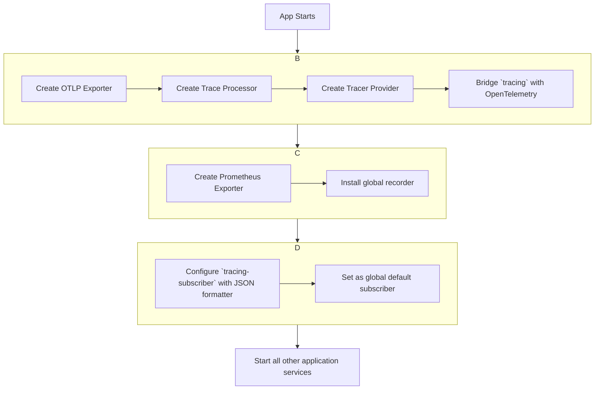
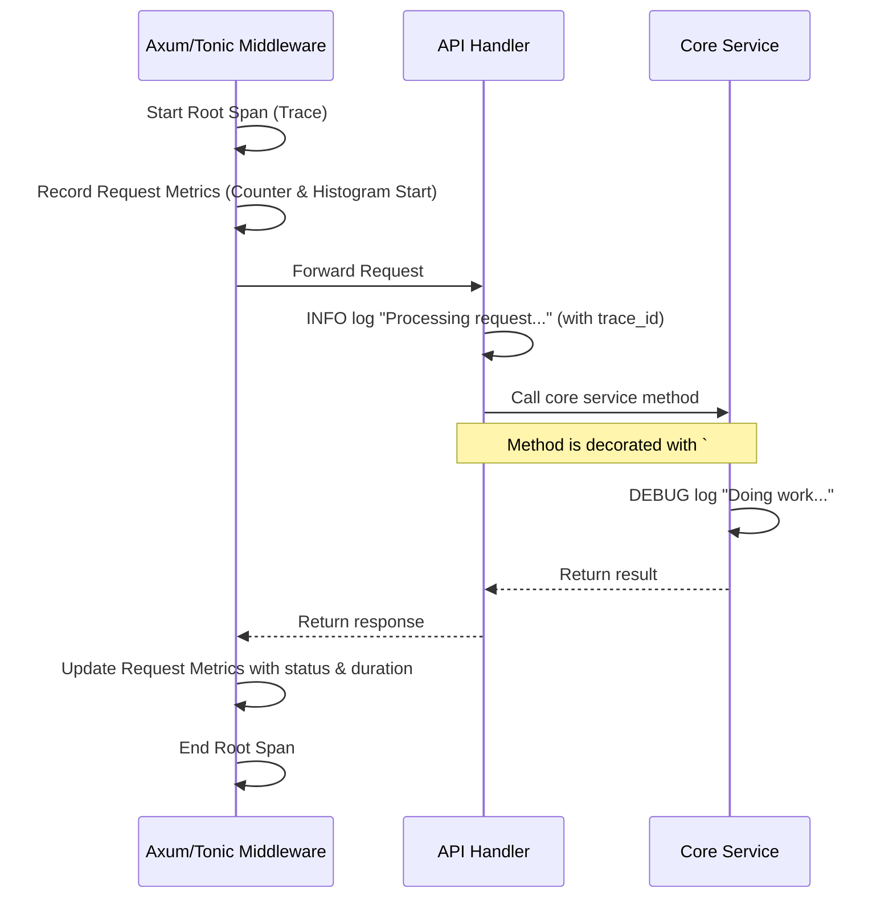

### **核心模块详细设计：可观测性 (Observability)**

该模块的目标是为 Conflux 提供全面、深入的洞察力，使其内部状态、性能和健康状况对开发者和运维人员完全透明。它包含三个核心支柱：**指标 (Metrics)**、**分布式追踪 (Distributed Tracing)** 和 **结构化日志 (Structured Logging)**。

#### **1. 接口设计 (API Design)**

可观测性模块主要通过暴露特定的网络端点来对外提供数据。

| Endpoint | Method | Description |
| :--- | :--- | :--- |
| `/metrics` | `GET` | **指标**: 暴露所有 Prometheus 格式的指标，供 Prometheus 服务器抓取。 |
| `/health` | `GET` | **健康检查 (Liveness Probe)**: 检查节点自身是否存活（例如，进程是否在运行，核心任务是否 panic）。 |
| `/ready` | `GET` | **就绪检查 (Readiness Probe)**: 检查节点是否已准备好接收流量。这个检查更深入。 |
| *(无特定端点)* | - | **追踪**: 追踪数据通过 OTLP (OpenTelemetry Protocol) 协议被持续推送到一个外部的 OpenTelemetry Collector。 |
| *(无特定端点)* | - | **日志**: 结构化日志被输出到 `stdout`/`stderr`，由容器运行时（如 Docker, containerd）收集，并转发给日志聚合系统（如 Loki, Splunk, ELK）。 |

---

#### **2. 出参入参设计 (Input/Output Parameter Design)**

##### **输入参数 (Inputs)**

* 此模块主要是输出数据，几乎没有输入参数。

##### **输出参数 (Outputs)**

1. **`GET /metrics`**:
    * **Content-Type:** `text/plain; version=0.0.4`
    * **Body:** Prometheus 文本格式的指标数据。

      ```text
      # HELP conflux_http_requests_total Total number of HTTP requests.
      # TYPE conflux_http_requests_total counter
      conflux_http_requests_total{method="POST",path="/v1/login",status="200"} 527
      # HELP conflux_raft_is_leader Whether this node is the Raft leader.
      # TYPE conflux_raft_is_leader gauge
      conflux_raft_is_leader 1
      # HELP conflux_raft_apply_duration_seconds Histogram of Raft state machine apply duration.
      # TYPE conflux_raft_apply_duration_seconds histogram
      conflux_raft_apply_duration_seconds_bucket{le="0.005"} 129
      ...
      ```

2. **`GET /health`**:
    * **成功:** 返回 `200 OK`，Body: `{ "status": "UP" }`。
    * **失败:** 返回 `503 Service Unavailable`。

3. **`GET /ready`**:
    * **成功:** 返回 `200 OK`，Body: `{ "status": "READY" }`。
    * **失败:** 返回 `503 Service Unavailable`。

---

#### **3. 数据模型设计 (Data Model Design)**

这里的“数据模型”指的是我们定义的**指标体系**和**日志/追踪的 Schema**。

##### **a) 指标体系 (Metrics Taxonomy)**

我们将遵循 RED (Rate, Errors, Duration) 和 USE (Utilization, Saturation, Errors) 等业界标准来命名指标。所有指标都以 `conflux_` 为前缀。

* **HTTP/gRPC 层 (RED):**
  * `conflux_http_requests_total` (Counter): `method`, `path`, `status`
  * `conflux_http_requests_duration_seconds` (Histogram): `method`, `path`
  * `conflux_grpc_requests_total` (Counter): `service`, `method`, `code`
  * `conflux_grpc_requests_duration_seconds` (Histogram): `service`, `method`
* **Raft 共识层:**
  * `conflux_raft_is_leader` (Gauge): `{}` (值为 1 或 0)
  * `conflux_raft_current_term` (Gauge): `{}`
  * `conflux_raft_last_applied_log_index` (Gauge): `{}`
  * `conflux_raft_replication_lag_bytes` (Gauge): `target_node_id` (衡量与 Leader 的差距)
  * `conflux_raft_snapshot_last_duration_seconds` (Gauge): `{}`
* **状态机与存储层:**
  * `conflux_raft_apply_duration_seconds` (Histogram): `{}`
  * `conflux_db_storage_size_bytes` (Gauge): `cf_name` (列族大小)
  * `conflux_db_cache_hit_ratio` (Gauge): `cache_name`
* **业务逻辑层:**
  * `conflux_authz_checks_total` (Counter): `result` ('allow', 'deny')
  * `conflux_configs_total` (Gauge): `tenant`
  * `conflux_watch_subscribers_total` (Gauge): `config_key`
  * `conflux_publish_proposals_total` (Counter): `status` ('pending', 'approved', 'executed')
* **运行时:**
  * `conflux_process_cpu_seconds_total` (Counter): `{}`
  * `conflux_process_resident_memory_bytes` (Gauge): `{}`

##### **b) 结构化日志 Schema (JSON)**

每一行日志都应是一个 JSON 对象，包含以下标准字段：

```json
{
  "timestamp": "2023-10-27T10:00:00.123Z",
  "level": "INFO",
  "service": "conflux",
  "version": "1.2.3",
  "message": "User login successful",
  "trace_id": "0x...", // OpenTelemetry Trace ID
  "span_id": "0x...",  // OpenTelemetry Span ID
  "target": "conflux::protocol::http::login", // Rust module path
  // --- 业务上下文 ---
  "tenant_id": "tenant-A",
  "user_id": "user-alice",
  "source_ip": "1.2.3.4"
}
```

##### **c) 分布式追踪 Span Attributes**

所有 Trace Span 都应包含标准化的属性，以符合 OpenTelemetry 语义约定。

* `service.name`, `service.version`
* `http.method`, `http.url`, `http.status_code`
* `db.system`, `db.statement`
* `conflux.tenant_id`, `conflux.user_id` (自定义属性)

---

#### **4. 核心流程设计 (Core Flow Design)**

##### **a) 初始化流程**

在 `main.rs` 中，需要在启动任何业务逻辑之前，首先初始化可观测性管道。



##### **b) 请求处理中的可观测性流程**



---

#### **5. 关键逻辑详细说明 (Key Logic Details)**

##### **a) `/ready` 就绪检查逻辑**

这个端点的 handler 需要执行一系列检查来确定节点是否真正准备好服务流量。

```rust
async fn readiness_check_handler(State(core_handle): State<CoreAppHandle>) -> StatusCode {
    // 1. 检查 Raft 状态
    let raft_state = core_handle.raft_node.raft.metrics().current().state();
    if raft_state == ServerState::Learner {
        // Learner 正在同步数据，未就绪
        return StatusCode::SERVICE_UNAVAILABLE;
    }

    // 2. 检查与 Leader 的同步情况 (如果自己不是 Leader)
    if raft_state == ServerState::Follower {
        let metrics = core_handle.raft_node.raft.metrics().current();
        if let Some(leader_metrics) = metrics.replication.get(&leader_id) {
            if metrics.last_applied.index < leader_metrics.matched.index.saturating_sub(100) {
                // 落后 Leader 超过 100 条日志，认为未就绪
                return StatusCode::SERVICE_UNAVAILABLE;
            }
        }
    }
    
    // 3. 检查与元数据数据库的连接
    if core_handle.metadata_service.pool.is_closed() {
        return StatusCode::SERVICE_UNAVAILABLE;
    }
    
    // 所有检查通过
    StatusCode::OK
}
```

##### **b) 使用 `tracing` crate**

`tracing` crate 是 Rust 生态的事实标准。我们将使用它的组合式 `Subscriber` 来同时处理日志、指标和追踪。

* **`tracing_subscriber::fmt`**: 用于格式化日志（可以配置为 `json()`）。
* **`tracing-opentelemetry`**: 将 `tracing` 的 Span 数据转换为 OpenTelemetry 格式并导出。
* **`metrics-tracing-context`**: (这是一个假设的或需要自己实现的库) 它会从 `tracing` 的 Span 中提取上下文（如 `http.path`）并将其附加到通过 `metrics` crate 记录的指标上。

##### **c) 技术选型**

* **指标:** `metrics` crate (facade) + `metrics-exporter-prometheus` (backend)。
* **追踪:** `tracing` crate (facade) + `opentelemetry` + `tracing-opentelemetry` + `opentelemetry-otlp` (backend)。
* **日志:** `tracing` crate + `tracing-subscriber` (with `json` formatter)。

---

#### **6. 详细测试用例和测试方法 (Detailed Test Cases & Methods)**

##### **a) 单元/集成测试**

* **`test_metrics_endpoint_exposes_data`**: 启动一个服务，调用几次 API，然后请求 `/metrics` 端点，断言响应体中包含了预期的指标（如 `conflux_http_requests_total`），并且值是正确的。
* **`test_health_endpoint_returns_ok`**: 验证 `/health` 在正常情况下返回 200。
* **`test_readiness_probe_logic`**:
  * 在节点处于 Learner 状态时，验证 `/ready` 返回 503。
  * 在节点成为同步的 Follower 后，验证 `/ready` 返回 200。
  * 模拟数据库连接断开，验证 `/ready` 返回 503。
* **`test_structured_log_output`**: 捕获 `stdout`，验证日志输出是合法的 JSON，并且包含了 `trace_id` 等关键字段。

##### **b) 端到端测试 (需要 Prometheus, Jaeger/Tempo, Loki)**

* **Golden Path Testing**: 运行一个完整的用户场景（例如，发布一个新配置），然后在：
  * **Grafana (Prometheus)**: 验证相关的请求速率、延迟和 Raft 指标图表有数据。
  * **Jaeger/Tempo**: 找到这个请求的 Trace，验证它包含了从 HTTP 入口到 Raft 提交的完整调用链。
  * **Loki**: 使用 `trace_id` 查询，验证能找到与该 Trace 相关的所有日志。

---

#### **7. 设计依赖 (Dependencies)**

* **外部系统**: Prometheus, OpenTelemetry Collector, Loki/ELK 等。
* **Rust Crates**: `tracing`, `metrics`, `opentelemetry`, `prometheus` 等相关生态库。
* **所有其他模块**: 可观测性模块需要深入到所有其他模块中去“埋点”，以收集数据。

---

#### **8. 已知存在问题 (Known Issues)**

1. **性能开销**: 开启全量的追踪和日志记录会带来一定的性能开销。高吞吐量场景下，需要对追踪进行采样，并可能需要调整日志级别。
2. **指标基数爆炸 (Cardinality Explosion)**: 如果在指标的标签 (label) 中使用了具有高基数的维（例如，`user_id`），会导致 Prometheus 存储的 series 数量爆炸，最终拖垮 Prometheus。必须仔细设计标签，只使用低基数的维度（如 `tenant_type`, `http_status_code`）。
3. **日志与追踪的关联**: 将 Raft 内部异步执行的 `apply` 操作的 Trace 与触发它的原始 `client_write` 请求的 Trace 关联起来，是一个具有挑战性的问题，可能需要在 `RaftCommand` 中手动传递 Trace 上下文。

---

#### **9. 可迭代 Enhancement (Potential Enhancements)**

1. **动态采样 (Dynamic Sampling)**: 实现一个更智能的追踪采样策略，例如，对出错的请求 100% 采样，对高延迟的请求增加采样率，而对正常的请求进行低概率采样。
2. **指标聚合代理 (Metrics Aggregation Agent)**: 在每个节点上部署一个聚合代理（如 `statsd` 或 OpenTelemetry Collector），让应用将指标发送给本地代理。代理负责聚合和预计算，然后再将聚合后的数据发送给中央 Prometheus，这可以有效降低主 Prometheus 的负载和指标基数。
3. **业务看板 (Business Dashboards)**: 在 Grafana 中创建专门的业务看板，用于可视化业务价值指标（如租户活跃度、配置采纳率、发布成功率等），而不仅仅是技术指标。这使得产品的价值对业务方也变得可见。
4. **自动化异常检测**: 将指标和日志数据流对接到一个支持异常检测的平台（如 `Elasticsearch Machine Learning`, `Prometheus anomly-detector`），自动发现性能衰退、错误率飙升等问题，并进行告警。
