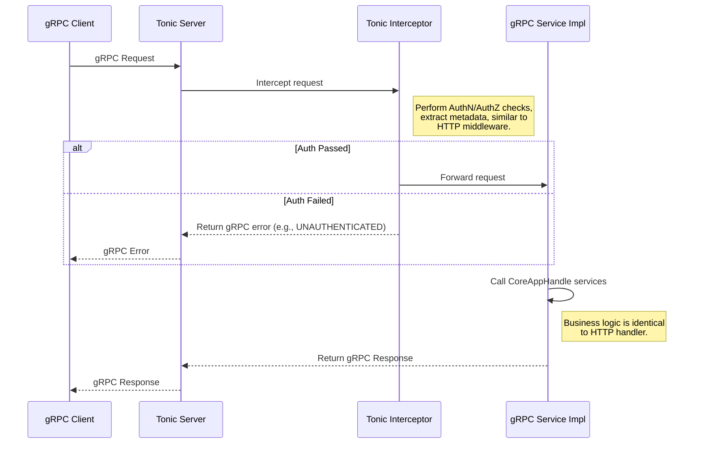

### **核心模块详细设计：协议层 (Protocol Layer)**

协议层的核心目标是解耦网络协议细节与核心业务逻辑。它通过一个插件化的架构，允许 Conflux 同时支持多种协议（如 HTTP/REST, gRPC），并能轻松地在未来添加更多协议（如 WebSocket, MQTT）。

#### **1. 接口设计 (API Design)**

此模块的接口设计分为两部分：定义插件契约的内部 `trait`，以及每个插件具体实现的外部网络接口。

##### **a) `ProtocolPlugin` Trait (内部插件契约)**

这是所有协议插件必须实现的 `trait`，它定义了插件的生命周期和与系统核心的交互方式。

```rust
// file: src/protocol/mod.rs
use std::sync::Arc;
use crate::app::CoreAppHandle; // 这是一个封装了所有核心服务的句柄

// 协议插件的配置
pub struct ProtocolConfig {
    pub listen_addr: String,
    // 其他特定于协议的配置，如TLS证书路径等
}

#[async_trait]
pub trait ProtocolPlugin: Send + Sync {
    /// 返回协议的唯一名称，例如 "http-rest", "grpc"。
    fn name(&self) -> &'static str;

    /// 启动协议服务。这是一个长时运行的异步任务。
    /// 它接收一个到应用核心的句柄，用于执行业务操作。
    ///
    /// # Arguments
    /// * `core_handle` - 包含了 RaftNode, MetadataService, AuthzService 等核心服务的句柄。
    /// * `config` - 此协议实例的配置。
    async fn start(&self, core_handle: CoreAppHandle, config: ProtocolConfig) -> anyhow::Result<()>;
}
```

##### **b) `CoreAppHandle` (核心服务句柄)**

这个结构体是解耦的关键。它将核心服务（如 Raft, DB 等）的句柄打包在一起，传递给插件，而不是让插件直接依赖具体的服务实现。

```rust
// file: src/app.rs

#[derive(Clone)]
pub struct CoreAppHandle {
    pub raft_node: Arc<RaftNode>,
    pub metadata_service: Arc<MetadataService>,
    pub authz_service: Arc<AuthzService>,
    pub watch_service: Arc<WatchService>,
    // ... 其他共享服务
}
```

##### **c) HTTP/REST API (由 `http` 插件实现)**

这是暴露给 Web UI、CLI 和普通 HTTP 客户端的接口。

| Endpoint | Method | Description |
| :--- | :--- | :--- |
| `/v1/login` | `POST` | 用户登录，获取 JWT |
| `/v1/fetch/configs/{tenant}/{app}/{env}/{name}` | `GET` | **客户端**: 拉取已发布的配置内容 |
| `/v1/mgt/configs/{...}/publish` | `POST` | **管理**: 原子化发布新版本 |
| `/v1/mgt/configs/{...}/rollback` | `POST` | **管理**: 一键回滚 |
| `/_cluster/nodes` | `POST` | **运维**: 添加集群节点 |
| `/_auth/roles/{...}/permissions` | `POST` | **授权**: 为角色添加权限 |

##### **d) gRPC API (由 `grpc` 插件实现)**

这是暴露给高性能、多语言 SDK 的接口。

```protobuf
// file: proto/conflux.v1.proto

// 配置拉取服务
service ConfigService {
  // 客户端拉取配置
  rpc FetchConfig(FetchConfigRequest) returns (FetchConfigResponse);
}

// 配置管理服务
service ManagementService {
  rpc PublishConfig(PublishConfigRequest) returns (PublishConfigResponse);
  rpc RollbackConfig(RollbackConfigRequest) returns (RollbackConfigResponse);
}

// 订阅服务 (在 Watch Service 设计中已详述)
service WatcherService {
  rpc Watch(WatchRequest) returns (stream ChangeEvent);
}

// ... 其他服务的 proto 定义
```

---

#### **2. 出参入参设计 (Input/Output Parameter Design)**

此模块的出入参就是其暴露的 HTTP 和 gRPC API 的请求/响应体。

* **HTTP:** 使用 JSON 作为主要的数据交换格式。请求头用于传递认证令牌 (`Authorization: Bearer ...`)和客户端标签 (`X-Client-Label-...`)。
* **gRPC:** 使用 Protobuf 进行序列化。元数据（`metadata`）用于传递认证令牌和客户端标签。

---

#### **3. 数据模型设计 (Data Model Design)**

协议层本身是**无状态的**。它的数据模型主要是 API 的请求/响应体结构，这些结构体通常定义在 `src/protocol/http/schemas.rs` 或 Protobuf 文件中，并使用 `serde` 或 `prost` 进行序列化。

**核心设计：插件注册与启动**

在应用主程序中，我们根据启用的 Cargo `features` 来动态地构建一个插件列表。

```rust
// file: src/main.rs

// 引入所有可能的插件实现
#[cfg(feature = "protocol-http")]
use crate::protocol::http::HttpProtocol;

#[cfg(feature = "protocol-grpc")]
use crate::protocol::grpc::GrpcProtocol;

fn main() {
    // ... 初始化 core_handle ...

    let mut plugins: Vec<Box<dyn ProtocolPlugin>> = Vec::new();

    // 根据 feature 编译时地添加插件实例
    #[cfg(feature = "protocol-http")]
    {
        plugins.push(Box::new(HttpProtocol));
        println!("HTTP protocol plugin enabled.");
    }
    #[cfg(feature = "protocol-grpc")]
    {
        plugins.push(Box::new(GrpcProtocol));
        println!("gRPC protocol plugin enabled.");
    }

    // 并行地启动所有已启用的插件
    let tasks = plugins.into_iter().map(|plugin| {
        let core_handle = core_handle.clone();
        // 从配置中读取该插件的配置
        let plugin_config = get_config_for_plugin(plugin.name()); 
        
        tokio::spawn(async move {
            if let Err(e) = plugin.start(core_handle, plugin_config).await {
                eprintln!("Protocol plugin '{}' failed: {}", plugin.name(), e);
            }
        })
    });
    
    // 等待所有插件任务完成 (实际上是永远等待)
    futures::future::join_all(tasks).await;
}
```

---

#### **4. 核心流程设计 (Core Flow Design)**

##### **a) HTTP 插件 (`axum`) 实现流程**

```mermaid
graph TD
    A[Request arrives at Axum server] --> B{Routing Layer};
    B --> C[AuthN Middleware (JWT)];
    C --> D[AuthZ Middleware (Casbin)];
    D --> E[RLS Context Middleware (Optional)];
    E --> F[API Handler];
    
    subgraph F [API Handler]
        F1[Extract Path, Query, Body] --> F2[Call CoreAppHandle services];
        F2 -- e.g., call metadata_service.create_app(...) --> F3;
        F2 -- e.g., call raft_node.client_write(...) --> F3;
        F3[Process service result] --> F4[Construct HTTP Response];
    end
    
    F4 --> G[Response sent to client];
```

##### **b) gRPC 插件 (`tonic`) 实现流程**



---

#### **5. 关键逻辑详细说明 (Key Logic Details)**

##### **a) 统一的中间件/拦截器逻辑**

HTTP 的 `axum::middleware` 和 gRPC 的 `tonic::Interceptor` 功能相似。为了避免代码重复，我们可以将核心的认证、授权、日志记录等逻辑实现在一个通用的函数中，然后为 Axum 和 Tonic 分别编写一个薄薄的适配器来调用它。

```rust
// file: src/protocol/shared_middleware.rs

// 通用检查逻辑
async fn universal_auth_check(
    auth_token: &str,
    core_handle: &CoreAppHandle,
    // ...其他所需信息
) -> Result<AuthContext, AppError> {
    // 1. 验证 JWT
    // 2. 调用 authz_service.check(...)
    // 3. 返回包含 user_id, tenant_id 的上下文
}
```

##### **b) 错误处理与转换**

核心服务（如 `MetadataService`, `RaftNode`）会返回它们自己的错误类型（`DbError`, `RaftError`）。协议层的 handler 负责捕获这些内部错误，并将它们转换为对客户端有意义的 HTTP 状态码或 gRPC 状态码。

```rust
// Axum handler 中
match core_handle.do_something().await {
    Ok(data) => Ok(Json(data)),
    Err(AppError::NotFound) => Err(StatusCode::NOT_FOUND),
    Err(AppError::PermissionDenied) => Err(StatusCode::FORBIDDEN),
    Err(AppError::DatabaseError(_)) => Err(StatusCode::INTERNAL_SERVER_ERROR),
    // ...
}
```

##### **c) CPU 密集型任务的处理**

如果某个请求需要进行 CPU 密集型操作（例如，校验一个非常大的配置文件 Schema），直接在 `tokio` 的主事件循环中执行会阻塞其他所有请求。协议层的 handler 必须将这类操作包裹在 `tokio::task::spawn_blocking` 中，将其移交给一个专门的阻塞线程池来处理。

---

#### **6. 详细测试用例和测试方法 (Detailed Test Cases & Methods)**

##### **a) 单元测试**

* **`test_http_schema_validation`**: 测试 HTTP 请求/响应体的序列化和反序列化。
* **`test_error_mapping`**: 单元测试错误转换逻辑，确保内部错误能正确映射到 HTTP/gRPC 状态码。

##### **b) 集成/API 测试 (使用 `reqwest` 和 `tonic-build` 的客户端)**

* **`test_unauthenticated_request_is_rejected`**: 验证不带 token 的请求返回 401 或 `UNAUTHENTICATED`。
* **`test_unauthorized_request_is_rejected`**: 验证带了 token 但无权限的用户请求返回 403 或 `PERMISSION_DENIED`。
* **`test_http_fetch_config_success`**: 完整的端到端测试，从登录获取 token 到拉取一个配置。
* **`test_grpc_publish_config_success`**: 完整的端到端测试，通过 gRPC 客户端发布一个新配置。
* **`test_plugin_loading_logic`**: 在 `main.rs` 的测试中，根据不同的 feature flags，验证 `plugins` 向量中包含了正确的 `ProtocolPlugin` 实例。

---

#### **7. 设计依赖 (Dependencies)**

* **所有核心服务 (`CoreAppHandle`)**: 协议层是所有核心服务的“门面”，重度依赖它们。
* **`axum`**: HTTP 插件的实现基础。
* **`tonic`**: gRPC 插件的实现基础。
* **`serde`**: 用于 JSON 序列化。
* **`prost`, `tonic-build`**: 用于 Protobuf 的代码生成和序列化。
* **Cargo `features`**: 用于实现插件化的编译时开关。

---

#### **8. 已知存在问题 (Known Issues)**

1. **代码重复风险**: 如果不加以注意，HTTP 和 gRPC 的 handler 之间可能会出现大量重复的业务逻辑代码。必须通过 `CoreAppHandle` 和共享的服务层来强制逻辑复用。
2. **配置管理的复杂性**: 同时支持多种协议意味着需要管理多种配置文件（`config.toml` 中需要有 `[protocol.http]` 和 `[protocol.grpc]` 等多个部分）。
3. **API 版本控制**: 当前设计是 `v1`。当需要引入不兼容的 API 变更时，需要一套清晰的版本管理策略（例如，通过 URL 路径 `/v2/...` 或 gRPC 的 package `conflux.v2`）。

---

#### **9. 可迭代 Enhancement (Potential Enhancements)**

1. **统一 API 网关 (Unified API Gateway)**: 对于非常复杂的系统，可以引入一个专门的 API Gateway（如 `Envoy`, `Kong`），而不是在应用进程内实现所有协议。Conflux 只需提供一个内部的 gRPC 服务，API Gateway 负责将其暴露为 HTTP/REST, GraphQL 等多种协议，并处理认证、速率限制等通用逻辑。这可以进一步简化 Conflux 自身的代码。
2. **OpenAPI / gRPC-Gateway 集成**:
    * 为 HTTP API 编写 OpenAPI (Swagger) 规范，并使用工具（如 `utoipa`）自动生成文档。
    * 使用 `gRPC-Gateway` 或类似的工具，根据 Protobuf 定义自动生成一个反向代理，将 RESTful JSON API 翻译成 gRPC 调用。这可以让你只需维护一套 Protobuf 定义，就能同时获得 gRPC 和 HTTP/JSON 两种接口，极大地减少了代码重复。
3. **运行时插件系统 (WASM)**: 这是对当前编译时插件模型的重大升级。允许在运行时动态加载新的协议插件（编译为 WebAssembly 模块）。这提供了极致的灵活性，但会引入 FFI 开销、安全沙箱和 ABI 稳定性等新的复杂性。对于大多数场景，编译时插件是更稳健的选择。
