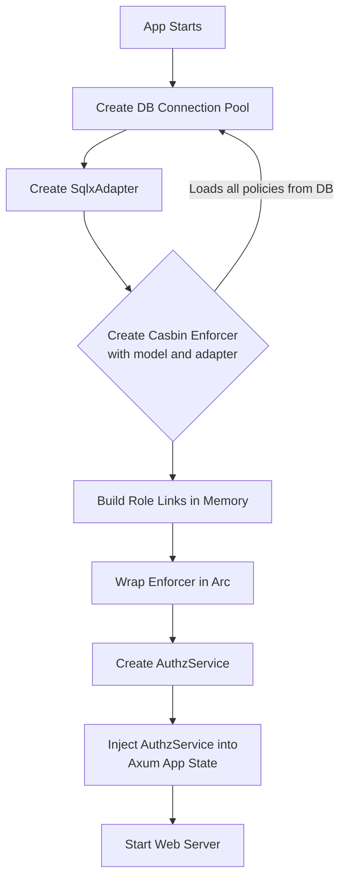
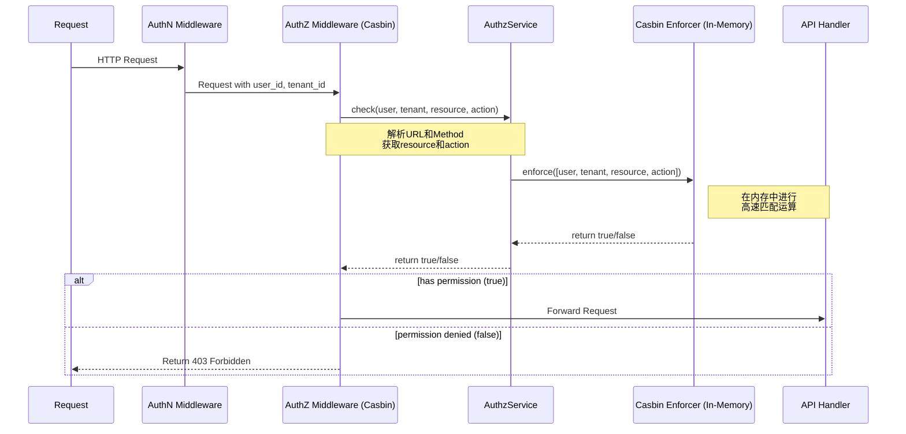
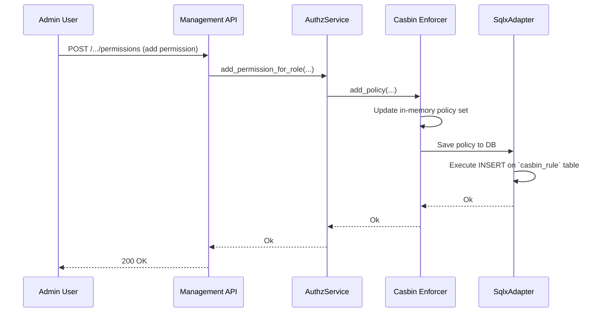

# **核心模块详细设计：基于 `casbin-rs` 的 RBAC 授权模块**

该模块负责为 Conflux 提供灵活、可扩展且与业务逻辑解耦的访问控制。它将使用 `casbin-rs` 作为核心引擎，将授权决策逻辑从应用代码中分离出来。

## **1. 接口设计 (API Design)**

与 RLS 方案不同，`casbin-rs` 方案需要在应用层提供明确的 API 来管理权限。

### **a) 内部 Rust API**

模块的核心是一个 `AuthzService` 结构体，它封装了 `casbin::Enforcer`。

```rust
// file: src/auth/service.rs
use casbin::{Enforcer, Result as CasbinResult};
use std::sync::Arc;

// 封装了Enforcer，并提供更符合业务的接口
#[derive(Clone)]
pub struct AuthzService {
    enforcer: Arc<Enforcer>,
}

impl AuthzService {
    /// 创建一个新的AuthzService实例。
    pub async fn new(db_pool: PgPool) -> CasbinResult<Self>;

    /// 核心检查函数：检查一个用户在特定租户下是否有权对资源执行操作。
    pub async fn check(
        &self,
        user_id: &str,
        tenant: &str,
        resource: &str,
        action: &str,
    ) -> CasbinResult<bool>;

    // --- 策略管理接口 ---
    pub async fn add_permission_for_role(
        &self,
        role: &str,
        tenant: &str,
        resource: &str,
        action: &str,
    ) -> CasbinResult<bool>;

    pub async fn remove_permission_for_role(/*...*/) -> CasbinResult<bool>;
    
    // --- 角色管理接口 ---
    pub async fn assign_role_to_user(
        &self,
        user_id: &str,
        role: &str,
        tenant: &str,
    ) -> CasbinResult<bool>;

    pub async fn revoke_role_from_user(/*...*/) -> CasbinResult<bool>;

    // ... 其他管理接口，如获取用户的角色，获取角色的权限等
}
```

### **b) 外部管理 API (RESTful HTTP)**

这些 API 用于管理员或 CI/CD 工具来管理权限。

| Endpoint | Method | Description |
| :--- | :--- | :--- |
| `POST /_auth/check` | `POST` | (内部调试用) 检查一个权限 |
| `/tenants/{tenant}/roles` | `GET` | 列出租户下的所有角色 |
| `/tenants/{tenant}/roles/{role}/permissions` | `POST` | 为角色添加权限 |
| `/tenants/{tenant}/roles/{role}/permissions` | `DELETE` | 移除角色的权限 |
| `/tenants/{tenant}/users/{user_id}/roles` | `GET` | 查看用户在租户下的角色 |
| `/tenants/{tenant}/users/{user_id}/roles` | `POST` | 为用户分配角色 |
| `/tenants/{tenant}/users/{user_id}/roles/{role}` | `DELETE` | 撤销用户的角色 |

---

#### **2. 出参入参设计 (Input/Output Parameter Design)**

##### **输入参数 (Inputs)**

1. **`AuthzService::check(...)`**:
    * `user_id`: `&str` - 发起请求的用户唯一标识。
    * `tenant`: `&str` - 请求所属的租户。
    * `resource`: `&str` - 被访问的资源路径，例如 `"/apps/my-app/envs/prod/configs/db.toml"`。
    * `action`: `&str` - 执行的操作，例如 `"read"`, `"write"`。

2. **`POST /tenants/{t}/roles/{r}/permissions`**:
    * Path Params: `t`, `r`
    * Body: `{"resource": "/apps/my-app/*", "action": "read"}`

##### **输出参数 (Outputs)**

1. **`AuthzService::check(...) -> CasbinResult<bool>`**:
    * 返回一个 `CasbinResult`，成功时包含一个布尔值表示是否有权限。

2. 管理 API 在成功时返回 `200 OK` 或 `204 No Content`，并可能在 `GET` 请求中返回 JSON 数据。失败时返回 `4xx` 或 `5xx` 错误。

---

#### **3. 数据模型设计 (Data Model Design)**

##### **a) Casbin 访问控制模型 (`model.conf`)**

这是设计的核心，定义了授权的结构。我们将采用一个支持租户(domain)的 RBAC 模型。

```ini
# 文件: src/auth/model.conf

[request_definition]
# 请求格式: subject(用户), domain(租户), object(资源), action(操作)
r = sub, dom, obj, act

[policy_definition]
# 策略格式: subject(角色), domain(租户), object(资源), action(操作)
p = sub, dom, obj, act

[role_definition]
# 角色继承/用户角色映射: user, role, domain(租户)
# 含义: 用户(user)在指定的租户(domain)内，被授予某个角色(role)
g = _, _, _

[policy_effect]
# 效果: 只要有一条策略允许，就允许
e = some(where (p.eft == allow))

[matchers]
# 匹配器:
# 1. 检查用户(r.sub)在租户(r.dom)下是否拥有角色(p.sub) -> g(r.sub, p.sub, r.dom)
# 2. 检查请求的租户是否与策略的租户匹配 -> r.dom == p.dom
# 3. 检查请求的资源是否匹配策略的资源模式 -> keyMatch2(r.obj, p.obj)
# 4. 检查请求的操作是否匹配策略的操作 -> r.act == p.act
m = g(r.sub, p.sub, r.dom) && r.dom == p.dom && keyMatch2(r.obj, p.obj) && r.act == p.act
```

* `keyMatch2` 是一个内置函数，支持 `/path/*` 风格的通配符。

##### **b) 持久化存储 (PostgreSQL)**

我们使用 `casbin-sqlx-adapter`，它会自动处理数据库的读写。

* **数据库表:** 只需要一张由 adapter 创建的 `casbin_rule` 表。
* **我们原有的** `permissions` 和 `user_roles` 表**将被废弃**。`roles` 表可以保留，用于存储角色的描述等元数据，但不再参与核心的授权逻辑。

**`casbin_rule` 表中的数据示例:**

* 一条权限策略：
    `ptype='p', v0='admin', v1='tenant-A', v2='/apps/*', v3='write', v4='', v5=''`
* 一条用户角色分配：
    `ptype='g', v0='user-alice', v1='admin', v2='tenant-A', v3='', v4='', v5=''`

---

#### **4. 核心流程设计 (Core Flow Design)**

##### **a) 应用启动与服务初始化流程**



##### **b) 授权检查中间件流程**



##### **c) 权限变更流程**



---

#### **5. 关键逻辑详细说明 (Key Logic Details)**

##### **a) `AuthzService` 的实现**

```rust
// file: src/auth/service.rs
pub struct AuthzService {
    enforcer: Arc<Enforcer>,
}

impl AuthzService {
    pub async fn new(db_pool: PgPool) -> CasbinResult<Self> {
        let adapter = SqlxAdapter::new(db_pool, 8).await?;
        let mut enforcer = Enforcer::new("src/auth/model.conf", adapter).await?;
        
        // 关键：构建角色之间的继承关系，对于RBAC模型是必须的
        enforcer.build_role_links()?;
        
        Ok(Self { enforcer: Arc::new(enforcer) })
    }

    pub async fn check(&self, user_id: &str, tenant: &str, resource: &str, action: &str) -> CasbinResult<bool> {
        self.enforcer.enforce((user_id, tenant, resource, action))
    }
    
    // 示例：添加权限
    pub async fn add_permission_for_role(&self, role: &str, tenant: &str, resource: &str, action: &str) -> CasbinResult<bool> {
        let rules = vec![
            vec![role.to_string(), tenant.to_string(), resource.to_string(), action.to_string()]
        ];
        // add_policies 会同时更新内存和数据库
        self.enforcer.add_policies(rules).await
    }
}
```

##### **b) 策略热更新 (Policy Hot-Reload)**

`casbin-rs` 的一个重要问题是，如果多个 Conflux 节点实例运行，一个节点通过 `Enforcer` API 修改了策略（从而更新了数据库），其他节点的内存中的 `Enforcer` 实例并不会知道这个变更。

**解决方案：基于 Pub/Sub 的策略同步器**

1. **引入 Pub/Sub:** 使用 Redis Pub/Sub 或 PostgreSQL 的 `NOTIFY`/`LISTEN` 机制。
2. **发布通知:** 当一个 `AuthzService` 实例调用一个写操作（如 `add_policy`）时，在成功后，它会向一个特定的 channel (e.g., `"casbin_policy_updated"`) 发布一条消息。
3. **订阅与重载:** 每个 Conflux 节点在启动时，都会启动一个后台任务，订阅这个 channel。当收到消息时，该任务会调用 `enforcer.load_policy().await`。
4. **`load_policy()`**: 这个方法会清空 `Enforcer` 的内存策略集，然后从数据库中重新加载所有策略。

这个机制保证了整个集群的 `Enforcer` 实例能在短时间内达到最终一致。

---

#### **6. 详细测试用例和测试方法 (Detailed Test Cases & Methods)**

##### **a) 单元测试 (`/tests/authz_unit.rs`)**

* **`test_model_and_policy`**: 使用内存中的 Adapter (`MemoryAdapter`) 来测试核心的 RBAC 逻辑。
    1. 手动加载模型和一些测试策略。
    2. `test_admin_can_write`: 断言 `enforce(("alice", "tenant-A", "/app/1", "write"))` 为 `true`。
    3. `test_developer_cannot_write`: 断言 `enforce(("bob", "tenant-A", "/app/1", "write"))` 为 `false`。
    4. `test_cross_tenant_access_denied`: 断言 `enforce(("alice", "tenant-B", "/app/1", "read"))` 为 `false`。
    5. `test_keymatch_logic`: 验证 `keyMatch2` 的通配符行为。

##### **b) 集成测试**

* **`test_api_permission_denied`**:
    1. 启动一个完整的 Conflux 实例。
    2. 通过管理 API 设置一个低权限用户。
    3. 使用该用户的 token 调用一个需要高权限的 API。
    4. 断言返回 `403 Forbidden`。
* **`test_add_permission_is_effective_immediately`**:
    1. 创建一个用户，初始时没有权限访问某资源，并验证返回 403。
    2. 通过管理 API 为该用户的角色添加相应权限。
    3. 再次调用之前的 API，断言现在返回 `200 OK`。
* **`test_policy_hot_reload_across_nodes` (高级)**:
    1. 启动两个 Conflux 节点实例 (Node A, Node B)。
    2. 在 Node A 上为一个用户添加权限。
    3. (需要 Pub/Sub 机制) 等待一小段时间。
    4. 向 Node B 发送一个请求，验证新添加的权限在 Node B 上也已生效。

---

#### **7. 设计依赖 (Dependencies)**

* **`casbin`**: 核心授权引擎。
* **`casbin-sqlx-adapter`**: 用于将策略持久化到 PostgreSQL。
* **`sqlx`**: Rust SQL 工具包。
* **Axum**: Web 框架，用于实现中间件和管理 API。
* **认证模块**: 提供可靠的 `user_id` 和 `tenant` 信息。
* **Pub/Sub 系统 (如 Redis, or `postgres-notify`)**: (可选但推荐) 用于实现策略的热重载。

---

#### **8. 已知存在问题 (Known Issues)**

1. **启动性能**: 如果 `casbin_rule` 表中有数百万条规则，应用启动时首次调用 `Enforcer::new` 会很慢，因为它需要将所有规则加载到内存。
2. **策略同步延迟**: 基于 Pub/Sub 的热重载机制存在延迟。在消息传播和节点重载策略期间（通常是毫秒到秒级），集群中不同节点的授权决策可能短暂不一致。
3. **规则管理的复杂性**: 随着规则增多，直接通过 API 管理大量的 `p` 和 `g` 规则会变得非常繁琐。

---

#### **9. 可迭代 Enhancement (Potential Enhancements)**

1. **增量加载适配器 (Incremental Loading Adapter)**: 开发或使用一个更高级的 Casbin adapter，它支持增量加载和部分更新，而不是每次都全量 `load_policy()`。这可以解决启动性能和热重载效率问题。
2. **授权管理 UI**: 开发一个专门的前端管理界面，以更友好的方式展示和管理角色、用户和权限，而不是依赖原始的 API 调用。
3. **策略测试框架**: 开发一个工具，允许管理员在将新策略部署到生产环境之前，针对一组预定义的测试用例运行这些策略，以验证其正确性，防止错误的策略导致生产问题。
4. **ABAC 扩展**: 当前模型是 RBAC。未来可以轻松地在 `model.conf` 中引入基于属性的控制（ABAC）。例如，在 `request_definition` 中加入 `r.ip`，然后在 `matchers` 中加入 `ipMatch(r.ip, p.ip_range)`，实现基于 IP 地址的访问控制，而无需修改任何 Rust 代码。
