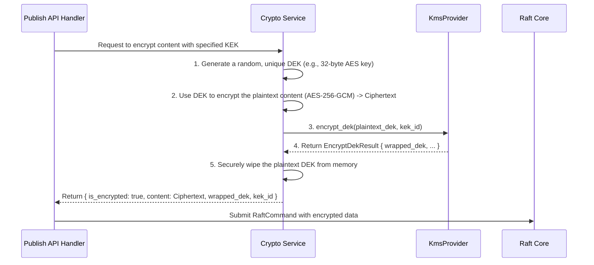
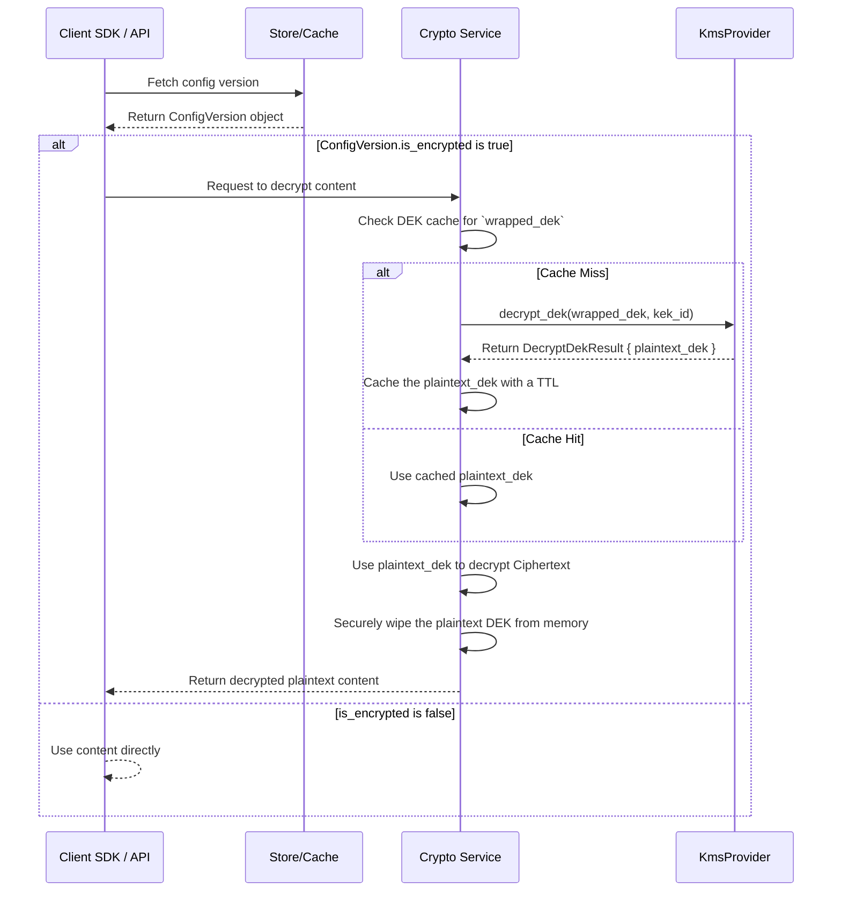

### **核心模块详细设计：安全与加密模块**

该模块负责为 Conflux 提供端到端的安全保障。它包括三个主要方面：**传输层安全 (mTLS)**、**静态数据加密 (信封加密与 KMS 集成)** 和 **密钥管理**。

#### **1. 接口设计 (API Design)**

此模块的大部分功能对用户是透明的，或通过对现有 API 的扩展来实现，而不是引入全新的 API 端点。

##### **a) 配置管理 API 扩展 (用于加密)**

`POST /configs/{id}/versions` 或 `POST /.../publish` API 的请求体将增加一个 `encryption` 字段，以允许调用者请求对新版本进行加密。

```json
// 请求体扩展
{
  "content": "db_password = 'very-secret-password'",
  "description": "Update production database password",
  // ... 其他元数据 ...
  
  "encryption": {
    "enabled": true,
    // 可选: 指定使用哪个 KEK (Key Encryption Key)。
    // 如果不指定，则使用租户或系统的默认 KEK。
    "kek_id": "arn:aws:kms:us-east-1:123456789012:key/..."
  }
}
```

##### **b) KMS Provider Trait (内部接口)**

为了支持不同的 KMS 服务（AWS KMS, GCP KMS, Vault 等），我们将设计一个内部的 `trait`。

```rust
// file: src/security/kms.rs
use anyhow::Result;

// 加密一个数据加密密钥 (DEK) 的结果
pub struct EncryptDekResult {
    pub wrapped_dek: Vec<u8>, // 加密后的DEK
    pub kek_id: String,       // 使用的KEK的标识符
}

// 解密一个DEK的结果
pub struct DecryptDekResult {
    pub plaintext_dek: Vec<u8>, // 明文DEK
}

#[async_trait]
pub trait KmsProvider: Send + Sync {
    /// 返回此提供者的名称，例如 "aws-kms"。
    fn name(&self) -> &'static str;

    /// 加密一个明文DEK。
    async fn encrypt_dek(&self, plaintext_dek: &[u8], kek_id: &str) -> Result<EncryptDekResult>;

    /// 解密一个加密后的DEK。
    async fn decrypt_dek(&self, wrapped_dek: &[u8], kek_id: &str) -> Result<DecryptDekResult>;
}
```

---

#### **2. 出参入参设计 (Input/Output Parameter Design)**

* **输入**:
  * `encrypt_dek`: 明文 DEK (`&[u8]`) 和 KEK 的 ID (`&str`)。
  * `decrypt_dek`: 加密后的 DEK (`&[u8]`) 和 KEK 的 ID (`&str`)。
* **输出**:
  * `EncryptDekResult`: 包含加密后的 DEK 和 KEK ID。
  * `DecryptDekResult`: 包含解密后的明文 DEK。

---

#### **3. 数据模型设计 (Data Model Design)**

##### **a) `ConfigVersion` 结构体扩展**

`ConfigVersion` 结构体（在 Raft 状态机中管理）需要增加字段来存储加密相关的信息。

```rust
// Raft State Machine (`ConfigVersion` struct)
#[derive(Serialize, Deserialize, Debug, Clone)]
pub struct ConfigVersion {
    // ... existing fields ...
    
    // 标志位，表示 `content` 字段是否被加密
    pub is_encrypted: bool,
    
    // 加密后的数据加密密钥 (Data Encryption Key)
    pub wrapped_dek: Option<Vec<u8>>,
    
    // 用于加密 DEK 的密钥加密密钥 (Key Encryption Key) 的ID
    pub kek_id: Option<String>,
}
```

##### **b) 密钥缓存 (In-Memory Cache)**

频繁调用 KMS 会增加延迟和成本。我们可以在 Conflux 服务器端和客户端 SDK 中引入一个**解密后的 DEK 缓存**。

* **数据结构:** `moka::sync::Cache<String, Arc<Vec<u8>>>`
  * **Key:** `sha256(wrapped_dek)` - 使用加密 DEK 的哈希作为缓存键，避免直接暴露密钥内容。
  * **Value:** `Arc<Vec<u8>>` - 解密后的明文 DEK。
* **缓存策略:**
  * **TTL (Time-To-Live):** 缓存的 DEK 必须有一个较短的有效期（例如 5 分钟）。这是一种安全与性能的权衡。有效期过后，即使再次请求也需要重新调用 KMS 解密。
  * **内存安全:** 缓存的明文 DEK 必须被安全地处理，防止被 dump 到磁盘或暴露在日志中。

---

#### **4. 核心流程设计 (Core Flow Design)**

##### **a) 信封加密流程 (在 `publish` API 中)**



##### **b) 解密流程 (在客户端 SDK 或 `FetchConfig` API 中)**



##### **c) 传输层安全 (mTLS) 流程**

mTLS 主要用于 Conflux 节点间的内部 Raft 和运维 API 通信。

```mermaid
graph TD
    A[Node A wants to send AppendEntries to Node B] --> B{Load its own private key and certificate};
    B --> C{Load the CA (Certificate Authority) certificate};
    C --> D[Establish a TLS connection to Node B];
    
    subgraph "TLS Handshake"
        D --> E[Node A sends its certificate to Node B];
        E --> F[Node B receives Node A's cert];
        F --> G{Node B uses CA cert to verify<br>Node A's certificate is valid};
        G -- Valid --> H[Node B sends its own certificate to Node A];
        H --> I[Node A receives Node B's cert];
        I --> J{Node A uses CA cert to verify<br>Node B's certificate};
    end

    J -- Valid --> K[Handshake successful, secure channel established];
    J -- Invalid --> L[Handshake failed, connection dropped];
    G -- Invalid --> L;
    
    K --> M[Node A sends encrypted Raft RPC over the channel];
```

---

<h4><ins>5. 关键逻辑详细说明</ins></h4>

##### **a) KMS Provider 实现**

* 我们将使用 Cargo `features` 来编译时地选择 KMS 提供者。
* **`kms-aws` feature:** 会包含一个 `AwsKmsProvider` 结构体，它使用 `aws-sdk-kms` crate 来与 AWS KMS 交互。它需要能从环境中获取 AWS 凭证（例如，通过 IAM Role for Service Accounts in EKS）。
* **`kms-vault` feature:** 会包含一个 `VaultKmsProvider`，使用 `vaultrs` crate 与 HashiCorp Vault 的 Transit Secrets Engine 交互。

##### **b) 密钥轮换 (Key Rotation)**

KEK 的轮换发生在 KMS 中，Conflux 不需要直接参与。然而，Conflux 需要能够处理轮换后的情况。

* **KMS 的原生支持:** 像 AWS KMS 这样的服务支持自动轮换 KEK。当轮换发生时，旧版本的 KEK 不会立即失效，而是仍可用于解密。这保证了用旧 KEK 加密的 DEK 仍然可以被解密。
* **重新加密 (Re-wrapping):** 我们可以设计一个**后台的、低优先级的“密钥刷新”任务**。
    1. 该任务会定期扫描所有加密的 `ConfigVersion`。
    2. 对于每个版本，它会检查其 `kek_id` 是否是最新的。
    3. 如果不是，它会：
        a.  调用 `KMS.decrypt` 使用旧 KEK 解密 `wrapped_dek`。
        b.  调用 `KMS.encrypt` 使用**新 KEK** 重新加密明文 DEK。
        c.  通过 Raft 提交一个命令，用新的 `wrapped_dek` 和 `kek_id` 更新这个 `ConfigVersion`。

##### **c) mTLS 证书管理**

* 在 Kubernetes 环境中，**`cert-manager`** 是管理证书生命周期的最佳实践。
* 我们可以创建一个 `Certificate` CRD，让 `cert-manager` 为每个 Conflux 节点自动签发和续订证书，并将它们作为 Kubernetes `Secret` 挂载到 Pod 中。
* Conflux 进程在启动时，会从这些挂载的文件中加载自己的私钥、证书以及 CA 证书。

---

#### **6. 详细测试用例和测试方法 (Detailed Test Cases & Methods)**

##### **a) 单元/集成测试**

* **`test_encryption_decryption_roundtrip`**:
    1. 使用一个 Mock `KmsProvider`。
    2. 调用加密流程加密一段文本。
    3. 调用解密流程解密它。
    4. 断言解密后的文本与原文相同。
* **`test_dek_cache`**:
    1. 首次解密一个配置，验证 Mock `KmsProvider` 的 `decrypt_dek` 方法被调用了 1 次。
    2. 立即再次解密同一个配置，验证 `decrypt_dek` **没有**被再次调用。
    3. 等待缓存 TTL 过期后，再次解密，验证 `decrypt_dek` 又被调用了 1 次。
* **`test_mtls_handshake`**: (需要网络测试框架) 启动两个配置了 mTLS 的服务，验证它们之间可以成功建立连接，而一个没有有效客户端证书的客户端则无法连接。

##### **b) 端到端测试 (需要真实的或 Mock 的 KMS)**

* **`test_create_encrypted_config_and_fetch`**:
    1. 调用 `publish` API，请求加密。
    2. 直接检查 Raft 状态机（或 RocksDB），验证存储的 `content` 是乱码，并且 `is_encrypted=true`。
    3. 使用客户端 SDK（它也需要配置 KMS 凭证）拉取该配置。
    4. 验证 SDK 获取到的是解密后的明文内容。

---

#### **7. 设计依赖 (Dependencies)**

* **外部 KMS**: AWS KMS, GCP KMS, Vault 等。
* **加密库 (`ring`, `aes-gcm`)**: 用于数据本身的对称加密。
* **KMS SDKs (`aws-sdk-kms`, `vaultrs`)**: 用于与 KMS 服务交互。
* **TLS 库 (`rustls`)**: 用于实现 mTLS。
* **(推荐) `cert-manager`**: 在 K8s 环境中自动化证书管理。
* **Raft 状态机**: 存储加密相关的元数据。

---

#### **8. 已知存在问题 (Known Issues)**

1. **KMS 成为单点故障和性能瓶颈**: 整个系统的加解密能力现在强依赖于外部 KMS 的可用性和性能。如果 KMS 宕机或网络不通，所有加密配置的读取都会失败。
2. **凭证管理复杂性**: Conflux 服务和客户端 SDK 都需要被安全地授予访问 KMS 的凭证。在复杂的网络环境中，正确配置 IAM 角色、网络策略等可能非常复杂。
3. **“上帝”权限**: 任何能访问 KMS 并有权使用 KEK 的实体，理论上都可以解密所有数据。因此，对 KMS 的访问控制策略必须是安全策略中等级最高、审查最严格的部分。

---

#### **9. 可迭代 Enhancement (Potential Enhancements)**

1. **租户级 KEK (Bring Your Own Key - BYOK)**:
    * 允许企业级租户提供他们自己的 KEK ID。
    * Conflux 会使用客户提供的 KEK 来加密该租户的数据。
    * 这给了客户最终的控制权：即使 Conflux 的基础设施被完全攻破，只要客户在他们的 KMS 中吊销了该 KEK 的权限，他们的数据就是安全的。这是最高级别的安全承诺。
2. **每个 Secret 一个 DEK vs 每个版本一个 DEK**:
    * 当前设计是每个**版本**一个 DEK。
    * 一个更细粒度的模型是，识别出配置文件中的**单个 secret 字段**，并为每个字段使用独立的 DEK 进行加密。
    * 这需要一个更复杂的解析和存储模型，但提供了更强的隔离性，并允许只解密应用实际需要的字段。
3. **自动化的密钥刷新任务**:
    * 将之前提到的“重新加密”后台任务作为系统的一个内置功能来实现，并允许管理员通过 API 触发或调度它。
    * 这使得 KEK 的轮换成为一个平滑、自动化的运维操作。
