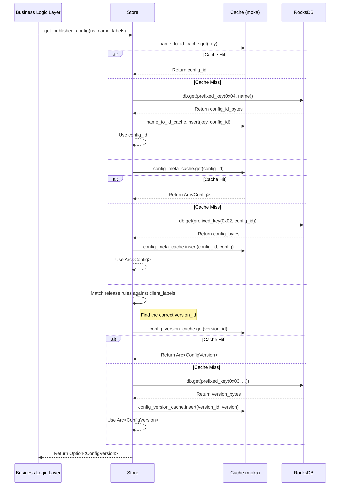

### **核心模块详细设计：Raft 状态机 (State Machine)**

状态机是 Raft 共识算法的应用层。它接收由 Raft 核心确认的、已提交的日志条目（命令），并按顺序将它们应用到本地状态上，从而保证集群中所有节点的状态最终一致。

#### **1. 接口设计 (API Design)**

状态机本身不直接对外暴露网络接口。它的接口是严格由 `openraft` crate 定义的 `RaftStateMachine` trait。我们的 `Store` 结构体将实现这个 trait。

##### **a) `openraft::RaftStateMachine` Trait (核心接口)**

```rust
// file: src/store/state_machine.rs
use openraft::{RaftStateMachine, Snapshot, Entry, EntryPayload, LogId, SnapshotMeta};

#[async_trait::async_trait]
impl RaftStateMachine<TypeConfig> for Arc<Store> {
    /// 应用一批已提交的日志条目。这是状态机最核心的方法。
    async fn apply(&mut self, entries: &[Entry<TypeConfig>]) -> Result<Vec<()>, StorageError>;

    /// 开始创建一个快照。用于日志压缩和新节点追赶。
    async fn begin_snapshot(&mut self) -> Result<Snapshot<Type_config>, StorageError>;

    /// 安装一个从 Leader 接收到的快照。
    async fn install_snapshot(
        &mut self,
        meta: &SnapshotMeta<TypeConfig>,
        snapshot: &mut Self::SnapshotData,
    ) -> Result<(), StorageError>;
}
```

##### **b) 内部查询接口 (Internal Query API)**

状态机还需要为业务逻辑层提供读取当前状态的接口。这些接口**不经过 Raft**，直接访问本地存储。

```rust
// file: src/store/mod.rs

pub struct Store { /* ... private fields ... */ }

impl Store {
    // 根据命名空间和名称获取已发布的配置版本。
    // 这个方法会执行“发布规则匹配”逻辑。
    pub async fn get_published_config(
        &self,
        namespace: &ConfigNamespace,
        name: &str,
        client_labels: &BTreeMap<String, String>,
    ) -> Result<Option<ConfigVersion>, StoreError>;
    
    // 获取一个配置项的元数据。
    pub async fn get_config_meta(
        &self,
        config_id: u64
    ) -> Result<Option<Config>, StoreError>;

    // 列出一个配置项的所有历史版本。
    pub async fn list_config_versions(
        &self,
        config_id: u64
    ) -> Result<Vec<ConfigVersion>, StoreError>;

    // ... 其他必要的只读查询
}
```

---

#### **2. 出参入参设计 (Input/Output Parameter Design)**

##### **输入参数 (Inputs)**

1. **`apply(entries: &[Entry<TypeConfig>])`**:
    * `entries`: 日志条目切片。每个 `Entry` 包含：
        * `log_id`: Raft 日志 ID (term + index)。
        * `payload`: `EntryPayload` 枚举，可能是：
            * `Normal(RaftCommand)`: 包含我们业务逻辑命令的正常日志。
            * `Membership(Membership)`: 集群成员变更日志。
            * `Blank`: 空日志。

2. **`get_published_config(...)`**:
    * `namespace`, `name`: 用于定位配置项。
    * `client_labels`: 客户端上报的标签，用于匹配发布规则。

##### **输出参数 (Outputs)**

1. **`apply(...) -> Result<Vec<()>, StorageError>`**:
    * 成功时返回一个 `Vec<()>`，其长度与输入的 `entries` 相同，表示每个条目都已成功应用。
    * 失败时返回一个自定义的 `StorageError`，封装了底层的 RocksDB 错误或序列化错误。

2. **`begin_snapshot(...) -> Result<Snapshot<...>, StorageError>`**:
    * 返回一个 `openraft::Snapshot` 结构，包含快照元数据 (`SnapshotMeta`) 和一个实现了 `AsyncRead` 的快照数据流。

---

#### **3. 数据模型设计 (Data Model Design)**

状态机需要同时管理**内存中的状态**（用于快速查询）和**持久化的状态**（真理之源）。

##### **a) 持久化存储模型 (RocksDB Schema)**

我们使用带前缀的 Key 来组织 RocksDB 中的数据，使其像一个结构化的数据库。

| Key Prefix (u8) | Key Suffix (Bytes) | Value (Serialized Bytes) | Description |
| :--- | :--- | :--- | :--- |
| `0x01` | (none) | `(LogId, Membership)` | Raft 核心元数据（最后应用的日志ID，集群成员信息） |
| `0x02` | `config_id` (u64, big-endian) | `bincode::encode_to_vec(Config, config::standard())` | 存储 `Config` 元数据对象 |
| `0x03` | `config_id` + `version_id` | `bincode::encode_to_vec(ConfigVersion, config::standard())` | 存储 `ConfigVersion` 内容对象 |
| `0x04` | `"namespace/name"` (UTF-8) | `config_id` (u64, big-endian) | **索引**: 从配置名快速查到 `config_id` |
| `0x05` | `config_id` (u64, big-endian) | `(name, namespace)` | **反向索引**: 从 `config_id` 查回其名称和命名空间 |

**设计理由:**

* **前缀分区:** 使用前缀可以高效地对不同类型的数据进行迭代和范围扫描。
* **二进制 Key:** 对 `config_id` 和 `version_id` 使用 `u64` 的大端字节表示，比字符串 Key 更紧凑，且 RocksDB 的范围扫描性能更好。
* **索引:** 显式创建索引 (`0x04`) 是必要的，因为 RocksDB 本身不支持二级索引。这避免了在处理请求时进行全表扫描。
* **序列化:** `bincode` 2.x 是一种紧凑、快速的二进制序列化格式，非常适合内部存储。

##### **b) 内存缓存模型 (In-Memory Cache)**

直接缓存 RocksDB 中的所有数据可能会消耗大量内存。我们采取一个更智能的策略：**只缓存热点数据和索引**。

```rust
// file: src/store/mod.rs

use moka::future::Cache; // 一个高性能、支持异步的并发缓存库

pub struct Store {
    // 底层存储句柄
    db: Arc<DB>,
    
    // Raft元数据，必须在内存中
    last_applied_log: RwLock<Option<LogId>>,
    membership: RwLock<Membership>,

    // 高性能缓存层 (使用 moka::future::Cache)
    // Key: config_id, Value: Arc<Config>
    config_meta_cache: Cache<u64, Arc<Config>>,

    // Key: version_id, Value: Arc<ConfigVersion>
    config_version_cache: Cache<u64, Arc<ConfigVersion>>,

    // Key: "namespace/name", Value: config_id
    name_to_id_cache: Cache<String, u64>,

    // 依赖
    watch_service: Arc<WatchService>,
    // ...
}
```

**为什么选择 `moka`?**

* **并发性能:** 类似 `DashMap`，内部使用分片锁，并发性能极高。
* **丰富特性:** 支持基于大小(Size-based)、基于时间(Time-based)和引用计数(Reference-based)的驱逐策略。
* **异步 API:** 与 `tokio` 无缝集成。

---

#### **4. 核心流程设计 (Core Flow Design)**

##### **a) `apply` 方法流程**

这是状态机最关键的写路径。

```mermaid
graph TD
    A[Start apply(entries)] --> B{Loop over each entry};
    B --> C{Match entry.payload};
    C -- Normal(command) --> D{Deserialize RaftCommand};
    D --> E{Match RaftCommand};
    E -- Publish(plan) --> F[Execute 'Publish' Logic];
    C -- Membership(mem) --> G[Update Membership];
    
    subgraph F ["Execute 'Publish' Logic"]
        direction TB
        F1[Create new ConfigVersion] --> F2[Update Config with new Release rules & latest_version_id];
        F3[Prepare RocksDB WriteBatch];
        F2 --> F3;
        F1 --> F3;
        F3 --> F4[Invalidate Caches];
        F4 --> F5[Notify WatchService];
    end
    
    B -- All entries processed --> H[Update last_applied_log];
    H --> I[Add last_applied_log to WriteBatch];
    I --> J[Atomically commit WriteBatch to RocksDB];
    J --> K[End apply];

```

##### **b) `get_published_config` 查询流程**

这是状态机最关键的读路径。



---

#### **5. 关键逻辑详细说明 (Key Logic Details)**

##### **a) 原子化写入**

所有对 RocksDB 的写入都必须通过 `WriteBatch` 来完成。`apply` 方法会为一批 `entries` 创建一个 `WriteBatch`，将所有的数据变更（增、删、改）和元数据更新（`last_applied_log`）都放入其中，最后调用一次 `db.write(batch)`。这保证了单个 `apply` 调用的原子性：要么所有变更都成功，要么都不成功。

##### **b) 缓存失效 (Cache Invalidation)**

这是一个“写时失效 (Write-through invalidation)”策略。在 `apply` 方法中，当一个 `Config` 或 `ConfigVersion` 被更新或删除时，我们必须**主动地**从缓存中移除对应的条目。

```rust
// in 'Publish' logic inside apply()
// ... after updating config_meta in the WriteBatch ...

// Invalidate caches for the affected items
self.config_meta_cache.invalidate(&config.id).await;
self.name_to_id_cache.invalidate(&config.name_key()).await;
// ... invalidate any other relevant caches ...
```

这确保了下一次对该项的读取一定会穿透缓存，从 RocksDB 加载最新的数据。

##### **c) 快照实现**

快照的实现必须避免长时间锁定整个状态机。

* **`begin_snapshot`**: 使用 RocksDB 的 `iterator()` 功能。迭代器是 RocksDB 在某个时间点的一致性视图。我们可以启动一个后台任务，在不阻塞 `apply` 方法的情况下，流式地读取迭代器中的所有数据，将其序列化后写入快照流。
* **`install_snapshot`**: 这是一个破坏性操作。在安装快照期间，节点无法响应读写。首先，清空本地 RocksDB 的相关数据（通过范围删除），然后流式地从快照数据中读取，反序列化后通过 `WriteBatch` 写入 RocksDB。最后，清空所有内存缓存并用快照中的元数据重建。

---

#### **6. 详细测试用例和测试方法 (Detailed Test Cases & Methods)**

##### **a) 单元测试**

* **`test_apply_publish_creates_version_and_updates_config`**: 验证 `Publish` 命令能正确创建 `ConfigVersion` 并更新 `Config`。
* **`test_apply_membership_change`**: 验证集群成员变更日志能正确更新内存中的 `membership` 状态和 RocksDB。
* **`test_read_your_writes`**: 验证 `apply` 写入一个变更后，立即通过查询接口能读到新值。
* **`test_cache_invalidation`**: 验证 `apply` 一个更新后，缓存中的旧值被移除。
* **`test_release_rule_matching_logic`**: 对 `get_published_config` 中的规则匹配逻辑进行详细的单元测试，覆盖各种标签组合和优先级场景。

##### **b) 集成测试**

* **`test_snapshot_and_recovery`**:
    1. 启动一个单节点集群，写入一些数据。
    2. 触发快照 `begin_snapshot`，保存快照文件。
    3. 销毁节点。
    4. 重新启动一个空节点，调用 `install_snapshot` 加载快照文件。
    5. 验证节点状态已完全恢复。
* **`test_node_join_via_snapshot`**:
    1. 启动一个单节点集群，写入大量数据。
    2. 触发快照。
    3. 启动一个新节点，让它作为 Learner 加入。
    4. 验证 Leader 会自动发送快照给新节点，并且新节点能成功安装并追上集群。

##### **c) 故障注入测试 (Chaos Testing)**

* **`test_apply_fails_rollback`**: 模拟在 `db.write(batch)` 时 RocksDB 发生 I/O 错误，验证状态机的内存状态不会被部分更新，保持一致性。
* **`test_serde_error_in_log`**: 模拟 Raft 日志中包含一个无法反序列化的损坏命令，验证 `apply` 方法会返回错误而不是 `panic`。

---

#### **7. 设计依赖 (Dependencies)**

* **`openraft`**: 定义了核心的 `RaftStateMachine` 接口。
* **`rocksdb`**: 底层的持久化存储引擎。
* **`moka`**: 提供高性能的内存缓存。
* **`tokio`**: 提供异步运行时和 `RwLock` 等并发原语。
* **`serde` + `bincode` 2.x**: 用于数据的序列化和反序列化。
* **`WatchService`**: 状态机在变更成功后，需要调用它来通知订阅者。

---

#### **8. 已知存在问题 (Known Issues)**

1. **查询性能与数据增长**: 随着数据量的增长（尤其是历史版本），`list_config_versions` 这类需要进行范围扫描的操作，其性能会线性下降。
2. **状态机逻辑复杂性**: 所有的业务逻辑都集中在 `apply` 方法中，随着功能增多，这个方法可能会变得非常庞大和难以维护。
3. **无硬性 Schema 校验**: RocksDB 是一个 schemaless 的存储。如果在代码演进中，`Config` 结构体发生了不兼容的变更（例如，字段改名），从旧版本节点恢复快照可能会导致反序列化失败。

---

#### **9. 可迭代 Enhancement (Potential Enhancements)**

1. **引入分页 (Pagination)**: 为所有列表查询接口（如 `list_config_versions`）增加分页参数 (`limit`, `offset`/`cursor`)，避免一次性加载过多数据导致内存压力和高延迟。
2. **命令模式重构 (Command Pattern Refactoring)**: 将 `apply` 方法中的大型 `match` 语句重构。可以为每种 `RaftCommand` 创建一个独立的处理器（`CommandHandler` trait），`apply` 方法只负责反序列化和分发。这会使代码更符合开闭原则。
3. **数据迁移框架 (Data Migration Framework)**: 引入一个简单的版本号机制来管理存储在 RocksDB 中的数据结构。在启动时，状态机可以检查当前的数据版本，并按需执行迁移脚本，以处理不兼容的结构变更。这大大提升了系统的长期可维护性。
4. **只读副本的线性一致性读**: 为 Follower 节点实现 `openraft` 的 `Read` 协议。这允许 Follower 节点在执行读请求前，与 Leader 确认自己的日志是否足够新，从而在不把所有读请求都路由到 Leader 的情况下，提供强一致性读。这是一个重要的性能和可用性优化。
