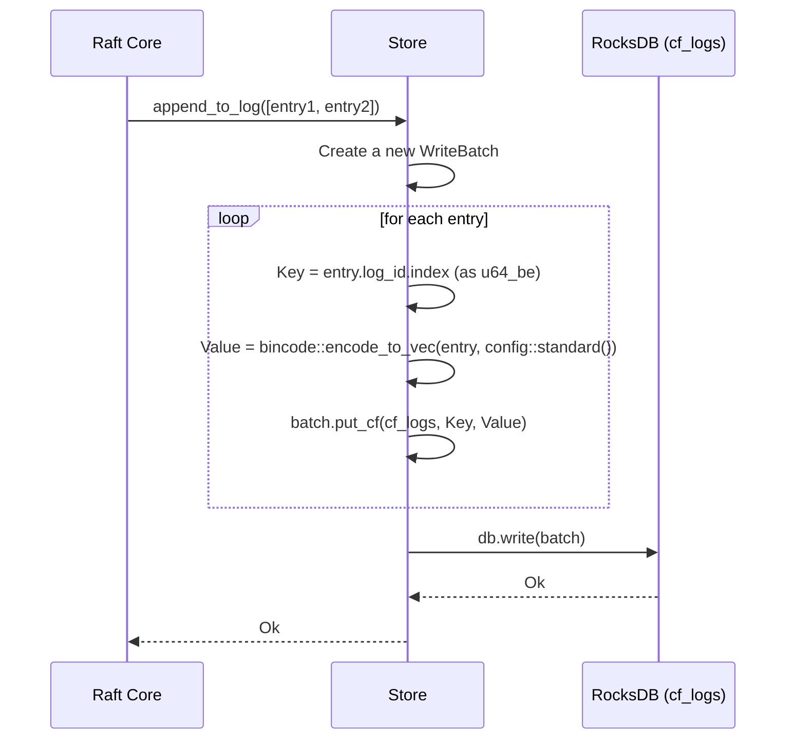
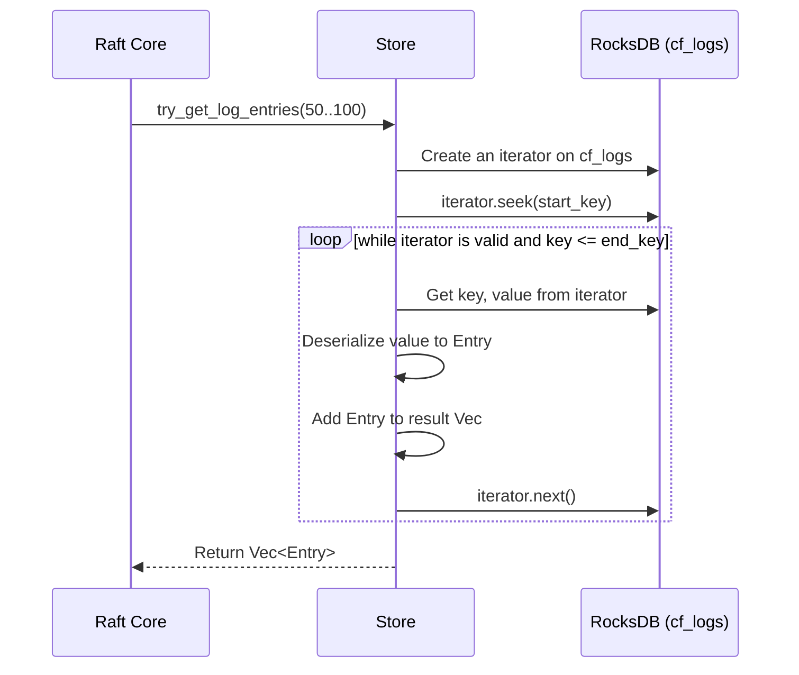

### **核心模块详细设计：统一存储层 (Unified Storage Layer - `Store`)**

`Store` 模块的目标是提供一个高性能、可靠、事务性的持久化层。它使用 RocksDB 作为底层引擎，并向上层模块暴露符合其需求的接口，包括 `openraft` 所需的 `RaftStorage` trait。

#### **1. 接口设计 (API Design)**

`Store` 模块的接口是纯 Rust API，供系统内部调用。

##### **a) `Store` 结构体与构造函数**

```rust
// file: src/store/mod.rs
use rocksdb::{DB, Options as RocksDbOptions};
use std::sync::Arc;

// Store 是我们统一的存储层
#[derive(Clone)]
pub struct Store {
    // 共享的、线程安全的 RocksDB 实例句柄
    db: Arc<DB>,

    // ... 其他字段，如内存缓存 (在State Machine设计中已详述)
}

impl Store {
    /// 打开或创建一个新的 Store。
    ///
    /// # Arguments
    /// * `path` - RocksDB 数据库文件的路径。
    pub fn new<P: AsRef<Path>>(path: P) -> Result<Self, StoreError>;
}
```

##### **b) `openraft::RaftStorage` Trait 实现**

这是 `Store` 模块为 **共识层** 提供的核心接口。

```rust
// file: src/store/storage.rs
use openraft::{RaftStorage, RaftStateMachine, ...};
use crate::store::Store;

#[async_trait]
impl RaftStorage<TypeConfig> for Store {
    // 类型别名，指向我们的状态机实现
    type SM = Self;

    /// 获取状态机的句柄。因为 Store 同时实现了 SM，所以直接返回自己。
    async fn get_state_machine(&self) -> Arc<Self::SM>;

    // --- Raft 元数据读写 ---
    async fn read_vote(&self) -> Result<Option<Vote>, ...>;
    async fn save_vote(&self, vote: &Vote) -> Result<...>;
    
    // --- Raft 日志读写 ---
    async fn get_log_state(&self) -> Result<LogState<TypeConfig>, ...>;
    async fn try_get_log_entries<RB: RangeBounds<u64>>(
        &self,
        range: RB,
    ) -> Result<Vec<Entry<TypeConfig>>, ...>;
    async fn append_to_log<I>(&self, entries: I) -> Result<(), ...>
    where I: IntoIterator<Item = Entry<Type_config>>;
    async fn delete_conflict_logs_since(&self, log_id: LogId);
    async fn purge_logs_upto(&self, log_id: LogId);

    // --- 快照相关 ---
    async fn get_last_purged_log_id(&self) -> Result<Option<LogId>, ...>;
    async fn set_last_purged_log_id(&self, log_id: LogId);
    async fn get_snapshot(&self) -> Result<Option<Snapshot<TypeConfig>>, ...>;
    async fn set_current_snapshot(&self, snapshot: Snapshot<TypeConfig>);
}
```

##### **c) `RaftStateMachine` Trait 实现**

这是 `Store` 模块为**状态机逻辑**提供的接口（在之前的设计中已详述，这里作为接口定义的一部分再次列出）。

```rust
#[async_trait]
impl RaftStateMachine<TypeConfig> for Store {
    async fn apply(&mut self, entries: &[Entry<TypeConfig>]) -> Result<Vec<()>, ...>;
    async fn begin_snapshot(&mut self) -> Result<Snapshot<...>, ...>;
    async fn install_snapshot(&mut self, meta: &SnapshotMeta, snapshot: &mut ...);
}
```

---

#### **2. 出参入参设计 (Input/Output Parameter Design)**

此模块的出入参由 `openraft` 的 trait 定义，我们的主要工作是正确地实现这些接口。

* **输入:** 大部分输入是 `openraft` 的内部数据结构，如 `Entry`, `Vote`, `LogId`, `Snapshot`。
* **输出:** 大部分输出是 `Result<T, StorageError>`，其中 `T` 是 `openraft` 期望的数据结构。`StorageError` 是我们自定义的错误类型，它应该能封装底层的 I/O 错误、序列化错误等。

```rust
// 自定义错误类型
#[derive(Debug, thiserror::Error)]
pub enum StoreError {
    #[error("RocksDB error: {0}")]
    DbError(#[from] rocksdb::Error),
    
    #[error("Serialization error: {0}")]
    Serialization(#[from] bincode::error::DecodeError),
    
    #[error("Raft storage error: {0}")]
    Raft(#[from] openraft::StorageError<NodeId>),
}
```

---

#### **3. 数据模型设计 (Data Model Design)**

这是 Storage 模块最核心的设计。我们将 RocksDB 作为一个统一的 Key-Value 存储，使用不同的**列族 (Column Families)** 和**键前缀**来隔离不同类型的数据。

##### **a) RocksDB 列族 (Column Families)**

使用列族是 RocksDB 的最佳实践，它允许对不同类型的数据使用不同的存储配置（例如，为 Raft 日志使用优化的压缩算法），并能高效地进行范围删除。

* **`cf_default` (默认列族):** 存储 Raft 元数据（如 `vote`）和状态机的元数据（如 `last_applied_log`）。这些数据访问不频繁，但很重要。
* **`cf_logs`:** 专门存储 Raft 日志条目 (`Entry`)。Key 是日志的 `index` (u64)。
* **`cf_state_machine`:** 存储应用状态机的数据，即我们的 `Config` 和 `ConfigVersion` 对象。

##### **b) Key Schema 设计**

| Column Family | Key (Bytes) | Value (Serialized Bytes) | Description |
| :--- | :--- | :--- | :--- |
| `cf_default` | `"vote"` (UTF-8) | `bincode::encode_to_vec(Vote, config::standard())` | 持久化的 Raft `Vote` |
| `cf_default` | `"last_purged_log_id"` | `bincode::encode_to_vec(LogId, config::standard())` | 最后被快照清除的日志ID |
| `cf_default` | `"snapshot_meta"` | `bincode::encode_to_vec(SnapshotMeta, config::standard())` | 当前快照的元数据 |
| **`cf_logs`** | `index` (u64, big-endian) | `bincode::encode_to_vec(Entry, config::standard())` | **Raft 日志**: Key 是日志索引 |
| **`cf_state_machine`** | (见状态机模块设计中的前缀) | (应用数据) | **状态机数据**: 使用 `0x02`, `0x03` 等前缀 |

**设计理由:**

* **列族隔离:** 将频繁写入的 `cf_logs` 与应用数据的 `cf_state_machine` 分离，可以独立调优它们的性能（如 block cache, L0/L1 compaction 策略）。
* **二进制 Key:** 对日志索引使用 `u64` 的大端字节序作为 Key，使得日志在物理上是按序存储的，极大地提升了范围查询（`try_get_log_entries`）的性能。

---

#### **4. 核心流程设计 (Core Flow Design)**

##### **a) Raft 日志追加流程 (`append_to_log`)**



##### **b) Raft 日志读取流程 (`try_get_log_entries`)**



##### **c) 状态机应用与持久化流程 (`apply`)**

这个流程展示了 `RaftStateMachine` 和 `RaftStorage` 的交互。

```mermaid
graph TD
    A[Raft Core calls apply(entries)] --> B[Store (as State Machine) starts];
    B --> C{Create a single WriteBatch};
    
    subgraph "For each entry in entries"
        D[Deserialize RaftCommand] --> E[Execute business logic];
        E --> F[Generate state machine data changes];
        F --> G[batch.put_cf(cf_state_machine, ...)];
    end
    
    B --> D;

    H[After loop, get last_applied_log] --> I[Serialize last_applied_log];
    I --> J[batch.put_cf(cf_default, "last_applied_log", ...)];

    J --> K[db.write(batch)];
    K --> L[Return Ok];
```

---

#### **5. 关键逻辑详细说明 (Key Logic Details)**

##### **a) RocksDB 配置调优**

`Store::new` 在创建 RocksDB 实例时，需要配置 `RocksDbOptions`。

* **`create_if_missing(true)`**: 如果数据库不存在则创建。
* **`create_missing_column_families(true)`**: 创建我们定义的列族。
* **`increase_parallelism()`**: 根据服务器的 CPU 核心数设置并行度，对 compaction 等后台任务有益。
* **Block Cache**: 配置一个共享的 LRU Block Cache，可以显著提升读性能。
* **Write Buffer & Compaction**: 为高写入吞吐量调整写缓冲区大小和 compaction 策略。

##### **b) 事务性**

虽然 RocksDB 本身支持事务，但对于 Raft 的需求，`WriteBatch` 已经提供了足够的原子性保证。在 `apply` 方法中，所有状态机数据的变更和 `last_applied_log` 的更新都在一个 `WriteBatch` 中完成，确保了状态机状态和 Raft 元数据之间的一致性。

##### **c) 错误处理**

所有对 `rocksdb::DB` 的调用都返回 `Result`。我们的 `Store` 方法必须仔细地将这些 `rocksdb::Error` 包装成自定义的 `StoreError`，并最终转换为 `openraft::StorageError`，以便 `openraft` 核心能理解并正确处理（例如，如果存储失败，Raft 节点会 `panic`，这是预期的安全行为）。

---

#### **6. 详细测试用例和测试方法 (Detailed Test Cases & Methods)**

`Store` 模块的测试非常关键，因为它需要严格遵守 `openraft` 的契约。

##### **a) 单元/集成测试 (针对 `Store` 模块)**

* **`test_open_and_create_store`**: 验证 `Store::new` 能在指定路径创建数据库和所有列族。
* **`test_vote_serde`**: 调用 `save_vote`，然后调用 `read_vote`，验证读回的数据与写入的相同。
* **`test_log_append_and_read`**:
    1. 调用 `append_to_log` 写入一批日志。
    2. 调用 `try_get_log_entries` 读取一个子范围，验证数据正确。
    3. 调用 `get_log_state`，验证返回的 `last_log_id` 是正确的。
* **`test_log_truncate_and_purge`**:
    1. 写入日志 1-100。
    2. 调用 `delete_conflict_logs_since(log_id=50)`，验证日志 50-100 被删除。
    3. 调用 `purge_logs_upto(log_id=20)`，验证日志 1-20 被删除。
* **`test_state_machine_apply_persists_correctly`**:
    1. 调用 `apply` 应用一个创建 `Config` 的命令。
    2. **不通过缓存**，直接使用 `db.get_cf` 从 RocksDB 读取，验证 `cf_state_machine` 中存在正确的数据。
    3. 验证 `last_applied_log` 也被正确更新。

**测试工具:** `openraft` 提供了一个 `testing` 模块，包含一个 `Suite`，可以用来对我们自定义的 `RaftStorage` 实现进行符合性测试。**我们必须使用这个测试套件来验证我们的 `Store` 实现是否完全符合 `openraft` 的要求。**

```rust
// 示例
#[test]
pub fn test_raft_storage_compliance() {
    // 使用 openraft 提供的测试套件
    openraft::testing::Suite::test_all(|| async {
        // 在这里创建我们的 Store 实例
        Store::new("/tmp/test-db")
    }).unwrap();
}
```

---

#### **7. 设计依赖 (Dependencies)**

* **`rocksdb`**: 底层 K/V 存储引擎。
* **`openraft`**: `Store` 模块是其 `RaftStorage` trait 的实现者。
* **`serde` + `bincode` 2.x**: 用于所有数据的序列化。
* **State Machine 模块**: `Store` 同时也是状态机，其 `apply` 逻辑依赖于状态机模块的设计。

---

#### **8. 已知存在问题 (Known Issues)**

1. **磁盘 I/O 成为瓶颈**: 作为一个中心化的持久化层，`Store` 的磁盘 I/O 性能直接决定了整个集群的写吞吐量上限。在普通的 HDD 上性能会很差，强烈推荐使用 SSD 或 NVMe。
2. **快照过程中的性能抖动**: 创建快照需要对大量数据进行迭代和 I/O，这可能会短暂地影响 RocksDB 的前台性能，导致 `apply` 或读请求的延迟增加。
3. **数据损坏风险**: 尽管 RocksDB 非常可靠，但如果发生未正确关闭、磁盘固件 bug 等极端情况，仍有数据损坏的风险。

---

#### **9. 可迭代 Enhancement (Potential Enhancements)**

1. **异步化的 RocksDB 操作**: `rust-rocksdb` crate 的 API 是同步阻塞的。在我们的异步 `Store` 方法中，所有对 `db` 的调用都应该被包裹在 `tokio::task::spawn_blocking` 中，以防止它们阻塞 `tokio` 的事件循环。这是一个关键的性能优化。
2. **实现 I/O 速率限制**: RocksDB 支持 I/O Rate Limiting。我们可以配置它，以限制后台的 compaction 和 flush 操作占用的 I/O 带宽，从而为前台的读写请求提供更稳定、可预测的延迟。
3. **远程备份/复制**: 除了 Raft 的快照，可以实现一个独立的后台任务，利用 RocksDB 的 `Checkpoint` 功能创建一个一致性的数据库副本，并将其定期同步到远程对象存储。这提供了另一层级的灾难恢复能力，独立于 Rafeness 逻辑。
4. **支持多种存储引擎**: 将 `Store` 的内部实现抽象到一个 `trait StorageEngine` 后面。这样，未来可以轻松地替换 RocksDB 为其他 K/V 存储（如 `sled`, `TiKV`），以适应不同的部署需求，而无需修改上层的 `RaftStorage` 实现。
