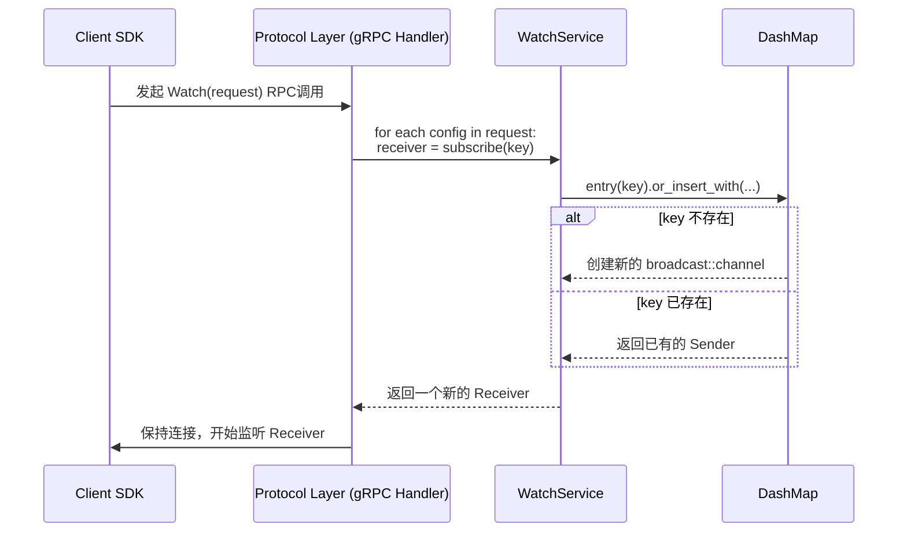
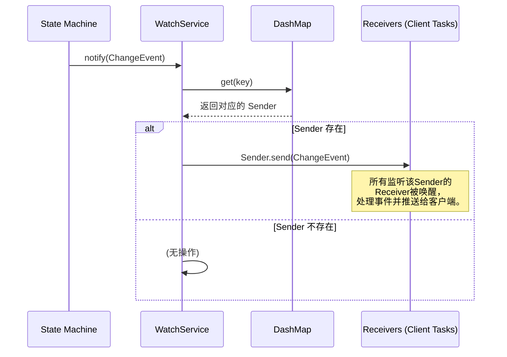

### **核心模块详细设计：Watch Service**

`Watch Service` 是 Conflux 的“反应中枢”。它负责在配置发生变更时，以极低的延迟将通知实时推送给成千上万的订阅客户端。它的性能和健壮性直接决定了系统的动态配置能力和最终用户体验。

#### **1. 接口设计 (API Design)**

`Watch Service` 有两类接口：供内部模块调用的 Rust API 和通过网络暴露给客户端的 gRPC API。

##### **a) gRPC API (外部接口)**

这是客户端 SDK 用来建立订阅的接口。

```protobuf
// file: proto/conflux.proto
syntax = "proto3";

package conflux.v1;

// Watcher服务定义
service WatcherService {
  // 客户端调用此RPC来订阅一个或多个配置的变更。
  // 这是一个服务器流式RPC，连接会一直保持，服务器会持续推送变更事件。
  rpc Watch(WatchRequest) returns (stream ChangeEvent);
}

// 订阅请求
message WatchRequest {
  // 一个请求可以订阅多个配置项，以减少连接数。
  repeated ConfigIdentifier configs_to_watch = 1;
}

// 唯一标识一个配置项
message ConfigIdentifier {
  string tenant = 1;
  string app = 2;
  string env = 3;
  string config_name = 4;
}

// 变更事件，这是服务器推送给客户端的数据
message ChangeEvent {
  // 事件类型
  enum EventType {
    UPSERT = 0; // 创建或更新
    DELETE = 1; // 删除
  }

  EventType event_type = 1;
  
  // 发生变更的配置项
  ConfigIdentifier identifier = 2;

  // 变更后的新版本号 (对于DELETE事件，此字段可能为0)
  uint64 new_version = 3;

  // 变更的描述信息，来自ConfigVersion
  string description = 4;

  // 变更发生的时间戳 (由Leader节点在Raft提交时生成)
  google.protobuf.Timestamp timestamp = 5;
}
```

##### **b) Rust API (内部接口)**

```rust
// file: src/watch/service.rs

// The WatchService struct
#[derive(Clone, Default)]
pub struct WatchService { /* ... private fields ... */ }

impl WatchService {
    /// 创建一个新的WatchService实例。
    pub fn new() -> Self;

    /// 供gRPC/WebSocket处理程序调用。
    /// 为一个给定的WatchKey订阅变更，返回一个可以接收事件的channel receiver。
    ///
    /// # Arguments
    /// * `key` - WatchKey，一个唯一标识被订阅资源的字符串，例如 "tenant/app/env/name"。
    pub fn subscribe(&self, key: &str) -> broadcast::Receiver<Arc<ChangeEvent>>;

    /// 供状态机(State Machine)在应用一个已提交的变更后调用。
    /// 此函数会向所有订阅了该变更的客户端广播事件。
    /// 这是一个“fire-and-forget”操作。
    ///
    /// # Arguments
    /// * `event` - 要广播的变更事件。
    pub fn notify(&self, event: Arc<ChangeEvent>);
}
```

---

#### **2. 出参入参设计 (Input/Output Parameter Design)**

##### **输入参数 (Inputs)**

1. **`WatchService::subscribe(key: &str)`**:
    * `key`: `&str` - 一个UTF-8字符串，格式为 `"{tenant}/{app}/{env}/{config_name}"`。这是内部使用的唯一键。

2. **`WatchService::notify(event: Arc<ChangeEvent>)`**:
    * `event`: `Arc<ChangeEvent>` - 一个被 `Arc` 包裹的变更事件结构体。使用 `Arc` 可以避免在广播给多个订阅者时对事件对象进行多次克隆，极大地提升了性能。

##### **输出参数 (Outputs)**

1. **`WatchService::subscribe(...) -> broadcast::Receiver<Arc<ChangeEvent>>`**:
    * 返回一个 `tokio::sync::broadcast::Receiver`。每个调用 `subscribe` 的协程都会得到一个独立的 `Receiver` 实例，它们都连接到同一个底层的 `broadcast::Sender`。

2. **gRPC `stream ChangeEvent`**:
    * 这是一个持续的流，服务器会不断地将 `ChangeEvent` protobuf 消息写入其中。客户端 SDK 会持续地从此流中读取。

---

#### **3. 数据模型设计 (Data Model Design)**

`Watch Service` 的核心数据模型是其内部状态，用于管理订阅关系。

```rust
// file: src/watch/service.rs
use tokio::sync::broadcast;
use dashmap::DashMap;
use std::sync::Arc;

// WatchKey: 唯一标识被订阅资源的字符串。
// e.g., "my-tenant/my-app/production/database.toml"
type WatchKey = String;

// ChangeEvent 结构体，与 protobuf 定义对应。
// 使用 Arc<T> 避免在广播时克隆。
pub type SharedChangeEvent = Arc<ChangeEvent>;

// WatchService 内部状态
pub struct WatchService {
    // 核心数据结构：一个支持高并发读写的HashMap。
    // Key: WatchKey
    // Value: 一个广播channel的发送端。所有订阅该Key的客户端共享这一个Sender。
    watchers: Arc<DashMap<WatchKey, broadcast::Sender<SharedChangeEvent>>>,
}
```

**为什么选择 `DashMap`?**
在一个高并发系统中，可能有成千上万的客户端同时订阅或取消订阅。使用标准的 `Arc<Mutex<HashMap>>` 会导致所有操作都争抢同一个锁，成为性能瓶颈。`DashMap` 内部使用了分片锁（Sharded Locks），将哈希空间分成多个部分，每个部分有自己独立的锁。这使得不同 Key 上的并发操作几乎没有锁竞争，极大地提升了并发性能。

---

#### **4. 核心流程设计 (Core Flow Design)**

##### **a) 客户端订阅流程**



##### **b) 配置变更通知流程**



---

#### **5. 关键逻辑详细说明 (Key Logic Details)**

##### **a) 原子化和无锁的订阅**

`subscribe` 方法的实现是并发安全的核心。

```rust
// in impl WatchService

pub fn subscribe(&self, key: &str) -> broadcast::Receiver<SharedChangeEvent> {
    // 1. DashMap的 `entry` API 是原子的。它会锁定key所在的分片。
    let entry = self.watchers.entry(key.to_string());

    // 2. `or_insert_with` 仅在Key不存在时才会执行闭包。
    //    这保证了对于同一个Key，broadcast::channel只会被创建一次。
    let sender = entry.or_insert_with(|| {
        // 3. 创建一个新的channel。容量128是一个合理的默认值，
        //    意味着一个缓慢的消费者最多可以落后128个事件。
        let (sender, _) = broadcast::channel(128);
        sender
    });

    // 4. `value()` 返回对sender的引用，然后调用`subscribe()`。
    //    此操作仅需读锁，非常快。
    sender.value().subscribe()
}
```

##### **b) 广播通知与错误处理**

`notify` 方法的实现非常简单，但错误处理的逻辑值得注意。

```rust
// in impl WatchService

pub fn notify(&self, event: SharedChangeEvent) {
    let key = format_key_from_event(&event); // 辅助函数

    // 1. 我们只关心是否存在一个sender。
    if let Some(sender) = self.watchers.get(&key) {
        // 2. 调用 `send`。
        //    如果返回Err，意味着当前没有任何活跃的订阅者(Receiver)。
        //    这完全是正常情况，我们不应panic或记录错误。
        //    因此，我们用 `let _ = ...` 来忽略这个Result。
        let _ = sender.send(event);
    }
}
```

---

#### **6. 详细测试用例和测试方法 (Detailed Test Cases & Methods)**

##### **a) 单元测试 (`/tests/watch_service_unit.rs`)**

* **`test_subscribe_to_new_key`**: 验证对新 Key 的首次订阅能成功返回一个 `Receiver`。
* **`test_subscribe_to_existing_key`**: 验证对同一个 Key 的多次订阅返回的 `Receiver` 都连接到同一个 channel。
* **`test_notify_single_subscriber`**: 验证一个通知能被单个订阅者收到。
* **`test_notify_multiple_subscribers`**: 验证一个通知能被所有订阅了该 Key 的多个订阅者收到。
* **`test_notify_unrelated_subscriber`**: 验证订阅了 Key A 的客户端不会收到 Key B 的通知。
* **`test_notify_no_subscribers`**: 验证对一个没有任何订阅者的 Key 发送通知不会导致任何错误。

##### **b) 集成测试 (`/tests/integration_watch.rs`)**

* **`test_full_flow_update_triggers_watch`**:
    1. 启动一个完整的 Conflux 实例。
    2. 客户端通过 gRPC `Watch` API 订阅 `config-A`。
    3. 通过管理 API 更新 `config-A`。
    4. 断言客户端收到了正确的 `ChangeEvent`。
* **`test_client_disconnect_cleans_up`**:
    1. 客户端订阅。
    2. 客户端断开 gRPC 连接。
    3. 验证服务器端的协程被正确终止（可能需要一些内部指标来暴露）。

##### **c) 并发/压力测试**

* **`test_concurrent_subscriptions`**:
    1. 使用 `tokio::task::JoinSet` 同时启动 1000 个任务。
    2. 每个任务都订阅同一个 Key。
    3. 主任务发送一个通知。
    4. 验证每个任务都收到了通知。
* **`test_slow_consumer`**:
    1. 创建一个订阅者，在收到消息后 `tokio::time::sleep` 一段时间。
    2. 快速发送超过 channel 容量的通知。
    3. 验证该订阅者的 `receiver.recv()` 调用返回 `Err(RecvError::Lapsed)`。

---

#### **7. 设计依赖 (Dependencies)**

* **State Machine**: 是 `notify` 方法的唯一调用者，是事件的源头。
* **Protocol Layer (gRPC/Axum)**: 是 `subscribe` 方法的调用者，负责将网络请求转化为内部 API 调用。
* **`tokio`**: 提供了核心的异步运行时、任务管理和 `broadcast` channel。
* **`dashmap`**: 提供了核心的并发安全哈希映射。
* **`Arc`**: 是实现零成本共享数据（`ChangeEvent`）的关键。

---

#### **8. 已知存在问题 (Known Issues)**

1. **内存泄漏风险 (Entry Leakage)**: `DashMap` 中的 `(Key, Sender)` 条目在创建后，即使所有订阅者都已断开 (`sender.receiver_count() == 0`)，**该条目也不会被自动移除**。如果系统运行时间极长，且有大量一次性的、动态生成的配置名，这会构成缓慢的内存泄漏。
2. **慢消费者问题 (Slow Consumer Problem)**: `tokio::sync::broadcast` channel 被设计为“快者优先”。如果某个客户端因为网络拥堵或自身处理缓慢而无法及时消费事件，一旦其内部缓冲区满了，它将开始丢失事件。对于配置中心，这通常是可以接受的（因为客户端可以通过轮询来最终同步），但需要明确记录这一行为。

---

#### **9. 可迭代 Enhancement (Potential Enhancements)**

1. **实现垃圾回收 (GC for Watchers)**:
    * 启动一个独立的后台任务 (`tokio::spawn`)。
    * 该任务每隔一段时间（例如 5 分钟）迭代一次 `watchers` 这个 `DashMap`。
    * 对于每个 `Sender`，调用 `sender.receiver_count()` 检查其活跃订阅者数量。
    * 如果数量为 0，则从 `DashMap` 中安全地移除该条目。这可以解决上述的内存泄漏问题。
2. **分片 Watch Service (Sharded Watch Service)**:
    * 对于需要支持数百万级别并发订阅的超大规模部署，单个 `WatchService` 实例（即使使用 `DashMap`）也可能成为瓶颈。
    * 可以将 `WatchService` 本身进行分片。例如，创建一个 `Vec<WatchService>`，并根据 `WatchKey` 的哈希值将订阅请求路由到不同的 `WatchService` 实例上，进一步分散并发压力。
3. **提供可选的可靠通知 (Optional Reliable Notifications)**:
    * 对于绝对不能丢失变更通知的场景，可以引入一个基于外部消息队列（如 Redis Streams 或 NATS）的备用通知机制。
    * 客户端可以在 `WatchRequest` 中指定 `delivery_guarantee: GUARANTEED`。
    * 这时，`notify` 方法不仅会向 `broadcast` channel 发送消息，还会将事件写入到外部消息队列。客户端 SDK 则会从该队列消费，从而获得“至少一次”的交付保证。这是一个重大的功能扩展。
