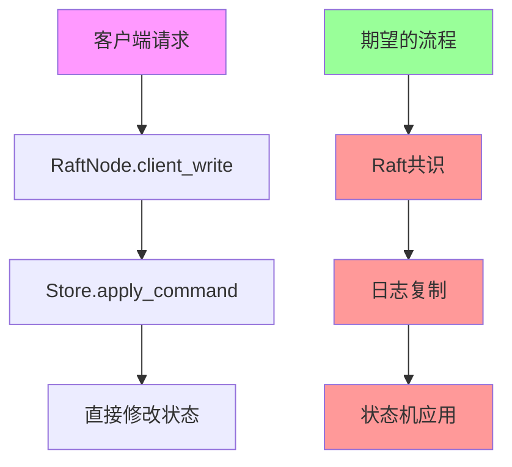
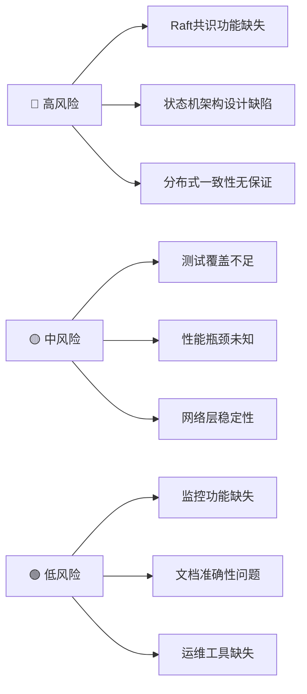

# Epic-Core-2 & Epic-Core-3 分析报告

**分析日期：** 2025-07-08  
**分析人员：** Architect Agent  
**分析范围：** Epic: [CORE-2] 共识与存储层 & Epic: [CORE-3] 状态机与核心业务逻辑

## 执行摘要

经过对代码实现的深入分析，发现两个Epic文档中存在**严重的完成度夸大问题**。当前实现更接近单机配置存储系统，而非真正的分布式共识系统。建议立即修正评估标准并优先解决核心架构问题。

## 🚨 主要问题识别

### 1. 完成度评估严重不准确

#### Epic-Core-2 (声称91%完成)

**关键问题发现：**

- **Raft实例未初始化**：[`src/raft/node.rs:104-116`](../src/raft/node.rs) 存在大量TODO注释
- **共识绕过**：`client_write`方法直接调用`store.apply_command`，完全跳过Raft共识流程
- **网络层不完整**：`install_snapshot`和`full_snapshot`方法缺失关键实现

**代码证据：**

```rust
// src/raft/node.rs:104-116
// TODO: Complete Raft instance initialization
// The openraft 0.9 API requires specific trait implementations
// Current Store implements RaftStorage but needs RaftLogStorage and RaftStateMachine

// For now, we'll skip the Raft initialization to allow other components to work
// let log_store = Adaptor::new(self.store.clone());
// let state_machine = Adaptor::new(self.store.clone());
// let raft = openraft::Raft::new(...).await?;
```

**修正评估：** 实际完成度 **60-70%**（非91%）

#### Epic-Core-3 (声称100%完成)

**关键问题发现：**

- **架构设计缺陷**：没有独立的状态机组件，业务逻辑直接耦合在Store中
- **循环依赖设计**：`apply_to_state_machine`调用`store.apply_command`
- **职责混乱**：Store既是存储层又承担状态机职责

**代码证据：**

```rust
// src/raft/store/raft_storage.rs:140
EntryPayload::Normal(ref data) => {
    // Apply the command to the configuration store
    let response = self.apply_command(&data.command).await.unwrap_or_else(|e| {
        // 状态机直接调用apply_command，这是循环依赖
    });
}
```

**修正评估：** 实际完成度 **70-80%**（非100%）

### 2. 分布式共识功能缺失



**关键缺失功能：**

- ❌ Leader选举机制未实现
- ❌ 日志复制和一致性保证缺失
- ❌ 网络分区处理逻辑未完成
- ❌ 节点故障恢复机制缺失
- ❌ 集群成员变更处理不完整

### 3. 架构设计问题

#### 组件职责混乱

- [`Store`](../src/raft/store/mod.rs) 违反单一职责原则，既是存储层又是状态机
- [`RaftStorage`](../src/raft/store/raft_storage.rs) 实现了接口但未与Raft实例集成
- 网络层基础框架存在但关键功能缺失

#### 依赖关系问题

- Epic-Core-3依赖Core-2的基础设施，但Core-2核心功能未完成
- 状态机逻辑与存储逻辑高度耦合，难以独立测试和维护
- 缺少清晰的抽象层次和接口定义

### 4. 测试覆盖不完整

#### 当前测试问题分析

- **测试类型偏向单机**：主要覆盖存储功能，缺少分布式共识测试
- **容错场景缺失**：无网络分区、节点故障等分布式环境测试
- **性能测试空白**：缺少并发性能和负载测试
- **集成测试不足**：组件间协作验证不充分

## 📋 详细改进计划

### 阶段1：修正Epic-Core-2基础设施 (优先级：🔴 高)

#### 1.1 完成Raft实例初始化

**目标：** 实现真正的openraft集成

**具体任务：**

```rust
// 需要在 src/raft/node.rs 中完成
pub async fn start(&mut self) -> Result<()> {
    // 1. 创建日志存储适配器
    let log_store = Arc::new(RaftLogStorage::new(self.store.clone()));
    
    // 2. 创建独立状态机
    let state_machine = Arc::new(RaftStateMachine::new(self.store.clone()));
    
    // 3. 初始化Raft实例
    let raft = openraft::Raft::new(
        self.config.node_id,
        self.config.raft_config.clone(),
        self.network_factory.clone(),
        log_store,
        state_machine,
    ).await?;
    
    self.raft = Some(raft);
    
    // 4. 处理集群初始化
    if self.is_single_node_cluster().await {
        self.initialize_cluster().await?;
    }
    
    Ok(())
}
```

#### 1.2 重构client_write实现

**目标：** 通过Raft共识处理所有写请求

```rust
pub async fn client_write(&self, request: ClientRequest) -> Result<ClientWriteResponse> {
    if let Some(ref raft) = self.raft {
        // 通过Raft共识处理写请求
        let response = raft.client_write(request).await
            .map_err(|e| ConfluxError::raft(format!("Raft write failed: {}", e)))?;
        Ok(response)
    } else {
        Err(ConfluxError::raft("Raft not initialized"))
    }
}
```

#### 1.3 完善网络层实现

**关键任务：**

- 实现完整的`install_snapshot`方法
- 添加`full_snapshot`功能支持
- 增加连接池和重试机制
- 完善网络错误处理和恢复逻辑

### 阶段2：重构Epic-Core-3状态机架构 (优先级：🟡 中)

#### 2.1 创建独立状态机组件

**目标：** 分离业务逻辑和共识逻辑

```rust
// 新建 src/raft/state_machine.rs
pub struct ConfluxStateMachine {
    store: Arc<Store>,
    last_applied_log: Option<LogId<NodeId>>,
    last_membership: StoredMembership<NodeId, Node>,
}

impl RaftStateMachine<TypeConfig> for ConfluxStateMachine {
    async fn apply(&mut self, entries: &[Entry<TypeConfig>]) -> Result<Vec<ClientWriteResponse>> {
        // 纯粹的状态机逻辑
        // 不直接调用store.apply_command，而是调用专门的状态变更方法
        for entry in entries {
            match &entry.payload {
                EntryPayload::Normal(ref data) => {
                    self.apply_business_command(&data.command).await?;
                }
                EntryPayload::Membership(ref mem) => {
                    self.apply_membership_change(entry.log_id, mem.clone()).await?;
                }
                _ => {}
            }
        }
        Ok(vec![])
    }
}
```

#### 2.2 重构业务逻辑层

**关键改进：**

- 将配置管理逻辑从Store中提取到独立服务层
- 创建清晰的业务服务接口
- 增加事务性操作支持
- 实现原子性状态变更

#### 2.3 优化数据访问模式

**目标：** 提高并发性能和数据一致性

- 实现读写分离
- 优化锁粒度
- 增加缓存机制
- 完善持久化策略

### 阶段3：增强测试和运维功能 (优先级：🟢 低)

#### 3.1 分布式集成测试

```rust
// 新建 tests/integration/multi_node_test.rs
#[tokio::test]
async fn test_multi_node_consensus() {
    // 1. 创建3节点集群
    let cluster = create_test_cluster(3).await;
    
    // 2. 测试Leader选举
    cluster.wait_for_leader().await;
    
    // 3. 测试日志复制
    let leader = cluster.get_leader().await;
    leader.client_write(test_request()).await;
    cluster.verify_consistency().await;
    
    // 4. 测试网络分区恢复
    cluster.simulate_network_partition().await;
    cluster.heal_partition().await;
    cluster.verify_consistency().await;
}
```

#### 3.2 容错场景测试

**测试场景：**

- 节点故障和恢复
- 网络分区处理
- 脑裂情况处理
- 数据恢复验证

#### 3.3 性能和监控

**功能需求：**

- 添加Prometheus指标导出
- 实现集群健康检查
- 创建性能监控面板
- 增加日志和审计功能

## 🎯 修正后的完成度评估

| Epic | 文档声称 | 实际状况 | 建议评估 | 状态 | 关键阻塞问题 |
|------|----------|----------|----------|------|-------------|
| **CORE-2** | 🟢 91% | 🟡 60-70% | **基础可用** | 需重构 | Raft实例未初始化 |
| **CORE-3** | 🟢 100% | 🟡 70-80% | **逻辑完成** | 需重构 | 状态机架构缺陷 |

### 任务细分重新评估

#### Epic-Core-2 任务状态修正

| 任务ID | 任务名称 | 文档声称 | 实际状况 | 修正评估 |
|--------|----------|----------|----------|----------|
| **TASK-201** | Store 模块实现 | ✅ 95% | 🟡 85% | 基本完成，需优化 |
| **TASK-202** | RaftStorage trait 实现 | ✅ 95% | 🟡 75% | 接口完成，集成缺失 |
| **TASK-203** | TypeConfig 设计 | ✅ 100% | ✅ 95% | 基本正确 |
| **TASK-204** | RaftNetwork trait 实现 | ✅ 85% | 🔴 60% | 关键功能缺失 |
| **TASK-205** | RaftNode 服务实现 | ✅ 80% | 🔴 40% | 核心功能未实现 |
| **TASK-206** | client_write 接口实现 | ✅ 90% | 🔴 50% | 绕过共识机制 |

#### Epic-Core-3 任务状态修正

| 任务ID | 任务名称 | 文档声称 | 实际状况 | 修正评估 |
|--------|----------|----------|----------|----------|
| **TASK-301** | 核心数据结构定义 | ✅ 100% | ✅ 90% | 基本完成 |
| **TASK-302** | RaftCommand定义 | ✅ 100% | ✅ 95% | 功能完整 |
| **TASK-303** | RaftStateMachine实现 | ✅ 100% | 🔴 60% | 架构有问题 |
| **TASK-304** | CreateVersion逻辑 | ✅ 100% | 🟡 80% | 逻辑完成，集成待改 |
| **TASK-305** | UpdateReleaseRules逻辑 | ✅ 100% | 🟡 80% | 逻辑完成，集成待改 |
| **TASK-306** | 查询接口实现 | ✅ 100% | 🟡 85% | 功能完整，性能待优化 |

## 📊 风险评估矩阵



### 风险影响分析

| 风险类别 | 影响程度 | 发生概率 | 缓解策略 |
|----------|----------|----------|----------|
| **Raft共识缺失** | 极高 | 确定 | 立即重构实现 |
| **架构设计缺陷** | 高 | 确定 | 分阶段重构 |
| **测试覆盖不足** | 中 | 高 | 增加集成测试 |
| **性能问题** | 中 | 中 | 性能测试和优化 |

## 🚀 建议的实施路径

### 即时行动 (1周内)

1. **承认技术债务**：修正文档中的完成度评估
2. **停止新功能开发**：专注解决核心架构问题
3. **制定重构计划**：明确优先级和时间线

### 短期目标 (2-4周)

1. **Raft实例初始化**：完成openraft集成
2. **状态机重构**：创建独立状态机组件
3. **基础测试**：验证共识功能正常工作

### 中期目标 (1-2月)

1. **完善网络层**：实现完整的Raft网络功能
2. **集成测试**：多节点环境验证
3. **性能优化**：识别和解决性能瓶颈

### 长期目标 (3-6月)

1. **生产就绪**：完整的监控和运维功能
2. **高级功能**：快照、压缩、扩容等
3. **生态完善**：SDK、工具链、文档

## 建议的开发流程改进

### 1. 代码审查强化

- 架构变更必须经过专门审查
- 重要功能需要设计文档先行
- 测试覆盖率要求提升到80%以上

### 2. 里程碑验证

- 每个Epic完成前需要独立验证
- 分布式功能必须通过多节点测试
- 性能指标需要明确基准

### 3. 文档准确性

- 实现状态必须与代码一致
- 技术债务需要明确记录
- 完成标准需要具体可验证

## 结论和建议

### 核心发现

1. **完成度严重夸大**：两个Epic的实际完成度远低于文档声称
2. **架构存在根本缺陷**：缺少真正的分布式共识实现
3. **技术债务巨大**：需要大量重构工作才能达到生产标准

### 关键建议

1. **立即停止新功能开发**，专注修复核心架构问题
2. **重新制定项目里程碑**，基于实际完成度规划后续工作
3. **加强技术治理**，防止类似问题再次发生

### 成功标准

项目要达到真正的"生产就绪"状态，必须满足：

- ✅ 完整的Raft共识功能
- ✅ 独立的状态机架构
- ✅ 全面的分布式测试覆盖
- ✅ 明确的性能基准
- ✅ 完善的监控和运维功能

只有达到这些标准，Conflux分布式配置中心才能真正为生产环境提供可靠的服务。

---

**分析完成时间：** 2025-07-08  
**建议复审时间：** 重构完成后
