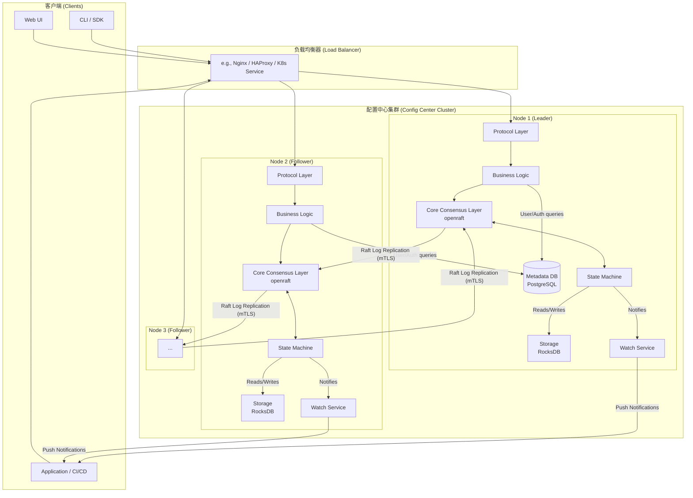

## **分布式配置中心：综合技术设计方案**

### **引言：系统愿景与核心原则**

本文档阐述了一个高可用、高性能、高安全的分布式配置中心（代号 "Conflux"）的完整设计。

**系统愿景:** 打造一个“不存在”的配置中心。对于应用开发者，配置的获取和更新应如访问本地文件般简单自然；对于运维和安全团队，系统的管理、扩展和审计应是自动化、可预测且零信任的。

**核心原则:**

1. **高可用性:** 通过 Raft 共识协议构建无单点故障的集群架构，保证核心服务的持续在线。
2. **高性能:** 读操作应达到微秒级延迟，写操作在保证一致性的前提下实现高吞吐。
3. **强安全性:** 采用零信任网络模型，实现端到端的加密、精细的权限控制和严格的密钥管理。
4. **卓越的开发者体验:** 提供功能完善的客户端 SDK 和声明式的 "Config-as-Code" 工作流，将复杂性封装在系统内部。
5. **可观测与可运维:** 提供全面的 Metrics、Tracing 和 Audit Logs，并设计自动化的集群生命周期管理能力。

---

### **1. 高阶架构方案 (High-Level Architecture)**

我们的系统将是一个**分布式、多节点的集群架构**。每个节点都是一个完全相同的 Rust 进程。集群通过 `openraft` 协议进行通信，选举出一个 Leader 节点，并保持数据在节点间的同步。这种架构天然满足了高可用和水平扩展的需求。

#### **1.1. 组件图 (Component Diagram)**



#### **1.2. 组件说明**

1. **Protocol Layer (协议层 - 插件化):**
    * 这是系统的入口，通过 Cargo `features` 启用不同的协议支持（如 `feature="http"`, `feature="grpc"`）。
    * 负责解析传入的请求，并将其转换为内部统一的命令格式。所有协议共享下层的业务逻辑。

2. **Business Logic Layer (业务逻辑层):**
    * 处理身份验证（AuthN）和授权（AuthZ - RBAC）。它会查询 **Metadata DB** 来获取用户、角色和权限信息。
    * 执行租户隔离、配额检查和速率限制。
    * 处理高级发布逻辑：根据客户端上报的标签，决定返回哪个版本的配置。

3. **Core Consensus Layer (核心共识层):**
    * 基于 `openraft` 实现。负责处理集群成员关系、Leader 选举和日志复制。
    * 接收来自业务逻辑层的写命令（例如“更新配置”），并将它们作为 Raft 日志项安全地复制到大多数节点。
    * 节点间通信将强制启用 **mTLS**，确保内部网络安全。

4. **State Machine (状态机):**
    * 这是配置数据的“真理之源”。`openraft` 会将已提交的日志项应用到状态机。
    * 状态机负责执行命令，例如创建、更新、删除配置，并将最终状态持久化到 **RocksDB**。
    * 所有配置数据的读取，都直接从状态机（及其底层存储）进行，确保一致性。

5. **Storage (Raft State - RocksDB):**
    * 一个嵌入式的高性能 Key-Value 存储。
    * 用于持久化 Raft 日志和状态机的快照。它的性能对整个集群的写入吞吐量至关重要。

6. **Metadata DB (元数据数据库 - PostgreSQL):**
    * 一个独立的、高可用的关系型数据库集群。
    * 存储非共识数据：用户信息、角色、权限、租户配额、审计日志等。这些数据不要求像配置数据那样极致的低延迟和一致性。将其分离可以简化 Raft 状态机，使其更专注和高效。

7. **Watch Service (订阅/通知服务):**
    * 管理客户端的长连接（WebSocket/gRPC Stream）。
    * 当状态机应用一个配置变更后，会通知此服务。
    * 服务会将变更通知推送给所有订阅了该配置的客户端。

---

### **2. 核心概念与数据模型**

为了支持版本管理、高级发布策略和审计，我们设计了以下核心数据模型。

#### **2.1. 状态机核心数据结构 (Raft 管理)**

这些实体由 Raft 共识保证其一致性，并存储在每个节点的 RocksDB 中。

```rust
use std::collections::BTreeMap;
use serde::{Serialize, Deserialize};
use chrono::{DateTime, Utc};

// 使用 u64 作为 ID 以提升内部引用效率
type ConfigId = u64;
type VersionId = u64;

// 代表一个租户、应用和环境的组合
#[derive(Serialize, Deserialize, Debug, Clone, Hash, Eq, PartialEq)]
pub struct ConfigNamespace {
    tenant: String,
    app: String,
    env: String,
}

/// 代表一个配置项的“元数据”和“发布状态”。它不包含实际的配置内容。
#[derive(Serialize, Deserialize, Debug, Clone)]
pub struct Config {
    pub id: ConfigId,
    pub namespace: ConfigNamespace,
    pub name: String, // e.g., "database.toml"
    pub latest_version_id: VersionId, // 指向最新创建的版本
    pub releases: Vec<Release>, // 发布规则，决定客户端获取哪个版本
    pub schema: Option<String>, // 默认校验 Schema
    pub retention_policy: RetentionPolicy, // 版本保留策略
    pub created_at: DateTime<Utc>, // 由 Leader 节点统一生成
    pub updated_at: DateTime<Utc>,
}

/// 代表一个配置项内容的不可变快照。
#[derive(Serialize, Deserialize, Debug, Clone)]
pub struct ConfigVersion {
    pub id: VersionId,
    pub config_id: ConfigId,
    pub content: Vec<u8>, // 原始内容，可能经过应用层加密
    pub content_hash: String, // 内容的 SHA256 哈希，用于完整性校验
    pub format: ConfigFormat, // An enum: Toml, Json, Yaml, etc.
    pub is_encrypted: bool, // 标志位
    pub description: String, // 变更描述，e.g., "Increase pool size"
    pub creator_id: u64, // 创建者用户 ID
    pub created_at: DateTime<Utc>,
}

/// 一条发布规则，定义了“什么样的客户端”应该获取“哪个版本”。
#[derive(Serialize, Deserialize, Debug, Clone, PartialEq, Eq)]
pub struct Release {
    pub labels: BTreeMap<String, String>, // 匹配的客户端标签，空 map 为默认规则
    pub version_id: VersionId, // 匹配成功后提供的版本
    pub priority: i32, // 规则优先级，高者优先
}

/// Raft 状态机要处理的命令枚举
#[derive(Serialize, Deserialize, Debug, Clone)]
pub enum RaftCommand {
    CreateConfig { config: Config, initial_version: ConfigVersion },
    CreateVersion { version: ConfigVersion },
    UpdateReleases { config_id: ConfigId, releases: Vec<Release> },
    DeleteConfig { config_id: ConfigId },
    PruneVersions { config_id: ConfigId }, // 执行数据清理
    // 更高层次的原子工作流命令
    Publish { config_id: ConfigId, new_version: ConfigVersion, new_releases: Vec<Release> },
}
```

#### **2.2. 元数据数据库 Schema (PostgreSQL)**

存储用户、权限、租户等非核心配置数据。

```sql
-- 自定义 RBAC 动作类型
CREATE TYPE rbac_action AS ENUM ('read', 'write', 'delete', 'list', 'publish');

-- 租户表
CREATE TABLE tenants (
    id BIGSERIAL PRIMARY KEY,
    name TEXT NOT NULL UNIQUE,
    max_configs INT NOT NULL DEFAULT 1000,
    max_config_size_bytes INT NOT NULL DEFAULT 102400,
    max_api_requests_per_minute INT NOT NULL DEFAULT 120,
    created_at TIMESTAMPTZ NOT NULL DEFAULT NOW()
);

-- 用户表
CREATE TABLE users (
    id BIGSERIAL PRIMARY KEY,
    username TEXT NOT NULL UNIQUE,
    password_hash TEXT NOT NULL, -- 使用 Argon2/bcrypt
    is_active BOOLEAN NOT NULL DEFAULT TRUE,
    created_at TIMESTAMPTZ NOT NULL DEFAULT NOW()
);

-- 角色表 (租户隔离)
CREATE TABLE roles (
    id BIGSERIAL PRIMARY KEY,
    tenant_id BIGINT NOT NULL REFERENCES tenants(id) ON DELETE CASCADE,
    name TEXT NOT NULL,
    UNIQUE(tenant_id, name)
);

-- 用户-角色关联表
CREATE TABLE user_roles (
    user_id BIGINT NOT NULL REFERENCES users(id) ON DELETE CASCADE,
    role_id BIGINT NOT NULL REFERENCES roles(id) ON DELETE CASCADE,
    PRIMARY KEY(user_id, role_id)
);

-- 权限表 (RBAC核心)
CREATE TABLE permissions (
    id BIGSERIAL PRIMARY KEY,
    role_id BIGINT NOT NULL REFERENCES roles(id) ON DELETE CASCADE,
    action rbac_action NOT NULL,
    resource_pattern TEXT NOT NULL, -- e.g., 'app-name/dev/*'，支持 LIKE 匹配
    UNIQUE(role_id, action, resource_pattern)
);

-- 审计日志表
CREATE TABLE audit_logs (
    id BIGSERIAL PRIMARY KEY,
    trace_id TEXT, -- 用于关联到分布式追踪系统
    user_id BIGINT REFERENCES users(id) ON DELETE SET NULL,
    tenant_id BIGINT NOT NULL REFERENCES tenants(id) ON DELETE CASCADE,
    action rbac_action NOT NULL,
    resource TEXT NOT NULL,
    outcome VARCHAR(16) NOT NULL, -- 'SUCCESS' or 'FAILURE'
    details JSONB, -- 存储 IP、变更 diff 等
    created_at TIMESTAMPTZ NOT NULL DEFAULT NOW()
);

-- 为常用查询添加索引...
-- 对关键表启用行级安全(RLS)策略，强制租户隔离...
```

---

### **3. 系统内部实现**

#### **3.1. Raft 共识与状态机**

* **Raft 实现:** 采用 `openraft` 库。状态机 (`Store`) 将实现 `RaftStateMachine` trait。
* **状态机逻辑:** `apply` 方法是核心。它会匹配 `RaftCommand`，并对内存缓存 (`BTreeMap`) 和持久化存储 (RocksDB) 进行原子更新。所有时间戳由 Leader 在提交日志时统一生成，以避免时钟偏斜。
* **持久化 (RocksDB):** 数据将以结构化的方式存储，使用不同的键前缀来区分不同类型的数据（如 `0x01` for `last_applied_log`, `0x03` for `configs/{id}`），便于高效读写和备份。
* **快照:** 状态机将实现 `begin_snapshot` 和 `install_snapshot`。快照会捕获整个状态机（包括所有配置和版本）的完整镜像，用于新节点快速加入和日志压缩。
* **读一致性:**
  * **Stale Reads (默认):** 客户端可从任何节点读取，性能最高，但可能有毫秒级延迟。
  * **Strong Reads (Leader Reads):** 提供特定 API，强制将读请求路由到 Leader，保证读到最新已提交数据。
  * **Linearizable Reads:** 通过 `openraft` 的 `ensure_linearizable()` 机制提供最强一致性保证，但性能开销最大，仅用于特殊场景。

#### **3.2. API 设计与数据流动**

API 分为面向最终客户端的“数据平面”和面向管理员的“控制平面”。

**a) 数据平面 API (Fetch Plane)**

* **Endpoint:** `GET /api/v1/fetch/config/{tenant}/{app}/{env}/{config_name}`
* **目的:** 客户端拉取配置，对版本、发布策略等内部复杂性无感知。
* **请求头:** 客户端需上报标签，如 `X-Client-Label-Region: us-east-1`。
* **响应:** 直接返回原始配置内容，并在响应头中包含版本信息 `X-Config-Version`。
* **服务端逻辑:**
    1. 解析客户端标签。
    2. 加载对应的 `Config.releases` 规则列表。
    3. 按优先级对规则进行匹配，找到应下发的 `version_id`。
    4. 加载对应的 `ConfigVersion.content` 并返回。

**b) 控制平面 API (Control Plane)**

* **Endpoint Prefix:** `/api/v1/mgt/...`
* **目的:** 管理配置的完整生命周期。
* **核心 API:**
  * `/configs`: 创建/列出配置项。
  * `/configs/{id}/versions`: 创建/列出版本（即更新内容）。**配置校验**在此步骤前完成。
  * `/configs/{id}/releases`: 管理发布规则（蓝绿/灰度）。
  * `/configs/{id}/publish`: **（推荐）** 提供一个更高层次的原子发布 API，将“创建版本”和“更新发布规则”合并为一个事务性操作，避免中间状态。
  * `/configs/{id}/resolve`: 提供一个“模拟器”API，用于调试发布规则。
* **幂等性:** 所有写操作 API 均支持 `X-Idempotency-Key` 请求头，允许客户端安全重试，防止因网络问题导致重复操作。

**c) 数据流动示例（原子化发布）**

1. **Request**: CI/CD 系统调用 `POST /mgt/configs/{id}/publish`，请求体包含新内容和发布策略（例如 "发布给 10% 的用户"）。
2. **Protocol Layer (`axum`)**: 解析请求，提取 JWT 令牌和幂等性 Key。
3. **Business Logic**:
    * **中间件**: 验证 JWT、检查幂等性 Key、执行 RBAC 权限检查、检查租户配额。
    * **Handler**:
        * 对新内容进行**格式和 Schema 校验**。
        * 调用加密模块对内容进行加密（如果需要）。
        * 构建一个 `RaftCommand::Publish` 命令，包含新的 `ConfigVersion` 和更新后的 `releases` 列表。
4. **Core Consensus (`openraft`)**: Leader 节点将 `Publish` 命令作为一条 Raft 日志，复制到大多数 Follower 节点。
5. **State Machine Apply**: 所有节点在状态机中原子地执行 `Publish` 命令：创建新版本记录，并更新配置的发布规则列表。
6. **Notification**: 状态机通知 **Watch Service**。
7. **Response**: Leader 向客户端返回 `200 OK`。

#### **3.3. 订阅/通知服务 (Watch Service)**

* **核心技术:** 使用 `tokio::sync::broadcast` channel 作为核心分发机制，并用 `DashMap` 管理从 `WatchKey` 到 `broadcast::Sender` 的映射。
* **订阅流程:** 客户端通过 WebSocket/gRPC 建立长连接，并指定要订阅的 `WatchKey`。`WatchService` 为其返回一个 `broadcast::Receiver`。
* **通知流程:** 状态机更新后，调用 `watch_service.notify(event)`。`broadcast::Sender` 会将变更事件高效地推送给所有订阅了该 Key 的 `Receiver`。
* **授权:** 客户端在发起订阅请求时，必须经过与 `fetch` API 相同的 RBAC 权限检查。

#### **3.4. 插件系统 (Plugin System)**

系统通过 `trait` 和 Cargo `features` 实现编译时插件化，兼顾性能和类型安全。

* `trait Protocol`: 定义了添加新网络协议（如 MQTT）的契约。
* `trait ConfigParser`: 定义了支持新配置文件格式（如 XML）的契约，包括 `parse` 和 `validate` 方法。
* **插件注册:** 主程序启动时，根据启用的 `features` 自动构建一个插件注册表 (`PluginRegistry`)，核心逻辑通过 `Box<dyn Trait>` 与插件解耦。

#### **3.5. 并发与异步模型**

* **I/O 并发:** 基于 `tokio` 的多线程任务调度器，每个网络请求在一个独立的 `tokio::task` 中处理，高效利用系统资源。
* **CPU 密集型任务:** 对于可能阻塞事件循环的操作（如解析超大配置文件、复杂校验），将使用 `tokio::task::spawn_blocking` 将其移交到专用线程池处理。

---

### **4. 安全设计 (Security)**

#### **4.1. 认证与授权 (RBAC)**

* **认证:** 通过 JWT 令牌进行。
* **授权:** 基于元数据数据库中的 `roles` 和 `permissions` 表实现 RBAC。
* **深度防御 (PostgreSQL RLS):** 对元数据数据库启用行级安全（Row-Level Security），即使 Conflux 服务节点被攻破，也能在数据库层面阻止其跨租户访问数据。

#### **4.2. 应用层加密与密钥管理**

* **模型:** 采用业界标准的**信封加密 (Envelope Encryption)**。
* **流程:**
    1. **加密时:** Conflux 服务端为每个加密配置生成一个唯一的**数据加密密钥 (DEK)**，用 DEK 加密配置内容。然后，调用外部 **KMS** (如 AWS KMS, Vault) 的 API，使用**密钥加密密钥 (KEK)** 加密 DEK。最终存储“加密后的内容”和“加密后的DEK”。
    2. **解密时:** 客户端 SDK 获取到加密数据后，调用 KMS API 解密 DEK，然后在内存中用解密后的 DEK 解密配置内容。
* **原则:** 主密钥 (KEK) 永不离开 KMS，Conflux 服务端和 SDK 均不直接接触和存储任何长期有效的明文密钥。

#### **4.3. 安全通信**

* **外部通信:** 客户端与 Conflux 服务之间的所有通信都必须使用 TLS。
* **内部通信:** Raft 节点之间的所有内部 RPC 通信，都将强制启用 **mTLS (双向 TLS)**，防止内部网络中的恶意节点伪造 Raft 消息。

---

### **5. 客户端 SDK (Client SDK)**

SDK 的目标是封装所有复杂性，提供极致简单的接口。

* **核心组件:**
  * **Public API:** 简单的 `get_string("key", "default")` 接口。
  * **In-Memory Cache:** `tokio::sync::watch` channel，为应用提供快速、同步的配置读取。
  * **后台任务:**
    * `Watcher`: 通过长连接接收实时变更通知。
    * `HTTP Poller`: 在启动或长连接中断时，通过轮询进行全量拉取。
* **健壮性设计:**
  * **本地文件快照:** SDK 将配置加密后缓存到本地磁盘，在服务启动且网络中断时，可从快照恢复，保证应用总能启动。
  * **Fail-Fast/Fail-Safe:** 提供初始化选项，决定在无法获取任何配置时是快速失败还是使用默认值安全运行。

---

### **6. 运维与可观测性**

#### **6.1. 集群运维**

* **自动化引导:** 利用 K8s Headless Service 和 DNS 记录，实现新集群的自动发现和初始化，无需人工干预。
* **节点生命周期管理:** 提供安全的管理 API（`add-node`, `remove-node`, `transfer-leader`），并推荐通过运维脚本调用，以管理集群的伸缩和节点替换。
* **备份与恢复:**
  * **备份:** 定期触发 Raft 快照，并将其上传到对象存储（如 S3）。
  * **恢复:** 支持从备份中恢复一个单节点，然后通过“添加节点”流程重建整个集群。
* **数据清理:** 基于可配置的**版本保留策略** (`retention_days`, `retention_count`)，由 Raft 驱动的后台任务自动清理过期的、未被引用的历史版本。

#### **6.2. 性能与资源隔离**

* **租户配额:** 在元数据数据库中定义租户的资源配额（如配置数、大小、API 速率），并在 API 入口处强制执行。
* **二级缓存:** 在 API 节点上引入可选的、基于 `tokio::sync::watch` 的二级缓存，为热点配置提供微秒级读取延迟，保护核心 Raft 集群免受过多读请求冲击。

#### **6.3. 可观测性**

* **Metrics (Prometheus):** 通过 `/metrics` 端点暴露丰富的指标，覆盖 HTTP/gRPC、Raft 核心、业务逻辑等各个层面。
* **Tracing (OpenTelemetry):** 对每个请求进行端到端追踪，生成详细的 Span，便于分析慢请求和错误链路。
* **Audit Logs:** 将所有重要的写操作记录到元数据数据库的 `audit_logs` 表中，并注入 `trace_id` 以关联分布式追踪。
* **部署与告警 (Kubernetes):**
  * 提供 Helm Chart，使用 `StatefulSet` 部署 Conflux 集群。
  * 通过 `Prometheus Operator` 和 `Alertmanager` 实现自动化监控和关键事件（如 `ClusterHasNoLeader`）告警。
* **Dashboard (Grafana):** 创建 Grafana 仪表盘，统一展示 Metrics 和 Traces，实现从宏观监控到微观诊断的无缝下钻。

---

### **7. 关键技术选型**

| 类别              | 选型                           | 理由                                                                                              |
| :---------------- | :----------------------------- | :------------------------------------------------------------------------------------------------ |
| **异步运行时**    | `tokio`                        | 业界标准，性能卓越，生态最完善，是所有核心依赖库的基础。                                          |
| **Web 框架/HTTP** | `axum`                         | `tokio` 团队开发，集成度高。基于 `tower::Service` 的中间件架构强大灵活。                          |
| **gRPC 框架**     | `tonic`                        | Rust gRPC 的事实标准，与 `tokio` 和 `prost` 深度集成，性能出色。                                  |
| **共识算法库**    | `openraft`                     | 功能完备、纯 Rust 实现的 Raft 库，支持动态成员变更、快照等高级功能。                              |
| **Raft 状态存储** | `rocksdb` (via `rust-rocksdb`) | 高性能嵌入式 LSM-Tree 键值存储，为高写入吞吐量优化，稳定可靠。                                    |
| **元数据存储**    | `PostgreSQL` + `sqlx`          | **PostgreSQL**: 功能强大，支持 RLS。**sqlx**: 纯异步，提供编译时检查的 SQL 查询，提升代码健壮性。 |
| **序列化**        | `serde`                        | Rust 生态的序列化/反序列化标准框架，易于扩展。                                                    |
| **并发 Map**      | `dashmap`                      | 为高并发读写优化的分片锁 `HashMap`，适用于 Watch Service 等场景。                                 |
| **错误处理**      | `thiserror` + `anyhow`         | **thiserror**: 定义结构化错误。**anyhow**: 简化应用层错误传播。地道且高效的组合。                 |
| **应用层加密**    | `ring` / `age`                 | **ring**: 高性能底层加密原语。**age**: 易用的高层非对称加密。密钥管理**必须**依赖外部 KMS。       |
| **内部通信安全**  | `rustls`                       | 现代、安全的 TLS 库，用于实现节点间的 mTLS。                                                      |

---

### **8. 潜在风险与权衡**

1. **Raft 运维复杂性**:
    * **风险**: 运营一个 Raft 集群比运营无状态服务复杂。
    * **权衡**: 这是获得高可用和无单点故障所必须的代价。相比依赖外部 Zookeeper/etcd，自建 Raft 核心让我们对性能和功能有完全掌控。

2. **编译时插件的灵活性**:
    * **风险**: 添加新协议/格式需要重新编译和部署。
    * **权衡**: 用**灵活性**换来了**极致的性能、类型安全和更低的实现复杂度**。对于核心基础设施服务，稳定和高性能是首要考虑的。

3. **读一致性**:
    * **风险**: 默认的读请求可能从 Follower 读取到毫秒级延迟的数据。
    * **权衡**: 获得了**极高的读吞吐量和低延迟**。对于需要强一致性的场景，我们提供了强制路由到 Leader 的 API 选项。

4. **密钥管理**:
    * **风险**: 系统安全性完全依赖于外部 KMS 的安全性和正确集成。
    * **权衡**: 这是一个清晰的职责边界划分。系统**不应该自己实现密钥管理**，而应委托给专业的 KMS，这符合最佳安全实践。
