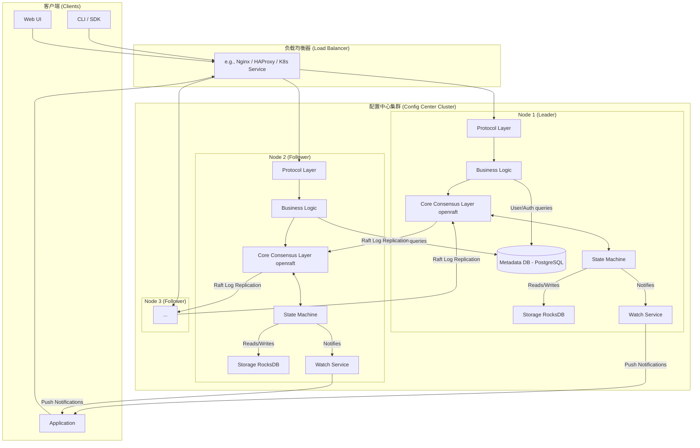

### 2. 高阶架构方案 (High-Level Architecture Proposal)

我们的系统将是一个**分布式、多节点的集群架构**。每个节点都是一个完全相同的 Rust 进程。集群通过 `openraft` 协议进行通信，选举出一个 Leader 节点，并保持数据在节点间的同步。这种架构天然满足了高可用和水平扩展的需求。

#### 组件图 (Component Diagram)

下面是单个节点内部以及集群交互的示意图。



**组件说明:**

1. **Protocol Layer (协议层 - 插件化):**
    * 这是系统的入口，通过 Cargo `features` 启用不同的协议支持（如 `feature="http"`, `feature="grpc"`）。
    * 负责解析传入的请求，并将其转换为内部统一的命令格式。
    * 所有协议共享下层的业务逻辑。

2. **Business Logic Layer (业务逻辑层):**
    * 处理身份验证（AuthN）和授权（AuthZ - RBAC）。它会查询 **Metadata DB** 来获取用户、角色和权限信息。
    * 执行租户隔离逻辑。
    * 处理灰度发布逻辑：根据客户端上报的标签，决定返回哪个版本的配置。

3. **Core Consensus Layer (核心共识层):**
    * 基于 `openraft` 实现。负责处理集群成员关系、Leader 选举和日志复制。
    * 接收来自业务逻辑层的写命令（例如“更新配置”），并将它们作为 Raft 日志项安全地复制到大多数节点。

4. **State Machine (状态机):**
    * 这是配置数据的“真理之源”。`openraft` 会将已提交的日志项应用到状态机。
    * 状态机负责执行命令，例如创建、更新、删除配置，并将最终状态持久化到 **RocksDB**。
    * 所有配置数据的读取，都直接从状态机（及其底层存储）进行，确保一致性。

5. **Storage (Raft State - RocksDB):**
    * 一个嵌入式的高性能 Key-Value 存储。
    * 用于持久化 Raft 日志和状态机的快照。它的性能对整个集群的写入吞吐量至关重要。

6. **Metadata DB (元数据数据库 - PostgreSQL):**
    * 一个独立的关系型数据库。
    * 存储非共识数据：用户信息、角色、权限、审计日志等。这些数据不要求像配置数据那样极致的低延迟和一致性。将其分离可以简化 Raft 状态机，使其更专注和高效。

7. **Watch Service (订阅/通知服务):**
    * 管理长连接（WebSocket/gRPC Stream）。
    * 当状态机应用一个配置变更后，会通知此服务。
    * 服务会通过高效的并发机制（如 `tokio::sync::broadcast` channel）将变更通知推送给所有订阅了该配置的客户端。

### 3. 关键技术选型与理由 (Key Technology/Crate Choices & Rationale)

| 类别               | 选型                                         | 理由                                                                                                                                                                                                                                                              |
| ------------------ | -------------------------------------------- | --------------------------------------------------------------------------------------------------------------------------------------------------------------------------------------------------------------------------------------------------------------- |
| **异步运行时**     | `tokio`                                      | 业界标准，性能卓越，生态系统最完善。`axum`, `tonic`, `openraft`, `sqlx` 等我们依赖的核心库都基于它构建，选择 `tokio` 是必然之选。                                                                                                                                  |
| **Web 框架/HTTP**  | `axum`                                       | 由 `tokio` 团队开发，与 `tokio` 和 `hyper` 无缝集成。其基于 `tower::Service` 的中间件架构极其强大和灵活，非常适合实现我们复杂的认证和业务逻辑。内置的 WebSocket 支持也简化了 Watch Service 的实现。                                                                |
| **gRPC 框架**      | `tonic`                                      | Rust gRPC 的事实标准，与 `tokio` 和 `prost`（Protobuf 实现）深度集成。性能出色，符合我们对高性能多协议支持的要求。                                                                                                                                              |
| **共识算法库**     | `openraft`                                   | 你已指定。它是一个功能完备、纯 Rust 实现的 Raft 库，支持动态成员变更、快照等高级功能，是构建我们共识核心的理想选择。                                                                                                                                            |
| **Raft 状态存储**  | `rocksdb` (via `rust-rocksdb`)               | 高性能的嵌入式 LSM-Tree 键值存储，为高写入吞吐量而优化，非常适合存储 Raft Log 和 State Machine。Facebook 等大厂广泛使用，极其稳定可靠。                                                                                                                                |
| **元数据存储**     | `PostgreSQL` + `sqlx`                        | **PostgreSQL**: 功能强大，成熟稳定，其行级安全策略（RLS）和丰富的索引类型非常适合实现复杂的 RBAC。**sqlx**: 纯异步的 SQL 工具包，提供编译时检查的 SQL 查询，极大提升了代码的健壮性，避免了运行时的 SQL 语法错误。                                        |
| **序列化**         | `serde`                                      | Rust 生态的序列化/反序列化标准框架。通过 `serde_json`, `serde_yaml`, `serde_toml` 等插件，我们可以轻松、高效地支持多种配置文件格式。                                                                                                                              |
| **错误处理**       | `thiserror` + `anyhow`                       | **thiserror**: 用于在库/模块内部创建具体的、结构化的错误类型，便于精确的错误匹配。**anyhow**: 用于在应用顶层（如业务逻辑层）提供带上下文的、易于传播的错误，简化错误处理代码。这是一个非常地道且高效的组合。                                                    |
| **应用层加密**     | `ring` 或 `age`                              | **ring**: 提供了一套经过严格测试的底层加密原语（如 AES-GCM），性能极高。**age**: 提供更高层次的、易于使用的非对称加密实现。我们将使用这些库的加密原语，但**密钥管理必须依赖外部 KMS (如 Vault, AWS KMS)**。 |
| **配置 Schema 校验** | `jsonschema` (for JSON) / Custom Validation | 对于 JSON，`jsonschema` 库是现成的优秀选择。对于其他格式（YAML, TOML），我们可以编写自定义的验证逻辑，或者寻找特定格式的验证库，并将其作为插件集成。                                                                                             |

### 4. 数据模型与流动 (Data Model & Flow)

#### 核心数据结构 (初步定义)

```rust
// In State Machine, managed by Raft
// Note: Actual implementation would use IDs (e.g., u64) instead of Strings where possible for efficiency.

// Represents a tenant, application, and environment combination.
// e.g., "tenant-A/app-B/production"
#[derive(Serialize, Deserialize, Debug, Clone, Hash, Eq, PartialEq)]
pub struct ConfigNamespace {
    tenant: String,
    app: String,
    env: String,
}

// Represents a single configuration file's content and metadata.
#[derive(Serialize, Deserialize, Debug, Clone)]
pub struct Configuration {
    namespace: ConfigNamespace,
    name: String, // e.g., "database.toml", "feature_flags.json"
    content: Vec<u8>, // Stored as raw bytes to support any format
    format: ConfigFormat, // An enum: Toml, Json, Yaml, etc.
    version: u64, // Monotonically increasing version
    is_encrypted: bool, // Flag indicating if `content` is application-layer encrypted
    schema: Option<String>, // Optional schema for validation
    // ... other metadata
}

// Enum defining a command to be applied to the state machine
#[derive(Serialize, Deserialize, Debug, Clone)]
pub enum RaftCommand {
    UpdateConfig(Configuration),
    DeleteConfig { namespace: ConfigNamespace, name: String },
    // ... other state-changing commands
}

// In Metadata DB (PostgreSQL), accessed via sqlx
// These are simplified examples.
pub struct User { pub id: i64, pub username: String, /* ... */ }
pub struct Role { pub id: i64, pub name: String, /* ... */ }
pub struct Permission { /* Defines what action a role can take on a resource */ }
```

#### 数据流动（以“更新配置”为例）

1. **Request**: 客户端（如 `curl` 或 SDK）发起一个 `HTTP PUT /tenants/my-tenant/apps/my-app/envs/prod/configs/database.toml` 请求，请求体中包含 TOML 配置内容。
2. **Protocol Layer (`axum`)**:
    * `axum` 路由匹配到请求，并调用相应的处理函数。
    * 从请求头中提取认证令牌（如 JWT）。
3. **Business Logic (Middleware & Handler)**:
    * **AuthN Middleware**: 验证 JWT 令牌的有效性。
    * **AuthZ Middleware**: 从令牌中解析出用户/角色，查询 PostgreSQL，检查该角色是否有权对 `my-tenant/my-app/...` 执行 `write` 操作。如果无权，直接返回 403 Forbidden。
    * **Handler**:
        * 从请求体中读取 TOML 内容。
        * 如果请求指定了 `X-Encrypt: true` 头，则调用加密模块，使用正确的密钥（从 KMS 获取）加密内容。
        * 构建一个 `RaftCommand::UpdateConfig`，其中包含新的配置内容、版本号（旧版本号+1）、命名空间等信息。
4. **Core Consensus (`openraft`)**:
    * 业务逻辑层调用 `raft.client_write(command)`.
    * `openraft` 将该命令序列化，并将其作为日志条目发送给所有 Follower 节点。
5. **Replication & Commit**:
    * Follower 节点接收到日志，将其写入本地 RocksDB，并向 Leader 回复成功。
    * 当 Leader 收到超过半数节点的成功回复后，该日志条目被视为“已提交”（Committed）。
6. **State Machine Apply**:
    * Leader 将已提交的命令应用到自己的状态机中：在 RocksDB 中更新或插入这条配置数据。
    * Leader 通知 Follower 应用该命令，Follower 也同步更新自己的状态机。
7. **Notification**:
    * 状态机在更新成功后，调用 `WatchService::notify("my-tenant/my-app/...")`。
    * `WatchService` 通过 `broadcast` channel 将变更事件（可能包含新版本号）推送给所有订阅了该配置的 WebSocket/gRPC Stream。
8. **Response**: Leader 向客户端返回 `200 OK`，表示更新成功。

### 5. 并发/异步模型设计 (Concurrency/Async Model Design)

* **I/O 并发**: 整个系统基于 `tokio` 的多线程任务调度器。每个进来的网络请求（HTTP/gRPC）都会被分派到一个独立的异步任务 (`tokio::spawn`)。这使得系统可以高效地处理数千个并发连接，因为任务在等待 I/O（如网络、磁盘）时不会阻塞线程，而是会将线程让出给其他任务。
* **订阅/通知 (Watch)**: 这是并发设计的关键点。我们将为每个可订阅的配置项（或命名空间）维护一个 `tokio::sync::broadcast::Sender`。当配置更新时，状态机只需向这个 channel 发送一个消息。所有监听该 channel 的任务（每个任务代表一个客户端连接）都会被唤醒。`broadcast` channel 是一种多生产者、多消费者的 channel，非常适合这种“一对多”的通知场景，且性能很高。
* **CPU 密集型任务**: 对于可能阻塞异步运行时的 CPU 密集型操作，例如：
  * 解析一个非常大的（比如 10MB）YAML 文件。
  * 对一个复杂的 schema 进行校验。
  * 我们将使用 `tokio::task::spawn_blocking` 将这些操作移交给一个由 `tokio` 管理的、专门用于阻塞操作的线程池。这可以防止单个请求的 CPU 繁忙导致整个事件循环（event loop）延迟，从而影响所有其他请求的响应时间。

### 6. 潜在风险与权衡 (Potential Risks & Trade-offs)

1. **Raft 运维复杂性**:
    * **风险**: 虽然 `openraft` 极大地简化了实现，但运营一个 Raft 集群（安全地增删节点、处理网络分区、备份与恢复）仍然比运营一个无状态服务复杂得多。
    * **权衡**: 这是为了获得 **99.9% 可用性**和**无单点故障**所必须付出的代价。相比依赖外部的 Zookeeper/etcd，自建 Raft 核心让我们对性能和功能有完全的掌控。

2. **编译时插件的灵活性**:
    * **风险**: 我们选择了编译时插件。这意味着，如果客户需要一个新的配置文件格式（例如，`.properties`），或者一个新的认证机制，我们就必须重新编译并部署整个集群。
    * **权衡**: 我们用**灵活性**换来了**极致的性能、类型安全和更低的实现复杂度**。运行时插件（如 WASM）会引入 FFI 开销、安全沙箱的复杂性以及不稳定的外部 ABI 接口。对于一个核心基础设施服务，稳定和高性能通常是首要考虑的。

3. **读一致性**:
    * **风险**: 为了提升读性能，客户端的读请求可以由任何一个节点（Leader 或 Follower）处理。但 Follower 节点的数据可能比 Leader 有微小的延迟。
    * **权衡**: 我们获得了**极高的读吞吐量和低延迟**。对于绝大多数配置拉取场景，毫秒级的陈旧是可以接受的。对于需要强一致性读（read-after-write）的特殊场景，我们必须提供一个 API 选项，将读请求**强制路由到 Leader 节点**，但这会牺牲一些读性能和可用性（如果 Leader 恰好不可用）。

4. **密钥管理**:
    * **风险**: 应用层加密的安全性完全取决于密钥管理的安全性。如果密钥泄露或管理不善，加密将形同虚设。
    * **权衡**: 我们的系统**不应该自己实现密钥管理**。设计上，我们必须明确地将密钥存储和轮换的责任委托给一个专业的、独立的 **Key Management Service (KMS)**。这是一个清晰的边界划分，让我们的系统专注于其核心职责。

### 1. 插件系统的 Trait 设计 (Plugin System Trait Design)

我们采用编译时插件模型，核心是定义一组清晰、稳定的 `trait` 作为插件的契约。插件的实现者将实现这些 trait，而主程序则通过 `Box<dyn Trait>` 来使用它们，实现运行时多态。

#### a) 协议插件 (`Protocol`)

**目标:** 允许添加新的网络协议（如 GraphQL, MQTT）来暴露配置中心的功能。

**Trait 定义:**
每个协议插件都需要启动一个长时运行的服务。它需要一个句柄（handle）来与我们的核心业务逻辑交互。

```rust
use std::sync::Arc;
use anyhow::Result;

// A handle to the core application logic, passed to plugins.
// This decouples plugins from the main application's internal structure.
#[derive(Clone)]
pub struct CoreAppHandle {
    // A simplified sender to enqueue commands into the Raft consensus layer.
    pub command_sender: mpsc::Sender<RaftCommand>,
    // A handle to the watch service to allow subscriptions.
    pub watch_service: Arc<WatchService>,
    // A connection pool to the metadata database for auth queries.
    pub db_pool: sqlx::PgPool,
    // ... other handles, e.g., for querying the state machine directly.
}

/// The contract for any network protocol plugin.
#[async_trait::async_trait]
pub trait Protocol: Send + Sync {
    /// Returns the unique name of the protocol, e.g., "http-rest".
    fn name(&self) -> &'static str;

    /// Starts the protocol server. This is a long-running task.
    /// It receives a handle to the application core to perform actions.
    async fn start(&self, core_handle: CoreAppHandle, config: ProtocolConfig) -> Result<()>;
}

// Example config for a protocol
pub struct ProtocolConfig {
    pub listen_addr: String,
}
```

**示例实现 (`http` feature):**

```rust
// In a file like `src/protocols/http.rs`

use axum::{Router, routing::get, extract::State};

pub struct HttpProtocol;

#[async_trait::async_trait]
impl Protocol for HttpProtocol {
    fn name(&self) -> &'static str { "http-rest" }

    async fn start(&self, core_handle: CoreAppHandle, config: ProtocolConfig) -> Result<()> {
        let app = Router::new()
            .route("/health", get(|| async { "OK" }))
            // Share the core handle with all axum handlers
            .with_state(core_handle);

        let listener = tokio::net::TcpListener::bind(&config.listen_addr).await?;
        println!("HTTP server listening on {}", config.listen_addr);
        axum::serve(listener, app).await?;
        Ok(())
    }
}
```

#### b) 配置解析器插件 (`ConfigParser`)

**目标:** 支持新的配置文件格式（如 XML, INI）。

**Trait 定义:**
解析器负责两件事：将原始字节解析为一种通用的内部表示，以及根据 schema 进行验证。`serde_json::Value` 是一个极佳的通用表示，因为多数结构化格式都能转换为它。

```rust
use serde_json::Value;
use thiserror::Error;

#[derive(Error, Debug)]
pub enum ParserError {
    #[error("Failed to parse content: {0}")]
    Parse(String),
    #[error("Validation failed: {0}")]
    Validation(String),
}

/// The contract for any configuration file format parser.
pub trait ConfigParser: Send + Sync {
    /// The unique name of the format, e.g., "json", "yaml".
    fn name(&self) -> &'static str;
    
    /// Parses raw bytes into a generic Value representation.
    fn parse(&self, content: &[u8]) -> Result<Value, ParserError>;

    /// Validates the raw content against a given schema.
    /// Returns Ok(()) if valid.
    fn validate(&self, content: &[u8], schema: &str) -> Result<(), ParserError>;
}
```

#### c) 插件注册与管理

在主程序启动时，我们会根据启用的 Cargo `features` 来构建一个插件注册表。

```rust
// In `src/plugins.rs`
use std::collections::HashMap;

pub struct PluginRegistry {
    pub protocols: Vec<Box<dyn Protocol>>,
    pub parsers: HashMap<String, Box<dyn ConfigParser>>,
}

impl PluginRegistry {
    pub fn new() -> Self {
        let mut protocols: Vec<Box<dyn Protocol>> = Vec::new();
        let mut parsers: HashMap<String, Box<dyn ConfigParser>> = HashMap::new();

        // Use conditional compilation based on features
        #[cfg(feature = "protocol-http")]
        {
            use crate::protocols::http::HttpProtocol;
            protocols.push(Box::new(HttpProtocol));
        }

        #[cfg(feature = "parser-json")]
        {
            use crate::parsers::json::JsonParser;
            let parser = JsonParser;
            parsers.insert(parser.name().to_string(), Box::new(parser));
        }

        #[cfg(feature = "parser-yaml")]
        {
            use crate::parsers::yaml::YamlParser;
            let parser = YamlParser;
            parsers.insert(parser.name().to_string(), Box::new(parser));
        }
        
        Self { protocols, parsers }
    }
}
```

这种设计将插件与核心逻辑完全解耦，并且在编译时就能保证所有被使用的插件都存在，没有运行时加载失败的风险。

---

### 2. Watch Service 的详细实现

**目标:** 高效地将配置变更通知成千上万的订阅客户端，延迟低于 100ms。

**核心技术:** 我们将使用 `tokio::sync::broadcast` channel 作为核心分发机制，并用 `DashMap` 来管理订阅。`DashMap` 是一个为高并发读写优化的 `HashMap`，比 `Arc<Mutex<HashMap>>` 在这种场景下性能更好，因为它使用了分片锁，减少了锁竞争。

**数据结构:**

```rust
use tokio::sync::broadcast;
use dashmap::DashMap;
use std::sync::Arc;

// The event that gets broadcasted to clients.
#[derive(Clone, Debug)]
pub struct ChangeEvent {
    pub namespace: ConfigNamespace,
    pub config_name: String,
    pub new_version: u64,
    // Could include a summary of changes if needed
}

// The key for our map, uniquely identifying a watchable resource.
// e.g., "tenant-A/app-B/production/database.toml"
type WatchKey = String;

#[derive(Clone, Default)]
pub struct WatchService {
    // Map from WatchKey to a broadcast sender.
    // The sender will notify all subscribed receivers.
    watchers: Arc<DashMap<WatchKey, broadcast::Sender<ChangeEvent>>>,
}
```

**核心逻辑:**

```rust
impl WatchService {
    pub fn new() -> Self {
        Self {
            watchers: Arc::new(DashMap::new()),
        }
    }

    /// A client calls this to start listening for changes on a specific config.
    pub fn subscribe(&self, key: WatchKey) -> broadcast::Receiver<ChangeEvent> {
        // DashMap's `entry` API is atomic and very efficient.
        let sender = self.watchers.entry(key)
            .or_insert_with(|| {
                // If no sender exists for this key, create a new one.
                // The channel capacity can be tuned.
                let (sender, _) = broadcast::channel(128);
                sender
            });
        
        // Return a new receiver subscribed to this sender.
        sender.subscribe()
    }

    /// The state machine calls this AFTER a change is committed.
    pub fn notify(&self, event: ChangeEvent) {
        let key = format!("{}/{}/{}", event.namespace, event.config_name); // Construct the key
        
        // Find the sender for this key.
        if let Some(sender) = self.watchers.get(&key) {
            // Send the event. We don't care about the result.
            // If `send` returns an error, it just means there are no active
            // subscribers, which is fine. We don't want to panic.
            let _ = sender.send(event);
        }
    }
}
```

**与 Axum WebSocket 的集成:**

```rust
// In an Axum handler for a WebSocket upgrade request
use axum::{
    extract::{ws::{WebSocket, Message}, State, WebSocketUpgrade},
    response::Response,
};

async fn websocket_handler(
    ws: WebSocketUpgrade,
    State(core_handle): State<CoreAppHandle>,
    // ... params to identify which config to watch
) -> Response {
    let watch_key = "the_key_from_params"; // Determine the key from request
    ws.on_upgrade(move |socket| handle_socket(socket, core_handle, watch_key))
}

async fn handle_socket(mut socket: WebSocket, core_handle: CoreAppHandle, watch_key: String) {
    // 1. Subscribe to the watch service
    let mut receiver = core_handle.watch_service.subscribe(watch_key);

    // 2. Spawn a task to listen for changes and send them to the client
    loop {
        // `tokio::select!` allows us to concurrently listen for messages
        // from the client and from the watch service.
        tokio::select! {
            // If a change event is received from the broadcast channel...
            Ok(event) = receiver.recv() => {
                let payload = serde_json::to_string(&event).unwrap();
                // ...send it to the WebSocket client.
                if socket.send(Message::Text(payload)).await.is_err() {
                    // Client disconnected, break the loop.
                    break;
                }
            }
            // If a message is received from the WebSocket client...
            Some(Ok(msg)) = socket.recv() => {
                // ...we can handle it here (e.g., ping/pong, or changing subscription).
                if let Message::Close(_) = msg {
                    break;
                }
            }
            else => {
                // Both streams have closed.
                break;
            }
        }
    }
    // The connection is closed, the task ends, and the receiver is dropped.
    // The broadcast channel will clean up automatically.
}
```

---

### 3. 数据库 Schema 设计 (Metadata DB - PostgreSQL)

**目标:** 为用户、租户、RBAC 和审计日志设计一个健壮、可扩展的关系型数据库模式。

**设计原则:**

* **强类型:** 使用 `ENUM` 等 PostgreSQL 特性。
* **关系完整性:** 使用外键和 `ON DELETE` 约束。
* **性能:** 在所有外键和常用查询字段上建立索引。
* **租户隔离:** 几乎每个表都包含一个 `tenant_id`，所有查询都必须以此为 `WHERE` 条件。

**SQL DDL (PostgreSQL):**

```sql
-- Create a custom ENUM type for actions for type safety and storage efficiency.
CREATE TYPE rbac_action AS ENUM ('read', 'write', 'delete', 'list', 'publish');

-- Table for Tenants, the top-level organizational unit.
CREATE TABLE tenants (
    id BIGSERIAL PRIMARY KEY,
    name TEXT NOT NULL UNIQUE,
    created_at TIMESTAMPTZ NOT NULL DEFAULT NOW()
);

-- Table for Applications, which belong to a Tenant.
CREATE TABLE applications (
    id BIGSERIAL PRIMARY KEY,
    tenant_id BIGINT NOT NULL REFERENCES tenants(id) ON DELETE CASCADE,
    name TEXT NOT NULL,
    created_at TIMESTAMPTZ NOT NULL DEFAULT NOW(),
    UNIQUE(tenant_id, name) -- Application names must be unique within a tenant.
);
CREATE INDEX idx_applications_tenant_id ON applications(tenant_id);

-- Table for Users. Authentication details like password hashes are stored here.
CREATE TABLE users (
    id BIGSERIAL PRIMARY KEY,
    username TEXT NOT NULL UNIQUE,
    email TEXT UNIQUE,
    password_hash TEXT NOT NULL, -- NEVER store plain text passwords. Use Argon2/bcrypt.
    is_active BOOLEAN NOT NULL DEFAULT TRUE,
    created_at TIMESTAMPTZ NOT NULL DEFAULT NOW()
);
CREATE INDEX idx_users_username ON users(username);

-- Table for Roles, which are defined within the scope of a Tenant.
CREATE TABLE roles (
    id BIGSERIAL PRIMARY KEY,
    tenant_id BIGINT NOT NULL REFERENCES tenants(id) ON DELETE CASCADE,
    name TEXT NOT NULL,
    description TEXT,
    UNIQUE(tenant_id, name) -- Role names must be unique within a tenant.
);
CREATE INDEX idx_roles_tenant_id ON roles(tenant_id);

-- Join table to assign Roles to Users (many-to-many).
CREATE TABLE user_roles (
    user_id BIGINT NOT NULL REFERENCES users(id) ON DELETE CASCADE,
    role_id BIGINT NOT NULL REFERENCES roles(id) ON DELETE CASCADE,
    PRIMARY KEY(user_id, role_id)
);

-- The core of RBAC: defines what a Role is allowed to do.
CREATE TABLE permissions (
    id BIGSERIAL PRIMARY KEY,
    role_id BIGINT NOT NULL REFERENCES roles(id) ON DELETE CASCADE,
    action rbac_action NOT NULL,
    -- Resource path pattern. e.g., 'app-name/dev/*' or 'app-name/prod/db.json'
    -- We will use LIKE matching on this pattern.
    resource_pattern TEXT NOT NULL,
    UNIQUE(role_id, action, resource_pattern)
);
CREATE INDEX idx_permissions_role_id ON permissions(role_id);

-- Table for logging all significant actions for auditing.
CREATE TABLE audit_logs (
    id BIGSERIAL PRIMARY KEY,
    -- user_id can be NULL for system-initiated actions.
    user_id BIGINT REFERENCES users(id) ON DELETE SET NULL,
    tenant_id BIGINT NOT NULL REFERENCES tenants(id) ON DELETE CASCADE,
    action rbac_action NOT NULL,
    resource TEXT NOT NULL,
    outcome VARCHAR(16) NOT NULL, -- 'SUCCESS' or 'FAILURE'
    details JSONB, -- For storing request/response snippets, IP address, etc.
    created_at TIMESTAMPTZ NOT NULL DEFAULT NOW()
);
CREATE INDEX idx_audit_logs_created_at ON audit_logs(created_at);
CREATE INDEX idx_audit_logs_user_tenant ON audit_logs(user_id, tenant_id);
```

**RBAC 权限检查查询 (示例逻辑):**
当一个用户（`user_id = ?`）尝试对资源（`resource = ?`）执行操作（`action = ?`）时，后端会执行类似下面的查询来判断是否有权限：

```sql
SELECT EXISTS (
    SELECT 1
    FROM permissions p
    JOIN user_roles ur ON p.role_id = ur.role_id
    WHERE ur.user_id = $1 -- The user's ID
      AND p.action = $2   -- The action being performed, e.g., 'write'
      AND $3 LIKE p.resource_pattern -- The resource being accessed, e.g., 'my-app/prod/secrets.json'
);
```

此查询会返回 `true` 或 `false`，高效地完成了授权检查。

### Raft 状态机的具体实现 (Raft State Machine Implementation)

在 `openraft` 中，状态机（State Machine, SM）是应用业务逻辑的地方。它是一个被动的组件，由 `openraft` 核心在日志被提交后调用。我们的状态机需要负责：

1. **存储配置数据**: 维护所有租户、应用、环境下的配置及其版本。
2. **应用命令**: 执行 `UpdateConfig` 和 `DeleteConfig` 等命令。
3. **创建和安装快照**: 用于日志压缩，防止 Raft 日志无限增长，并帮助新节点快速追赶。
4. **响应查询**: 提供对当前配置数据的读取接口。

#### 1. 状态机数据结构 (`Store` struct)

我们将创建一个 `Store` 结构体，它将包含状态机的**内存状态**和对**持久化存储**的访问。

* **内存状态**: 为了快速读取，我们会在内存中缓存一些关键数据。`BTreeMap` 是一个好的选择，因为它提供了有序的键，便于调试和确定性测试，相比 `HashMap`，其性能对于我们的场景来说差异不大。
* **持久化存储**: RocksDB 将作为我们的真理之源。内存状态可以看作是 RocksDB 中数据的一个缓存或索引。

```rust
use openraft::{LogId, SnapshotMeta};
use std::collections::BTreeMap;
use std::sync::Arc;
use rocksdb::{DB, WriteBatch};
use crate::core::{Configuration, ConfigNamespace, RaftCommand, WatchService}; // Our previously defined types

// A unique key for a configuration in our stores.
// Format: "tenant/app/env/config_name"
type ConfigKey = String; 

pub struct Store {
    // --- Raft state ---
    /// The last applied log ID. Required by openraft.
    pub last_applied_log: RwLock<Option<LogId<NodeId>>>, // NodeId is from openraft

    /// The latest cluster membership configuration.
    pub membership: RwLock<Membership<NodeId, Node>>, // Types from openraft

    // --- Application state ---
    /// In-memory cache for fast reads.
    /// Key: "tenant/app/env/config_name", Value: The full configuration object.
    pub configurations: RwLock<BTreeMap<ConfigKey, Configuration>>,

    // --- Dependencies & Handles ---
    /// Handle to the underlying RocksDB instance for persistence.
    db: Arc<DB>,

    /// Handle to the watch service to notify subscribers of changes.
    watch_service: Arc<WatchService>,
}
```

*Note: Using `RwLock` allows concurrent reads while writes require exclusive access, which fits our read-heavy workload.*

#### 2. RocksDB 持久化设计

我们不能简单地将整个 `BTreeMap` 序列化到 RocksDB 的一个键中，因为这效率极低且无法进行细粒度操作。相反，我们将 RocksDB 作为一个结构化的键值存储来使用。

| Key Prefix | Key Suffix                                 | Value                                | Description                                       |
| :--------- | :----------------------------------------- | :----------------------------------- | :------------------------------------------------ |
| `0x01`     | (none)                                     | `last_applied_log` (serialized)      | Stores the last Raft log ID applied to the SM.    |
| `0x02`     | (none)                                     | `membership` (serialized)            | Stores the current cluster membership config.     |
| `0x03`     | `tenant/app/env/config_name` (UTF-8 bytes) | `Configuration` (serialized via `bincode` 2.x) | Stores an individual configuration object. |

这种设计使得我们可以：

* 高效地更新单个配置。
* 在系统启动时，通过迭代所有以 `0x03` 为前缀的键来重建内存中的 `configurations` BTreeMap。

#### 3. 实现 `openraft::RaftStateMachine` Trait

这是最核心的部分。我们将为 `Store` 实现 `RaftStateMachine` trait。

```rust
use openraft::{
    async_trait::async_trait,
    storage::{RaftStateMachine, Snapshot},
    BasicNode, // Assuming we use BasicNode for our node info
    Entry, EntryPayload,
    // ... other imports
};
use crate::NodeId; // Your application's NodeId type alias

#[async_trait]
impl RaftStateMachine<TypeConfig> for Arc<Store> // TypeConfig is an openraft generic
{
    // The state machine's data type, used for snapshotting.
    type SnapshotData = Cursor<Vec<u8>>; 

    async fn apply(&mut self, entries: &[Entry<TypeConfig>]) -> Result<Vec<()>, StorageError> {
        let mut responses = Vec::with_capacity(entries.len());
        
        // Use a RocksDB WriteBatch for atomic updates.
        let mut batch = WriteBatch::default();

        for entry in entries {
            // 1. Update last_applied_log in memory
            *self.last_applied_log.write() = Some(entry.log_id);

            match &entry.payload {
                EntryPayload::Blank => {
                    // Blank logs are usually for leadership commitment. No-op.
                }
                EntryPayload::Normal(req) => {
                    // `req` is our `RaftCommand`
                    let command: RaftCommand = serde_json::from_slice(&req.data).unwrap();
                    
                    match command {
                        RaftCommand::UpdateConfig(config) => {
                            let key = config.get_key(); // A helper method to create the key string
                            
                            // Update persistent store (using bincode 2.x API)
                            // Note: config must implement bincode::Encode trait
                            let config_bytes = bincode::encode_to_vec(&config, bincode::config::standard()).unwrap();
                            batch.put(prefixed_key(0x03, &key), config_bytes);

                            // Update in-memory cache
                            let old_config = self.configurations.write().insert(key.clone(), config.clone());

                            // Notify subscribers
                            self.watch_service.notify(ChangeEvent::from(config)); // Create event from config
                        }
                        RaftCommand::DeleteConfig { namespace, name } => {
                            let key = format!("{}/{}", namespace, name);
                            
                            // Update persistent store
                            batch.delete(prefixed_key(0x03, &key));

                            // Update in-memory cache
                            self.configurations.write().remove(&key);

                            // Notify subscribers (with a specific "deleted" event type)
                            // self.watch_service.notify(...)
                        }
                    }
                }
                EntryPayload::Membership(mem) => {
                    // Update membership in memory and persistence
                    *self.membership.write() = mem.clone();
                    batch.put(prefixed_key(0x02, b""), serde_json::to_vec(mem).unwrap());
                }
            }
            responses.push(());
        }

        // 2. Persist the last applied log ID
        let log_id_bytes = serde_json::to_vec(&*self.last_applied_log.read()).unwrap();
        batch.put(prefixed_key(0x01, b""), log_id_bytes);

        // 3. Atomically commit all changes to RocksDB
        self.db.write(batch).map_err(|e| StorageError::from(e))?;

        Ok(responses)
    }

    // --- Snapshotting logic ---

    async fn begin_snapshot(&mut self) -> Result<Snapshot<TypeConfig>, StorageError> {
        // 1. Create a consistent view of the data.
        // For simplicity, we clone the in-memory state. For very large states,
        // you would stream directly from a RocksDB iterator.
        let configurations_clone = self.configurations.read().clone();
        let last_applied_log = self.last_applied_log.read().clone();
        let membership = self.membership.read().clone();

        // 2. Serialize the state to bytes.
        let snapshot_data = serde_json::to_vec(&(&last_applied_log, &membership, &configurations_clone)).unwrap();
        
        let snapshot_id = last_applied_log.map(|l| l.to_string()).unwrap_or_default();
        let meta = SnapshotMeta {
            last_log_id: last_applied_log,
            last_membership: membership,
            snapshot_id,
        };

        // 3. Return the snapshot.
        Ok(Snapshot {
            meta,
            snapshot: Box::new(Cursor::new(snapshot_data)),
        })
    }

    async fn install_snapshot(&mut self, meta: &SnapshotMeta, snapshot: &mut Self::SnapshotData) -> Result<(), StorageError> {
        // This is a destructive operation: replace the entire state with the snapshot.

        // 1. Read all bytes from the snapshot data stream.
        let mut buffer = Vec::new();
        snapshot.read_to_end(&mut buffer).await?;
        let (last_applied_log, membership, configurations): (Option<LogId>, Membership, BTreeMap<ConfigKey, Configuration>) 
            = serde_json::from_slice(&buffer).unwrap();

        // 2. Atomically update the database.
        let mut batch = WriteBatch::default();
        // Clear old config data (not shown, but would involve iterating and deleting keys)
        // ... then write new data ...
        for (key, config) in &configurations {
            batch.put(prefixed_key(0x03, key), bincode::encode_to_vec(config, bincode::config::standard()).unwrap());
        }
        batch.put(prefixed_key(0x01, b""), serde_json::to_vec(&last_applied_log).unwrap());
        batch.put(prefixed_key(0x02, b""), serde_json::to_vec(&membership).unwrap());
        self.db.write(batch)?;

        // 3. Update in-memory state.
        *self.last_applied_log.write() = last_applied_log;
        *self.membership.write() = membership;
        *self.configurations.write() = configurations;
        
        Ok(())
    }
}
```

#### 4. 处理读请求 (Handling Read Requests)

读请求**不经过 Raft 协议**，它们直接查询本地状态机的状态。这正是我们为什么要在内存中保留一份缓存的原因。但是，这引出了一个关键的分布式系统问题：**读取一致性**。

**查询函数的实现 (在 `Store` 上):**

```rust
impl Store {
    pub fn get_config(&self, key: &ConfigKey) -> Option<Configuration> {
        self.configurations.read().get(key).cloned()
    }
}
```

**一致性级别选项:**

1. **Stale Reads (默认，最高性能):**
    * **实现**: 任何节点（Leader 或 Follower）都可以直接调用 `store.get_config()` 并返回结果。
    * **优点**: 极快，负载分散到所有节点。
    * **缺点**: Follower 节点的数据可能比 Leader 节点落后几毫秒到几百毫秒。
    * **适用场景**: 绝大多数配置拉取，客户端对最终一致性不敏感。

2. **Strong Reads (Leader Reads):**
    * **实现**: 客户端（或负载均衡器）必须将读请求路由到 Leader 节点。`openraft` 提供了 `raft.current_leader()` 方法来识别 Leader。
    * **优点**: 读取到的是最新的已提交数据。
    * **缺点**: 所有读负载都集中在 Leader 节点，增加了 Leader 的压力。
    * **适用场景**: 需要"写后读"一致性的场景，例如一个 UI 界面在更新配置后立即刷新，期望看到新值。

3. **Linearizable Reads (最强保证，性能开销最大):**
    * **实现**: 读请求被发送到 Leader。在返回数据前，Leader 必须与集群中的大多数节点通信（例如，通过一轮心跳）来确认自己仍然是 Leader 并且没有被网络分区。`openraft` 提供了实现此功能的机制（`Raft::ensure_linearizable()`）。
    * **优点**: 绝对保证你读到的不是因为网络分区而产生的陈旧 Leader 的数据。
    * **缺点**: 每次读操作都引入了一次网络往返的延迟，显著影响读性能。
    * **适用场景**: 对数据一致性有极高要求的金融或关键安全操作，在配置中心场景中较少使用。

我们的架构将**默认提供 Stale Reads**，并**通过特定的 API 端点或 gRPC 方法暴露 Strong Reads**的能力，让调用者根据自身需求进行权衡选择。

### 集成 Prometheus 和 OpenTelemetry (Integration Strategy)

Our strategy has two pillars:

1. **Metrics (Prometheus):** For quantifiable, aggregate data. Answers questions like "What is our request rate?", "How much memory is the cluster using?", "How many Raft leaders are there?".
2. **Traces (OpenTelemetry):** For request-scoped, detailed data. Answers questions like "Why was this specific request slow?", "Which part of the system (DB query, Raft commit, etc.) took the most time for this API call?".

#### 1. Prometheus Metrics Integration

We will expose a `/metrics` endpoint on our HTTP server that Prometheus can scrape. The `prometheus` crate is the standard for this, but higher-level crates like `metrics` provide a facade that makes instrumenting code cleaner.

**Key Metrics to Expose:**

We'll categorize our metrics to cover all aspects of the system.

**a) HTTP/gRPC Protocol Metrics (per-protocol):**
These can often be automatically generated by middleware. For `axum`, we can use a crate like `axum-prometheus`.

* `http_requests_total{protocol, method, path, status}` (Counter): Total number of requests.
* `http_requests_duration_seconds{protocol, method, path}` (Histogram): Latency distribution of requests.
* `http_requests_in_flight{protocol}` (Gauge): Number of currently processing requests.
* `websocket_connections_total{protocol}` (Gauge): Number of active WebSocket connections for the watch service.

**b) Raft/Consensus Metrics:**
`openraft` provides some metrics out-of-the-box, and we'll add our own.

* `openraft_is_leader{}` (Gauge, values 0 or 1): Is this node the current leader? Crucial for alerting.
* `openraft_current_term{}` (Gauge): The current Raft term number.
* `openraft_last_applied_log_index{}` (Gauge): The index of the last log applied to the state machine. Monitoring the delta between nodes shows replication lag.
* `openraft_peers_total{}` (Gauge): Number of peers this node sees in the cluster.
* `state_machine_apply_duration_seconds{}` (Histogram): Time taken to apply a batch of entries to the state machine. A key performance indicator for write throughput.
* `snapshot_creation_duration_seconds{}` (Histogram): Time taken to create a state machine snapshot.
* `snapshot_size_bytes{}` (Gauge): The size of the last created snapshot.

**c) Business Logic / Application Metrics:**
These are custom metrics that provide insight into how the application is being used.

* `configs_total{tenant, app, env}` (Gauge): Total number of configurations stored.
* `config_updates_total{tenant, app, result}` (Counter): Number of configuration updates, with a `result` label ('success', 'auth_error', 'validation_error').
* `auth_checks_duration_seconds{}` (Histogram): Latency of authorization checks against the metadata DB.
* `watch_notifications_sent_total{config_key}` (Counter): Number of notifications sent by the watch service.

**Implementation Sketch:**

We will use the `metrics` crate facade.

```rust
// In main.rs or a dedicated metrics module

use metrics::{counter, gauge, histogram};
use metrics_exporter_prometheus::PrometheusBuilder;

pub fn setup_metrics() {
    let builder = PrometheusBuilder::new();
    // This exporter will create the /metrics endpoint for us.
    // We need to bind it to our Axum router.
    builder.install().expect("failed to install Prometheus exporter");
}

// In our business logic, e.g., after an update
pub fn record_config_update(tenant: &str, app: &str, result: &str) {
    counter!("config_updates_total", 1, "tenant" => tenant.to_string(), "app" => app.to_string(), "result" => result.to_string());
}

// Inside the state machine's `apply` method
pub fn record_apply_duration(duration: Duration) {
    histogram!("state_machine_apply_duration_seconds", duration.as_secs_f64());
}

// In our Axum setup
let metrics_handle = builder.handle(); // Get handle from PrometheusBuilder
let app = Router::new()
    // ... other routes
    .route("/metrics", get(|| async move { metrics_handle.render() }));
```

This allows us to instrument our code with simple macro calls (`counter!`, `gauge!`) without being tightly coupled to the Prometheus implementation.

---

#### 2. OpenTelemetry Tracing Integration

Tracing provides a narrative for each request. We'll use the `opentelemetry` and `tracing` crates, along with `tracing-opentelemetry` to bridge them. Traces will be exported to an OpenTelemetry collector (like Jaeger or Grafana Tempo) for visualization.

**Key Spans to Create:**

A "span" represents a unit of work. Spans can be nested to show causality.

* **Root Span (Protocol Layer):** Each incoming HTTP/gRPC request will start a new root span. This span will contain attributes like `http.method`, `http.path`, `tenant_id`, `user_id`.
* **AuthN/AuthZ Span:** A child span for the authentication and authorization middleware. This will show how long it takes to validate a token and check permissions.
* **Raft Command Span:**
  * **For Writes:** A span covering the `raft.client_write()` call. This shows the time a client waits for a command to be proposed to the Raft cluster.
  * **Raft Commit Span:** *Within* the `client_write` span, a separate span can be created once the log is committed. This requires more advanced instrumentation but provides a precise measurement of the Raft commit latency itself.
* **State Machine Apply Span:** A span within the state machine `apply` function. This will be a *separate trace* from the initial request trace, but can be linked via `log_id`. This shows the internal processing time on the Leader.
* **Database Query Span:** Any call to the metadata DB (PostgreSQL) will be wrapped in its own span, showing the exact query time. `sqlx` has features to facilitate this.
* **Watch Notify Span:** A span for the notification process, showing how long it takes to broadcast a change event.

**Implementation Sketch:**

```rust
// In main.rs

use opentelemetry::{global, sdk::trace as sdktrace, trace::TraceError};
use opentelemetry_otlp::WithExportConfig;
use tracing_subscriber::{prelude::*, Registry};
use tracing_opentelemetry;
use tracing_subscriber::fmt;

fn setup_tracing() -> Result<(), TraceError> {
    // 1. Create an OTLP exporter (sends traces to a collector)
    let exporter = opentelemetry_otlp::new_exporter()
        .tonic()
        .with_endpoint("http://otel-collector:4317"); // Configurable endpoint

    // 2. Create a trace processor
    let tracer = opentelemetry_otlp::new_pipeline()
        .tracing()
        .with_exporter(exporter)
        .with_trace_config(sdktrace::config().with_resource(opentelemetry::sdk::Resource::new(vec![
            opentelemetry::KeyValue::new("service.name", "distributed-config-center"),
        ])))
        .install_batch(opentelemetry::runtime::Tokio)?;

    // 3. Bridge `tracing` with `opentelemetry`
    let telemetry_layer = tracing_opentelemetry::layer().with_tracer(tracer);

    // 4. Create a subscriber and set it as the global default.
    let subscriber = Registry::default()
        .with(telemetry_layer)
        .with(fmt::Layer::default()); // Also log to console for debugging

    tracing::subscriber::set_global_default(subscriber)
        .expect("Failed to set global subscriber");

    Ok(())
}

// In an axum handler, using the `tracing::instrument` macro
use tracing::{instrument, info, error};

#[instrument(skip(core_handle), fields(http.method = "PUT", http.path = path.as_str()))]
async fn update_config_handler(
    State(core_handle): State<CoreAppHandle>,
    path: String,
    // ...
) {
    info!("Starting config update");
    
    // The following code will execute within a child span named "permission_check"
    let check_result = instrument!(span = "permission_check", async {
        // ... query PostgreSQL for permissions ...
        core_handle.db_pool.query(...)
    }).await;
    
    if !check_result {
        error!("Permission denied");
        return; // The span automatically records the error status
    }

    // This will be another child span
    instrument!(span = "raft_propose", async {
        // ... build RaftCommand and call raft.client_write() ...
    }).await;

    info!("Config update proposed to Raft");
}
```

The `#[instrument]` macro is incredibly powerful. It automatically creates a span, attaches all arguments as attributes, and records the start/end time. We can create nested spans manually using `instrument!(span = ...)` to get fine-grained detail.

#### 3. Kubernetes, Alerting, and Dashboards

* **Deployment:**
  * We'll create a `Helm` chart for our application.
  * This chart will deploy our application as a `StatefulSet` in Kubernetes. A `StatefulSet` is essential because our nodes have a stable identity (`node-0`, `node-1`) and stable persistent storage (via `PersistentVolumeClaims`), which are requirements for a Raft cluster.
  * The Helm chart will also deploy a `Service` for client access and a `Headless Service` for inter-node Raft communication.
* **Prometheus Operator:**
  * By deploying the Prometheus Operator in our K8s cluster, we can define a `ServiceMonitor` custom resource. This resource will tell Prometheus how to automatically discover and scrape the `/metrics` endpoint of all our application pods.
* **Alerting (Alertmanager):**
  * We'll define critical alerts in Prometheus based on our exposed metrics.
  * **Example Alerts:**
    * `ALERT ClusterHasNoLeader IF count(openraft_is_leader == 1) == 0` (The most critical alert).
    * `ALERT HighRequestLatency IF histogram_quantile(0.99, rate(http_requests_duration_seconds_bucket[5m])) > 0.5`
    * `ALERT ReplicationLagHigh IF max(openraft_last_log_index) - min(openraft_last_log_index) > 100`
    * `ALERT HighAuthFailureRate IF sum(rate(config_updates_total{result="auth_error"}[5m])) / sum(rate(config_updates_total[5m])) > 0.1`
* **Dashboards (Grafana):**
  * We will create Grafana dashboards to visualize our data.
  * One dashboard for **Cluster Overview**: Leader status, node health, memory/CPU usage.
  * Another for **Performance Deep-Dive**: Request latency histograms, database query performance, Raft commit times.
  * Grafana can use Prometheus as a data source for metrics and Jaeger/Tempo as a data source for traces, allowing us to **correlate metrics with traces**. For example, you could see a spike in latency on a graph, zoom into that time period, and jump directly to the traces from slow requests to see the root cause.

This comprehensive observability setup ensures that when problems arise—and in a distributed system, they will—we will have all the necessary tools to diagnose and resolve them quickly and efficiently.

### 1. 增强的数据模型 (Enhanced Data Model)

为了支持版本管理和高级发布策略，我们不能只有一个`Configuration`结构体。我们需要将其拆分为几个关联的实体。状态机将维护这些实体之间的关系。

**核心实体:**

1. **`Config`**: 代表一个配置项的“元数据”和“发布状态”。它不包含实际的配置内容。
2. **`ConfigVersion`**: 代表一个配置项的**不可变**快照。每次内容变更都会创建一个新的 `ConfigVersion`。
3. **`Release`**: 发布策略的核心。它是一个规则，定义了“什么样的客户端”应该获取“哪个版本”。

**Rust 结构体定义 (在状态机中):**

```rust
use std::collections::BTreeMap;
use serde::{Serialize, Deserialize};
use chrono::{DateTime, Utc};

// Using u64 for IDs is more efficient than strings for internal references.
type ConfigId = u64;
type VersionId = u64;

/// Represents the metadata and live state of a single configuration file.
#[derive(Serialize, Deserialize, Debug, Clone)]
pub struct Config {
    pub id: ConfigId,
    pub namespace: ConfigNamespace,
    pub name: String, // e.g., "database.toml"
    
    // Pointer to the most recently created version.
    pub latest_version_id: VersionId, 
    
    // A list of rules that determine which version a client gets.
    // This is the core of our advanced deployment features.
    pub releases: Vec<Release>,

    // Default schema for validation. Can be overridden per-version.
    pub schema: Option<String>, 
    
    pub created_at: DateTime<Utc>,
    pub updated_at: DateTime<Utc>,
}

/// An immutable snapshot of a configuration's content at a point in time.
#[derive(Serialize, Deserialize, Debug, Clone)]
pub struct ConfigVersion {
    pub id: VersionId,
    pub config_id: ConfigId,
    
    // The actual content. Application-layer encryption happens here if enabled.
    pub content: Vec<u8>,
    pub content_hash: String, // SHA256 hash of the content for integrity and deduplication.
    
    pub format: ConfigFormat, // Toml, Json, Yaml, etc.
    
    pub creator_id: u64, // ID of the user who created this version
    pub created_at: DateTime<Utc>,
    pub description: String, // User-provided description of the change, e.g., "Increase pool size"
}

/// A single release rule.
#[derive(Serialize, Deserialize, Debug, Clone, PartialEq, Eq)]
pub struct Release {
    // The set of client-provided labels this rule applies to.
    // An empty map means it's a default/fallback rule.
    pub labels: BTreeMap<String, String>,

    // The version to serve if the labels match.
    pub version_id: VersionId,

    // Rules are evaluated in descending order of priority.
    // This resolves ambiguity if a client matches multiple rules.
    pub priority: i32, 
}
```

**在 RocksDB 中的存储:**

* `configs/{config_id}` -> `bincode::encode_to_vec(Config, config::standard())`
* `versions/{config_id}/{version_id}` -> `bincode::encode_to_vec(ConfigVersion, config::standard())`
* 索引: `config_by_name/{namespace}/{name}` -> `config_id` (用于快速查找)

---

### 2. 接口设计 (API Design)

API 需要分为两类：给**应用客户端**用的数据拉取 API，和给**管理员/CI/CD**用的管理 API。

#### a) 客户端数据拉取 API (The "Fetch" Plane)

这个 API 的核心是**简洁**。客户端不应该关心版本、蓝绿发布等复杂性。

* **Endpoint:** `GET /api/v1/fetch/config/{tenant}/{app}/{env}/{config_name}`
* **认证:** 基于客户端令牌 (e.g., JWT)
* **关键请求头:** 客户端必须上报自己的标签。
  * `X-Client-Label-Ip: 10.0.1.23`
  * `X-Client-Label-Region: us-east-1`
  * `X-Client-Label-Canary: true`
* **响应:**
  * **成功 (200 OK):** `Content-Type: application/toml` (或其他格式)。响应体就是**原始的配置内容**。
  * **头部信息:** `X-Config-Version: 12`, `X-Config-Hash: sha256:...`
  * **未找到 (404 Not Found):** 配置不存在或客户端无权访问。

#### b) 管理平面 API (The "Control" Plane)

这些 API 用于管理配置的整个生命周期。

| Endpoint                                       | Method | Description                                                                                             |
| ---------------------------------------------- | ------ | ------------------------------------------------------------------------------------------------------- |
| `/api/v1/mgt/configs`                          | `POST`   | 创建一个新的配置项及其初始版本 (v1)。                                                                    |
| `/api/v1/mgt/configs/{id}`                       | `GET`    | 获取配置项的元数据和发布规则。                                                                            |
| `/api/v1/mgt/configs/{id}/versions`              | `GET`    | **版本管理**: 列出该配置项的所有历史版本。                                                                  |
| `/api/v1/mgt/configs/{id}/versions`              | `POST`   | **版本管理**: 创建一个新版本 (即“更新”配置内容)。**配置校验**在此发生。                                          |
| `/api/v1/mgt/configs/{id}/releases`              | `GET`    | 查看当前的发布规则 (蓝绿、灰度等)。                                                                       |
| `/api/v1/mgt/configs/{id}/releases`              | `PUT`    | **蓝绿/灰度发布**: 全量更新发布规则集。                                                                    |
| `/api/v1/mgt/configs/{id}/rollback`              | `POST`   | **回滚**: 一个简化的快捷方式，用于将默认发布规则指向一个旧版本。Body: `{ "version_id": 5 }`。                 |

---

### 3. 关键功能设计 (Key Function Design)

现在，我们来详细阐述每个关键功能是如何通过上述模型和 API 实现的。

#### a) 配置校验 (Validation)

1. **触发:** 管理员调用 `POST /api/v1/mgt/configs/{id}/versions`，请求体中包含新的配置内容。
2. **处理流程 (在 API Handler 中):**
    a.  从数据库加载 `Config` 对象，获取其 `schema` 字段。
    b.  根据请求体中的 `Content-Type` 或 `Config` 的格式信息，从插件注册表中查找对应的 `ConfigParser` 插件。
    c.  如果 `schema` 存在，调用 `parser.validate(content, schema)`。
    d.  如果验证失败，立即返回 `400 Bad Request`，并附带详细的验证错误信息。请求**不会**进入 Raft 层。
    e.  如果验证成功，继续下一步创建版本的流程。

#### b) 版本管理 (Versioning)

1. **触发:** 上述配置校验成功后。
2. **处理流程:**
    a.  API Handler 创建一个 `RaftCommand::CreateVersion`，其中包含 `config_id`、新的 `content`、`description` 和创建者信息。
    b.  此命令被提交给 `openraft`。
    c.  **在状态机的 `apply` 方法中:**
        i.  接收到 `CreateVersion` 命令。
        ii. 创建一个新的 `ConfigVersion` 实例。
        iii. 计算 `content` 的 SHA256 哈希，存入 `content_hash`。
        iv. 生成一个新的 `version_id` (可以是 `config.latest_version_id + 1`)。
        v. 将这个新的 `ConfigVersion` 对象写入 RocksDB。
        vi. 更新 `Config` 对象，将其 `latest_version_id` 指向这个新的 `version_id`，并更新 `updated_at` 时间戳。
        vii. 将更新后的 `Config` 对象写回 RocksDB。

#### c) 蓝绿发布 & 指定节点发布 (Blue/Green & Targeted Releases)

这两种功能都通过操纵 `Config.releases` 规则列表来实现。

**场景: 将版本 v3 发布给灰度用户 (`canary: true`)，其他用户仍然使用 v2。**

1. **触发:** 管理员调用 `PUT /api/v1/mgt/configs/{id}/releases`。
2. **请求 Body:**

    ```json
    [
      {
        "labels": { "canary": "true" },
        "version_id": 3,
        "priority": 10
      },
      {
        "labels": {}, // 空 map 表示默认规则
        "version_id": 2,
        "priority": 0
      }
    ]
    ```

3. **处理流程:**
    a.  API Handler 创建一个 `RaftCommand::UpdateReleases`，其中包含 `config_id` 和上述的 `releases` 列表。
    b.  命令提交到 Raft 并被状态机应用。状态机简单地用新的列表覆盖 `Config` 对象中的 `releases` 字段。

**客户端拉取逻辑 (核心):**

这是当客户端调用 `GET /api/v1/fetch/config` 时，服务器端执行的逻辑。

1. **解析标签:** 从请求头 `X-Client-Label-*` 中解析出客户端标签，例如 `{"canary": "true", "region": "us-east-1"}`。
2. **获取规则:** 加载对应 `Config` 对象的 `releases` 列表。
3. **匹配规则:**
    a.  将 `releases` 列表按 `priority` 降序排序。
    b.  遍历排序后的规则:
        i.  对于每个规则，检查规则中的所有 `labels` 是否都是客户端标签的**子集**。
            ***Rule 1 (`priority: 10`, `labels: {"canary": "true"}`):** 检查客户端标签 `{"canary": "true", ...}` 是否包含 `canary: "true"`。**是**，匹配成功！
            *   **停止遍历**。
    c.  **找到版本:** 匹配到的规则指向 `version_id: 3`。
4. **提供内容:** 从 RocksDB 加载 `ConfigVersion` `id=3` 的对象，将其 `content` 作为响应体返回。

如果另一个**非灰度**客户端请求，它的标签中没有 `canary: "true"`。它将无法匹配第一个规则，但最终会匹配 `priority: 0` 的默认规则，从而获取到 `version_id: 2`。

**指定节点发布** 只是这个模型的一个特例，只需使用 `ip` 或 `hostname` 作为标签即可。

#### d) 回滚 (Rollback)

回滚是一个简化的 API，用于快速将**默认版本**指回一个旧版本。

1. **触发:** 管理员调用 `POST /api/v1/mgt/configs/{id}/rollback`，Body 为 `{ "version_id": 1 }`。
2. **处理流程:**
    a.  API Handler 创建一个 `RaftCommand::SetDefaultRelease { config_id, version_id: 1 }`。
    b.  **在状态机 `apply` 方法中:**
        i.  加载 `Config` 对象。
        ii. 查找 `releases` 列表中 `priority` 为 `0` (或最低) 的那条默认规则。
        iii. 将其 `version_id` 修改为 `1`。
        iv. 如果不存在默认规则，则创建一条。
        v. 将更新后的 `Config` 对象写回 RocksDB。

这个设计功能强大，将所有变更的决策权和状态都安全地保存在 Raft 共识集群中，确保了整个集群对于“谁应该得到什么配置”有一致的、可审计的视图。

### **一、客户端 SDK 设计 (Client SDK Design)**

一个优秀的 SDK 应该让应用开发者感觉配置中心“不存在”，配置就像本地文件一样易于访问，同时又能享受到动态更新的所有好处。SDK 的核心目标是**封装复杂性，提供简单性**。

#### **1. SDK 核心组件与架构**

SDK 内部将由以下几个核心组件构成，它们在独立的异步任务中运行：

```mermaid
graph TD
    subgraph "应用进程 (Application Process)"
        direction LR
        subgraph "Conflux SDK"
            API[Public API (getInstance, getConfigValue)] --> Cache
            Cache[(In-Memory Cache<br/>Arc<RwLock<Config>>)]

            subgraph "后台任务 (Background Tasks)"
                Poller[HTTP Poller] --> Updater
                Watcher[gRPC/WS Watcher] --> Updater
                Updater[Updater Task] --> Cache
                
                Poller -- Fetches Full Config --> Conflux_Server
                Watcher -- Receives Change Events --> Conflux_Server
            end
        end
        
        AppCode[应用代码] --> API
    end
    
    Conflux_Server[Conflux 服务端]
```

* **Public API (公共接口):** 这是应用开发者唯一需要交互的层面。接口必须极其简单，例如 `ConfluxClient::get_string("db.host", "default_value")`。
* **In-Memory Cache (内存缓存):** SDK 的“本地真理之源”。它以线程安全的方式（如 `Arc<RwLock<T>>` 或 `Arc<tokio::sync::watch::channel>`）存储所有配置。应用代码读取配置时，**总是直接、同步地**从这个缓存中读取，速度极快（纳秒级）。
* **HTTP Poller (轮询器):** 一个后台异步任务。它负责在 SDK 启动时，或在 Watcher 连接中断时，通过 HTTP **全量拉取**所有配置来填充本地缓存。它实现了基本的容错和冷启动。
* **Watcher (订阅者):** 一个后台异步任务。它与 Conflux 服务端建立一个 gRPC/WebSocket 长连接。当收到变更通知（例如 `ChangeEvent{config_name: "db.host", new_version: 5}`）后，它**不会**直接使用通知中的数据，而是会触发 **Updater** 去拉取这个特定配置的最新版本。这是一种“通知+拉取”的模式，比直接推送完整内容更健壮。
* **Updater (更新器):** 负责在接收到通知或轮询结果后，安全地更新内存缓存。它需要处理版本比较（避免用旧版本覆盖新版本）和原子化更新逻辑。

#### **2. 关键工作流程**

**a) 初始化流程 (Cold Start)**

1. 应用代码调用 `ConfluxClient::new(options)` 创建客户端实例。
2. SDK 立即启动 **Poller** 和 **Watcher** 两个后台任务。
3. **Poller** 首先发起一次全量配置拉取。
4. 拉取成功后，**Updater** 将配置填充到**内存缓存**中。此时，一个 `initialized` 信号（如 `tokio::sync::Notify`）被触发。
5. 应用代码可以等待这个信号，或者直接调用 `get_config`（在初始化完成前会返回默认值）。
6. 同时，**Watcher** 尝试建立长连接。如果成功，它将接管后续的更新通知。如果失败，**Poller** 会按预设的间隔（如 5 分钟）继续轮询，以保证最终一致性。

**b) 配置更新流程 (Hot Update)**

1. **Watcher** 收到一个变更事件。
2. **Watcher** 触发 **Updater**，告诉它“db.host”有变更。
3. **Updater** 通过 HTTP/gRPC 拉取“db.host”的最新版本。
4. **Updater** 验证版本号后，以线程安全的方式更新**内存缓存**中对应的值。
5. 应用代码在下一次调用 `get_config("db.host", ...)` 时，将自动、无感知地获取到新值。

#### **3. SDK 的健壮性设计**

* **本地文件快照 (Disk Snapshot):** SDK 在每次成功从服务端拉取配置后，都应将配置内容加密后写入一个本地快照文件。在应用进程重启时，如果网络不可用，SDK 会优先从这个文件快照中加载配置，保证应用即使在离线状态下也能启动。
* **Fail-Fast vs Fail-Safe:** 初始化时，SDK 应提供选项：
  * **Fail-Fast (快速失败):** 如果无法从服务端或本地快照加载到任何配置，SDK 初始化失败，应用进程退出。适用于强依赖配置才能启动的服务。
  * **Fail-Safe (安全运行):** 即使无法加载配置，SDK 仍然初始化成功，但所有 `get_config` 调用都返回开发者提供的默认值。
* **线程安全与平滑更新:** 使用 `Arc<tokio::sync::watch::channel>` 作为缓存是比 `Arc<RwLock<T>>` 更优的选择。`watch` channel 允许多个“读者”持有一个 `Receiver`，当“写者”更新值时，所有读者都能原子地看到新值，且写者不会被读者阻塞，非常适合“一写多读”的配置场景。

---

### **二、加密密钥管理 (KMS) 方案**

安全是配置中心的生命线，尤其是对于存储了数据库密码、API 密钥等敏感信息的场景。我们的加密方案必须遵循**最小权限**和**零信任**原则。

#### **1. 核心模型：信封加密 (Envelope Encryption)**

我们不直接用主密钥加密大量数据。我们将采用业界标准的信封加密模型。

1. **数据加密密钥 (DEK - Data Encryption Key):**
    * 这是一个随机生成的、高强度的对称密钥（如 AES-256-GCM）。
    * **每一个**需要加密的配置项，都会生成一个**唯一**的 DEK。
    * DEK 直接用于加密该配置项的**内容 (Plaintext)**。
2. **密钥加密密钥 (KEK - Key Encryption Key):**
    * 这是一个存储在专业 KMS 服务中的**主密钥**。
    * KEK **永远不会离开 KMS**。所有对 KEK 的操作都必须通过调用 KMS API 来完成。
    * KEK 用于加密 **DEK**。
3. **存储:** 在 Conflux 的数据库中，我们将存储：
    * **加密后的配置内容 (Ciphertext)**
    * **加密后的 DEK (Wrapped DEK)**
    * KEK 的标识符 (Key ID)

#### **2. 加密与解密流程**

**a) 加密流程 (由管理员或 CI/CD 通过管理 API 触发)**

1. **请求:** 管理员提交一个需要加密的配置项（如数据库密码）。
2. **Conflux 服务端:**
    a.  **生成 DEK:** 在内存中为这个配置项生成一个唯一的、随机的 DEK。
    b.  **加密内容:** 使用这个 DEK 加密配置内容，得到 `Ciphertext`。
    c.  **请求 KMS:** 调用 KMS 的 `Encrypt` API，将**明文 DEK** 和 **KEK ID** 发送给 KMS。
    d.  **获取加密 DEK:** KMS 使用指定的 KEK 加密 DEK，并返回 `Wrapped DEK`。
    e.  **销毁明文 DEK:** Conflux 服务端**立即**从内存中销毁明文 DEK。
    f.  **持久化:** 将 `Ciphertext`、`Wrapped DEK` 和 `KEK ID` 作为一个 `ConfigVersion` 的一部分，通过 Raft 提交并存入 RocksDB。

**b) 解密流程 (由客户端 SDK 在拉取配置后触发)**

1. **拉取:** SDK 从 Conflux 服务端获取到加密的配置版本（包含 `Ciphertext`, `Wrapped DEK`, `KEK ID`）。
2. **SDK (或其所在的应用) 向 KMS 发起请求:**
    a.  SDK 发现配置是加密的，于是调用 KMS 的 `Decrypt` API。
    b.  请求中包含 `Wrapped DEK` 和 `KEK ID`。
    c.  客户端必须进行 **KMS 身份验证** (例如，使用 AWS IAM Role, K8s Service Account 等)。
3. **KMS 响应:**
    a.  KMS 根据 KEK ID 找到主密钥。
    b.  验证调用方是否有权限使用此 KEK 进行解密操作。
    c.  验证通过后，解密 `Wrapped DEK`，返回**明文 DEK**。
4. **SDK 解密:**
    a.  SDK 使用获取到的明文 DEK 解密 `Ciphertext`，得到原始配置内容。
    b.  SDK 将解密后的内容放入**内存缓存**中，供应用代码使用。
    c.  SDK **立即**从内存中销毁明文 DEK。

#### **3. 优势与权衡**

* **安全性极高:**
  * 攻破 Conflux 数据库毫无用处，因为无法获得明文 DEK。
  * KEK 永不离开 KMS，KMS 提供了硬件安全模块 (HSM)、复杂的访问策略和审计日志。
  * 实现了职责分离：Conflux 负责存储，KMS 负责密钥管理，应用负责最终解密。
* **灵活性:**
  * 可以轻松地轮换密钥。要轮换一个配置的密钥，只需用新的 KEK 重新加密其 DEK 即可，无需重新加密海量数据。
  * 可以实现精细的权限控制。应用 A 可能只有权限解密属于它自己的配置，而无法解密应用 B 的配置，这一切都由 KMS 的访问策略来控制。
* **性能开销:** 解密过程增加了一次网络调用 (到 KMS)。这通常不是问题，因为配置拉取不是高频操作。SDK 的本地缓存可以完全缓解这个问题。对于需要启动时解密的场景，这次延迟是可以接受的。

**结论:** 通过设计一个健壮的、功能完备的客户端 SDK，我们极大地提升了系统的易用性和整体稳定性。通过集成专业的 KMS 并采用信封加密模型，我们构建了一个符合现代安全标准的、可信赖的配置管理平台。这两个设计将 Conflux 从一个“可用的系统”提升为了一个“可信赖的生产级系统”。

### **一、集群运维设计方案 (Cluster Operations Design)**

运维的目标是让集群的管理变得**可预测、自动化、低风险**。我们将围绕“集群生命周期”来设计运维能力。

#### **1. 自动化集群引导与发现 (Automatic Bootstrapping & Discovery)**

**问题:** 如何让一个全新的集群从分离的节点自动组织起来？

**设计方案:**
我们将利用 Kubernetes 的原生服务发现机制。

* **Headless Service:** 在我们的 Helm Chart 中，为 Conflux 的 `StatefulSet` 创建一个 Headless Service。例如，`conflux-headless-svc`。
* **DNS 记录:** K8s 会为这个服务自动创建 DNS A 记录，例如：
  * `conflux-poc-0.conflux-headless-svc.default.svc.cluster.local` -> Pod 0 的 IP
  * `conflux-poc-1.conflux-headless-svc.default.svc.cluster.local` -> Pod 1 的 IP
* **启动逻辑:**
    1. 每个 Conflux 节点在启动时，会通过环境变量知道自己的 `StatefulSet` 副本数（`REPLICAS`）和自己的序号（从 `HOSTNAME` 环境变量中解析，如 `conflux-poc-0`）。
    2. 节点 0 (`id=0`) 被预设为**引导节点 (Bootstrapping Node)**。它启动后会进入一个等待状态。
    3. 其他节点（1, 2, ...）启动后，会主动、循环地向节点 0 的 Raft 地址（`conflux-poc-0.conflux-headless-svc:9001`）发送一个“加入请求” (可以是一个简单的 HTTP/gRPC 调用)。
    4. 节点 0 接收到来自所有其他副本（`REPLICAS - 1` 个）的加入请求后，它就确认所有节点都已准备就绪。
    5. 此时，节点 0 调用 `raft.initialize()`，并将所有节点（包括自己）作为初始成员。
    6. 集群初始化完成，并开始选举 Leader。

**优势:** 这个过程完全自动化，无需任何手动 `curl` 命令。部署一个新集群就像执行 `helm install` 一样简单。

#### **2. 节点生命周期管理 API**

**问题:** 如何安全地增加、移除或替换节点？

**设计方案:** 我们需要提供一组安全的管理 API，并推荐通过一个运维脚本或 CLI 工具来调用，而不是直接手动操作。

* **API: `POST /mgt/cluster/add-node`**
  * **Body:** `{"node_id": 4, "raft_address": "conflux-poc-4.conflux-headless-svc:9001"}`
  * **流程:**
        1. 该 API 首先调用 `raft.add_learner()` 将新节点作为 **Learner** 加入。Learner 只接收日志，不参与选举和投票。
        2. API 会持续监控新 Learner 的日志同步进度。
        3. 当新 Learner 的日志追上 Leader 后，API 再调用 `raft.change_membership()`，将新节点加入到成员列表中，正式成为一个 Follower。
* **API: `POST /mgt/cluster/remove-node`**
  * **Body:** `{"node_id": 3}`
  * **流程:**
        1. 该 API 会检查要移除的节点是否是 Leader。如果是，它会先触发一次 **Leader 转移** (见下文)。
        2. 调用 `raft.change_membership()`，在新的成员列表中**移除**该节点。
        3. 一旦变更被提交，集群将不再向该节点发送任何 Raft 消息。
        4. 此时，可以安全地将对应的 Pod 缩容。
* **API: `POST /mgt/cluster/transfer-leader`**
  * **Body (可选):** `{"target_node_id": 2}` (如果不指定，则转移给最健康的节点)
  * **流程:** Leader 节点收到此请求后，会进入“转移模式”，停止接收新的写请求，并主动发起一轮选举，促使其他节点成为新的 Leader。这在计划性维护（如版本升级）前非常有用。

#### **3. 备份与恢复**

**问题:** 如何应对数据中心级别的灾难？

**设计方案:**

* **在线备份 (Online Backup):**
  * 我们将创建一个后台任务，定期（如每小时）调用 `raft.trigger_snapshot()`。
  * `openraft` 在创建快照后，我们可以捕获这个快照文件。
  * 一个运维任务会将这个快照文件（包含了某个时间点的**完整状态机数据**）上传到对象存储（如 S3, GCS）中，并按时间戳进行版本管理。
* **灾难恢复 (Disaster Recovery):**
  * 在一个全新的环境中，启动一个**单节点**的 Conflux 集群。
  * 提供一个恢复 API: `POST /mgt/cluster/restore-from-backup`，Body 中包含备份文件的 URL。
  * 该节点会下载备份文件，并调用 `raft.install_snapshot()` 来用备份数据**完全替换**其本地状态。
  * 恢复完成后，再通过“添加节点”流程，将其他新节点一个个地加入集群，重建一个与原集群状态一致的新集群。

---

### **二、性能与资源隔离设计方案**

**问题:** 在一个共享的（多租户）环境中，如何保证服务的公平性和稳定性？

#### **1. 租户配额管理 (Tenant Quotas)**

**设计方案:**
我们将把配额信息作为元数据，存储在**元数据数据库 (PostgreSQL)** 中，而不是 Raft 状态机里，因为配额数据本身不要求强一致性。

* **数据模型:** 在 `tenants` 表中增加列：
  * `max_configs` (INTEGER, default 1000)
  * `max_config_size_bytes` (INTEGER, default 102400)
  * `max_api_requests_per_minute` (INTEGER, default 120)
* **配额检查点:**
    1. **创建配置时:** 在 `RaftCommand::CreateConfig` 被提交到 Raft **之前**，API Handler 需要先查询 PostgreSQL，检查该租户的当前配置数是否已超过 `max_configs`。如果超过，则直接拒绝请求，返回 `429 Too Many Requests`。
    2. **创建版本时:** 检查新版本的内容大小是否超过 `max_config_size_bytes`。
    3. **所有管理 API:** 使用一个基于租户 ID 的**速率限制中间件** (例如，使用 Redis 实现的滑动窗口算法) 来强制执行 `max_api_requests_per_minute`。

#### **2. 关键路径性能优化与缓存**

**问题:** 如何进一步降低读取延迟，保护核心 Raft 集群？

**设计方案:**
我们将引入一个可选的、基于 `tokio::sync::watch` 的“二级缓存”层，直接在 API 节点上缓存最热的配置数据。

* **缓存结构:** `DashMap<ConfigKey, Arc<watch::Receiver<Option<ConfigVersion>>>>`
* **工作流程:**
    1. 当一个 `fetch_config` 请求首次到达时，API 节点会像之前一样，从状态机（RocksDB）中加载配置，并计算出正确的版本。
    2. **但在返回给客户端之前**，它会创建一个 `watch::channel`，将这个版本放入其中，并将 `Receiver` 存入二级缓存。
    3. **后续**对同一个配置的请求，将直接从这个 `watch::Receiver` 中 clone 数据，这是一个纯内存操作，速度极快，完全绕过了状态机和 RocksDB。
* **缓存失效:**
    1. 我们的 `Watch Service` (用于通知 SDK 的那个) 不仅向外推送事件，也在内部的 **Pub/Sub 系统**（如 Redis Pub/Sub 或进程内 `broadcast` channel）中发布一个失效消息。
    2. 所有 API 节点都订阅这个 Pub/Sub 系统。
    3. 当一个节点收到某个配置的失效消息时，它会从自己的二级缓存 `DashMap` 中移除对应的 `Receiver`。
    4. 下一次对该配置的请求就会发生“缓存穿透 (cache miss)”，重新从状态机加载新数据，并创建新的 `watch::channel`，从而实现缓存更新。

**优势:**

* **极致的读性能:** 对于热门配置，读取延迟可以降低到微秒级。
* **保护核心:** 大大减少了对核心 Raft 状态机的读取压力，使其能更专注于处理写请求和共识。
* **最终一致性:** 缓存的更新由 `Watch Service` 驱动，延迟非常低（几十毫秒），保证了数据的高时效性。

通过这些设计，我们的 Conflux 系统不仅拥有了强大的功能，还配备了一套完善的运维工具和性能保障体系。它不再是一个脆弱的实验室原型，而是一个准备好迎接生产环境风暴的、健壮可靠的“工业级”系统。

好的，让我们戴上最挑剔的“红队”帽子，对我们迄今为止构建的整个设计大厦进行一次压力测试和漏洞扫描。这是一个非常好的习惯，叫做“自我攻击”（Self-Attack）或“预演失败”（Pre-mortem）。

我们已经设计得相当全面了，但任何复杂的系统在投入生产前，总有一些“深水区”需要被照亮。以下是我识别出的几个潜在的漏洞、缺失或可以进一步强化的设计点：

### 1. 安全性深层漏洞：认证与授权的边界

**现状:** 我们设计了 RBAC，并通过中间件在管理 API 入口处进行检查。

**潜在漏洞:**

* **Watch Service 的授权:** 当一个客户端 SDK 通过 WebSocket/gRPC 发起 `WatchConfig` 请求时，我们**检查了它是否有读取该配置的权限**吗？如果没有，一个低权限的客户端可能会订阅一个高权限的配置项。虽然它拿不到内容，但它能**感知到变更**（例如，知道数据库密码在何时被修改了），这本身就是一种信息泄露。
* **Raft 内部通信安全:** 我们的节点间 Raft RPC (AppendEntries, Vote) 是通过普通 HTTP 传输的。在一个零信任网络中，这意味着任何能访问节点间网络（K8s 的 Pod 网络）的人都可以伪造 Raft 请求，潜在地扰乱集群（例如，伪造投票请求引发无休止的选举）。
* **元数据数据库的访问控制:** Conflux 服务节点用一个高权限的数据库用户连接到 PostgreSQL。如果一个 Conflux 节点被攻破，攻击者就能通过这个连接池访问和修改**所有租户**的用户和权限数据。

**强化方案:**

* **Watch 授权:** `WatchConfig` 的 gRPC/WebSocket 握手阶段，必须执行与 `FetchConfig` 完全相同的 RBAC 权限检查。
* **mTLS (双向 TLS):** 为所有 Raft 节点间的内部通信启用 mTLS。每个节点都有自己的证书，由一个内部 CA 签发。节点间通信时，它们会互相验证对方的证书，确保只有合法的集群成员才能发送 RaF t消息。这可以使用 `rustls` 库和 K8s 的 `cert-manager` 来轻松实现。
* **PostgreSQL 行级安全 (Row-Level Security, RLS):** 这是一个非常强大的 PostgreSQL 特性。我们可以为 `users`, `roles`, `permissions` 等表启用 RLS 策略。这样，即使 Conflux 节点使用同一个数据库用户连接，数据库本身也会根据当前设置的 `session` 变量（例如，`SET app.current_tenant_id = 123`）来强制隔离数据，确保一个查询**永远无法**看到或修改不属于它当前处理租户的数据。这提供了一层纵深防御。

### 2. 分布式系统经典问题：时钟与顺序

**现状:** 我们在数据模型中使用了 `DateTime<Utc>`，并依赖 `latest_version_id + 1` 来生成新版本号。

**潜在漏洞:**

* **时钟偏斜 (Clock Skew):** 分布式系统中，不同节点的物理时钟几乎不可能完全同步。如果我们依赖 `Utc::now()` 来打时间戳，可能会出现一个 Follower 节点上的时间戳比 Leader 节点还“新”的情况，导致日志和审计记录的混乱。
* **非幂等写操作:** 假设一个客户端发起了一个 `CreateVersion` 请求，但因为网络抖动超时了，它没收到成功的响应。客户端会怎么做？它会重试。但我们的设计中，每次调用 `CreateVersion` 都会创建一个全新的版本（`v2`, `v3`, ...），即使内容完全一样。这会导致不必要的版本冗余。

**强化方案:**

* **逻辑时钟/Leader 时钟:** 所有的时间戳应该由**单一来源**生成。最佳实践是由 **Leader 节点**在将命令提交到 Raft 日志时，统一盖上时间戳。这样保证了所有节点上的时间戳是单调递增的（相对于 Raft 日志顺序）。
* **幂等性令牌 (Idempotency Token):** 对于所有“写”操作的管理 API (如 `CreateVersion`, `UpdateReleases`)，都应该允许客户端传递一个可选的、唯一的**幂等性令牌**（例如，一个 UUID，放在 `X-Idempotency-Key` header 中）。
  * 服务端在处理写请求时，会先检查这个令牌是否在近期（如过去24小时）被处理过（可以存放在一个带 TTL 的 Redis 或内存缓存中）。
  * 如果处理过，服务端**不会**执行实际操作，而是直接返回上一次成功的结果。
  * 如果没处理过，则正常执行，并在成功后将该令牌记录下来。
  * 这使得客户端可以安全地重试写操作，而不会产生副作用。

### 3. 可用性与“爆炸半径”控制

**现状:** 我们设计了多节点 Raft 集群来保证高可用。

**潜在漏洞:**

* **Raft 本身的瓶颈:** 所有的写操作都必须通过 Leader 节点，并同步到大多数节点。这意味着整个集群的**写吞吐量受限于单个 Leader 的处理能力和网络延迟**。如果有一个租户进行疯狂的写操作，会拖慢**所有租户**的配置发布。
* **元数据数据库单点故障:** 虽然 Raft 集群是高可用的，但我们的 PostgreSQL 元数据数据库目前还是一个单点。如果它宕机，所有需要认证/授权的管理 API 都会失败。

**强化方案:**

* **写操作分片/联邦 (Sharding/Federation):** 这是非常高级的扩展方案，但值得在设计上预留可能性。如果未来写吞吐量成为瓶颈，我们可以考虑将不同的租户集合路由到**不同**的 Raft 集群上。例如，一个“联邦网关”根据租户 ID 将请求分发到“集群A”或“集群B”。这大大提高了系统的总写吞吞吐量，并隔离了故障域。
* **高可用的 PostgreSQL:** 在生产环境中，PostgreSQL 必须以高可用模式部署，例如使用流复制（Streaming Replication）和自动故障转移工具（如 Patroni, pg_auto_failover）。
* **优雅降级 (Graceful Degradation):** 当元数据数据库不可用时，我们是否可以“降级”服务？例如，管理 API 完全不可用，但**已认证的客户端 SDK**（持有有效的、未过期的长效令牌）的**配置拉取和 Watch 功能应继续正常工作**，因为它们不依赖元数据数据库。这保证了即使在部分故障时，核心的配置读取功能依然不受影响。

### 4. 数据模型与校验的灵活性

**现状:** 我们设计了 `Config` 和 `ConfigVersion`，并提到了 Schema 校验。

**潜在漏洞:**

* **Schema 与内容的分离:** 我们的 Schema 是存在 `Config` 元数据里的。如果我想**为一个特定的版本使用一个不同的 Schema**（例如，在 v2 版本中增加一个新字段，需要新的 Schema 来校验），当前模型不支持。
* **跨配置引用:** 有时一个配置项需要引用另一个配置项的值（例如，一个应用的 `config.yaml` 需要引用 `secrets.json` 里的密码）。我们的模型没有提供一种安全的方式来处理这种依赖关系。

**强化方案:**

* **版本化的 Schema:** 在 `ConfigVersion` 中也增加一个可选的 `schema` 字段。如果它为 `Some`, 则覆盖 `Config` 中的默认 Schema。这提供了更强的灵活性。
* **引入“引用”类型:** 在我们的配置解析和返回逻辑中，增加对一种特殊语法（如 `{{ conflux:prod/secrets/db_password }}`）的支持。当 SDK 拉取到包含这种语法的配置时，它会识别出这是一个引用，并**在客户端侧**安全地进行替换。这需要在 SDK 中实现一个简单的依赖解析器，并确保客户端有权限读取被引用的配置。

通过这次“自我攻击”，我们又为设计增添了几个关键的保险丝和加强筋。这些细节的考量，正是区分一个“能用”的系统和一个“可靠、安全、可信赖”的系统的关键所在。

### 1. 开发者体验与工作流的“最后一公里”

**现状:** 我们提供了功能强大的底层管理 API (`CreateConfig`, `CreateVersion`, `UpdateReleases`)。

**潜在漏洞:**

* **操作原子性缺失:** 一个典型的“发布新版本”工作流需要调用至少两个 API：`CreateVersion`，然后 `UpdateReleases`。如果第一步成功，第二步失败了（比如网络错误或发布规则写错了），系统就会处于一个不一致的中间状态：一个新版本被创建了，但它永远不会被任何客户端获取到。这会造成混乱和“幽灵版本”。
* **发布规则的复杂性:** `Release` 规则的定义非常灵活，但也极其容易出错。开发者可能会写出重叠的、有歧义的或自相矛盾的规则。调试“为什么我的客户端没有拿到预期的配置？”会成为一个巨大的痛点。
* **配置即代码 (Config-as-Code) 的缺失:** 在现代 DevOps 流程中，核心配置应该像代码一样被管理在 Git 中，通过 PR 和 CI/CD 来发布。我们当前的 API 是命令式的，不利于这种声明式的 GitOps 工作流。

**强化方案:**

* **引入“发布流程”抽象 (Publishing Workflow Abstraction):**
  * 创建一个更高层次的 API: `POST /mgt/configs/{id}/publish`。
  * 这个 API 的请求体可以是一个“发布计划 (Publishing Plan)”，例如：`{"content": "...", "description": "new feature", "strategy": {"type": "canary", "canary_labels": {"canary": "true"}}, "make_default_after_mins": 60}`。
  * Conflux 服务端负责**原子地**执行这个计划：在一个 Raft 命令中同时创建新版本并更新发布规则。这保证了工作流的原子性，极大地简化了客户端的逻辑。
* **发布规则预览与模拟器 (Release Rule Preview & Simulator):**
  * 提供一个只读 API: `GET /mgt/configs/{id}/resolve?label.region=us-east-1&label.canary=true`。
  * 这个 API 会模拟一个带有特定标签的客户端，并准确地返回它将会解析到哪个 `version_id` 以及匹配到了哪条 `Release` 规则。这将成为一个无价的调试工具。
* **Terraform/Pulumi Provider:** 开发一个官方的 Terraform Provider。开发者可以在 HCL 代码中声明式地定义配置、版本和发布策略，然后通过 `terraform apply` 来驱动 Conflux 的 API。这完美地实现了“配置即代码”，并将配置变更纳入到标准的 Code Review 和 CI/CD 流程中。

### 2. 数据完整性与存储健康

**现状:** 我们设计了版本管理，所有历史版本都会被保留在 RocksDB 中。

**潜在漏洞:**

* **无限的存储膨胀:** 我们没有设计任何数据清理机制。对于一个频繁变更的配置，几年下来可能会累积数万甚至数百万个历史版本。这将导致：
  * RocksDB 数据库体积无限增长，成本增加。
  * 备份和恢复时间变长。
  * `ListVersions` 这类 API 的性能下降。
* **状态机“毒化” (State Machine Poisoning):** Raft 会忠实地复制每一个命令。如果一个 bug 导致我们向状态机写入了不一致或损坏的数据（例如，一个 `Config` 的 `latest_version_id` 指向一个不存在的版本），这个“毒化”的状态会被复制到整个集群，且很难修复。

**强化方案:**

* **数据清理与归档策略 (Data Pruning & Archiving Strategy):**
  * 引入**版本保留策略 (Retention Policy)**，可以在 `Config` 级别进行配置（例如，`retention_days: 90`, `retention_count: 100`）。
  * 一个后台的 Raft 驱动的清理任务会定期执行，删除那些既“过期”又**未被任何 `Release` 规则引用**的旧版本。
  * 对于需要长期审计的场景，可以将这些被删除的版本归档到成本更低的对象存储中。
* **状态机不变性断言 (State Machine Invariant Assertions):**
  * 在我们的 `Store::apply` 方法的结尾，加入一个内部的 `validate_invariants()` 函数（只在 `debug` 模式下或以一定概率在 `release` 模式下运行）。
  * 这个函数会检查状态机的一些核心约束，例如：“每个 `Config` 的 `latest_version_id` 必须真实存在于 `versions` 表中”、“每个 `Release` 的 `version_id` 必须有效”等。
  * 这就像为我们的数据状态建立了一个内部的“免疫系统”，可以在 bug 造成大规模数据损坏之前就提前发现它。

### 3. 可观测性的最后盲点

**现状:** 我们有优秀的 Metrics 和 Tracing。

**潜在漏洞:**

* **审计日志与追踪的脱节:** 一个安全审计员在查看审计日志时，看到了一个可疑的配置变更。他如何快速地找到这次变更对应的完整请求上下文（请求者 IP、完整的 Trace、相关的其他 API 调用）？
* **业务价值衡量缺失:** 我们的 Metrics 更多是面向 SRE 的（延迟、QPS、错误率）。平台的所有者如何衡量这个配置中心是否成功？开发者用得爽不爽？

**强化方案:**

* **统一的关联 ID:**
  * 在所有日志（tracing, audit logs）和 API 响应中，都注入一个统一的 `trace_id`。
  * 在审计日志中，除了记录“谁在何时对什么做了什么”，还应记录更丰富的上下文，例如变更的“diff”摘要。这使得从一条审计日志就能快速定位到问题全貌。
* **定义业务价值指标 (Business Value Metrics):**
  * **配置变更传播延迟 (End-to-End Propagation Latency):** 从 `client_write` API 调用成功，到客户端 SDK 通过 Watcher 感知到变更，这个端到端的时间是一个核心的用户体验指标。
  * **配置采纳率 (Adoption Rate):** 有多少应用在实际使用配置，而不是一直依赖代码中的默认值？
  * **“死”配置检测:** 哪些配置被创建后，在过去 N 个月内从未被任何客户端拉取过？这可以帮助平台清理无用配置。

### 总结

这次深入审查，我们又发现了三类关键的、更深层次的设计优化点：

| 缺失领域             | 核心问题                               | 对系统的影响                                               |
| -------------------- | -------------------------------------- | ---------------------------------------------------------- |
| **开发者体验**       | 底层 API 是否等于好的用户工作流？       | 操作繁琐、易错，调试困难，阻碍系统在组织内的推广和采纳。 |
| **数据健康**         | 数据会永远正确且体积合理吗？             | 长期运行下，存储成本失控，性能下降，且存在数据损坏风险。 |
| **价值与洞察**       | 我们如何知道系统做得好不好？             | 缺乏排错深度和衡量业务成功的手段，沦为纯粹的技术工具。   |

通过引入**工作流抽象**、**数据生命周期管理**和**业务价值指标**，我们将 Conflux 从一个技术上可靠的系统，提升为了一个**体验上优秀、运营上健康、商业上可衡量**的平台。这正是顶级系统架构所追求的——不仅要考虑机器，更要考虑使用它和维护它的人。
